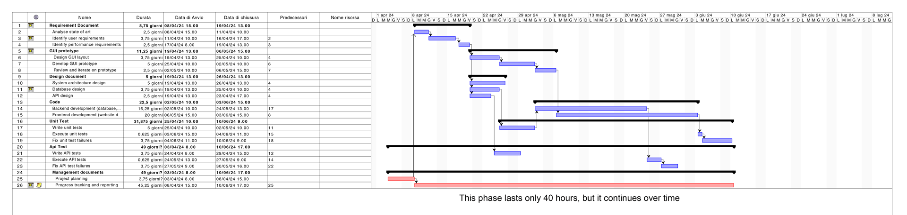

---
runme:
  id: 01HW7H68X7Q7DX9E3616K3H3G0
  version: v3
---

# Project Estimation - CURRENT

Date:

Version:

# Estimation approach

Consider the EZElectronics  project in CURRENT version (as given by the teachers), assume that you are going to develop the project INDEPENDENT of the deadlines of the course, and from scratch

# Estimate by size

### 

|             | Estimate                        |  
| ----------- | ------------------------------- |  
| NC =  Estimated number of classes to be developed   |    25                         |  
|  A = Estimated average size per class, in LOC       |    250                        |
| S = Estimated size of project, in LOC (= NC * A) | 6250 |
| E = Estimated effort, in person hours (here use productivity 10 LOC per person hour)  |  6250 / 10 = 625 person hour                                    |  
| C = Estimated cost, in euro (here use 1 person hour cost = 30 euro) | 625 * 30 =  18000|
| Estimated calendar time, in calendar weeks (Assume team of 4 people, 8 hours per day, 5 days per week ) | 625 / (4\*8\*5) = 4 weeks |

# Estimate by product decomposition

### 

|         component name    | Estimated effort (person hours)   |  
| ----------- | ------------------------------- |
| requirement document    | 50 |
| GUI prototype | 100 |
| design document | 80 |
| code | 300 |
| unit tests | 80|
| api tests | 50 |
| management documents  | 50 |

# Estimate by activity decomposition

|         Activity name    | Estimated effort (person hours)   |  
| ----------- | ------------------------------- |
|   Requirement document  |70  |
| Analyze state of art |  20|
| Identify user requirements | 30 |
| Identify performance requirements | 20 |
|  GUI prototype  |90 |
| Design GUI layout | 30 |
| Develop GUI prototype |40 |
| Review and iterate on prototype|20|
|  Design document  | 90|
|System architecture design| 40 |
|Database design| 30|
|API design| 20 |
|  Code  |290 |
|Backend development (database, API)| 130 |
|Frontend development (website design)| 160 |
|  Unit Test | 75|
|Write unit tests | 40 |
|Execute unit tests| 5 |
|Fix unit test failures| 30 |
|  Api Test  | 65|
|Write API tests| 30 |
|Execute API tests| 5 |
|Fix API test failures| 30 |
|  Management documents  | 70 |
|Project planning| 30 |
|Progress tracking and reporting| 40 |

750 person hours = 4,7 weeks (4 people team)

### Gantt

# Summary

The estimation by size, by product and activity decomposition differ because the degree of analysis is different. The first two are much more general while the estimation by activity offers a heightened level of detail, enabling a more precise assessment compared to the other two types. This granularity allows for a comprehensive breakdown of various activities. By dividing into specific activities, factors influencing time, resources, and potential risks can be meticulously analyzed and accounted for. 

|             | Estimated effort  (person hours)                      |   Estimated duration (weeks) |  
| ----------- | ------------------------------- | ---------------|
| estimate by size |625| 4|
| estimate by product decomposition |710| 4,4|
| estimate by activity decomposition |750| 4,7|

