---
runme:
  id: 01HW67YPRYVTRJDPNF5EZFYC3R
  version: v3
---

# Graphical User Interface Prototype - CURRENT

Authors:

- GABOR AMBRUS
- Moulay Nacim Hassani
- CHIARA ZAVATTA
- ONGARO ANDREA

Date: 04/05/2024

Version: 1.0

# Desktop version

All the pages has the header section that containts:

- Search Bar: Allows users to search for products by entering their code.
- Home Button: Takes users back to the homepage of the website.
- Product Button: Directs users to the main products page where they can browse or search for products.
- Account Page: Takes users to their account page where they can manage their profile, orders, and other account-related settings.
- Logout Button: Logs the user out of their account. Visible only if the user is logged

### Homepage

This page allows you to view the categories available on the site and click on them to go to the page where the products will be filtered by the selected category. There is also a section where you can preview the products on the site.

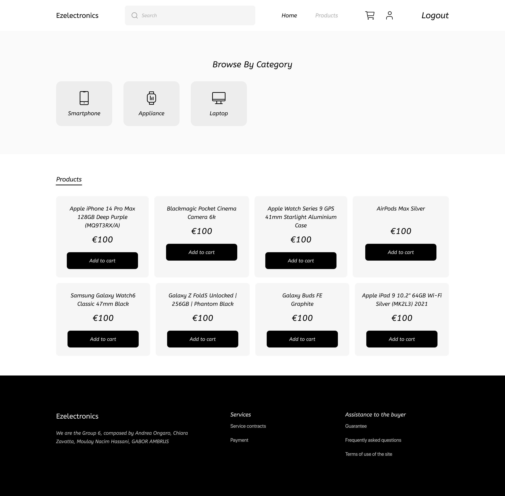

### Filter

This page provides options for users to filter products based on various criteria such as category, model, code and sold status.

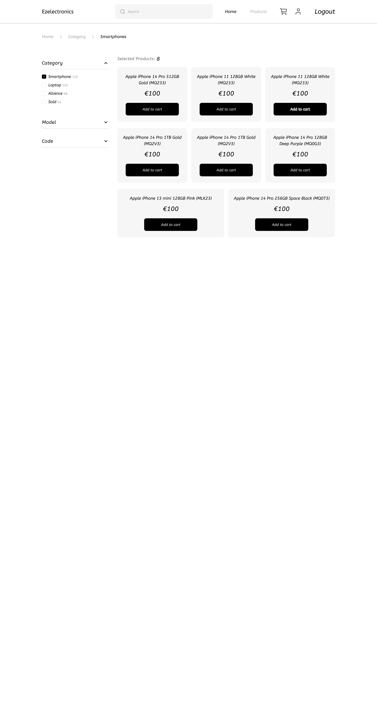

### Cart

This page permits to:

- View Cart: Displays the products currently in the user's shopping cart, along with their quantities and prices.
- Clear Cart: Allows users to remove all items from their cart, starting fresh.
- Go to Checkout: Takes users to the checkout page to complete their purchase.
- Remove products: Remove easily the product from the cart

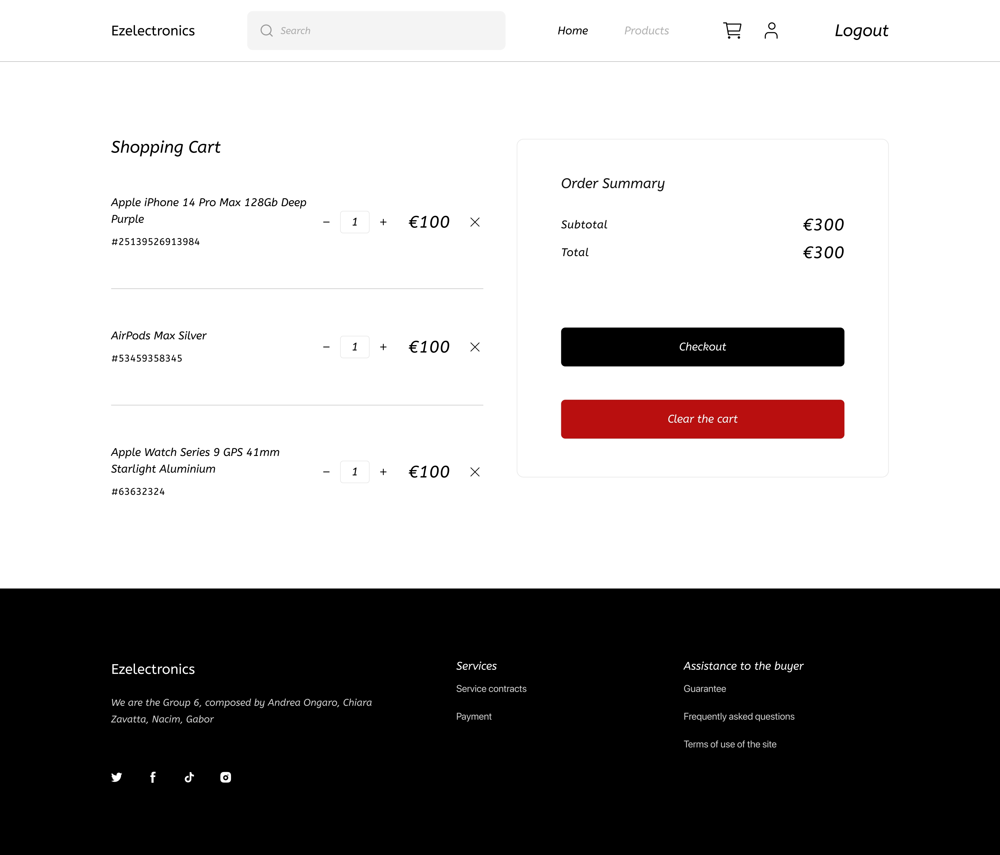

### Cart checkout completed

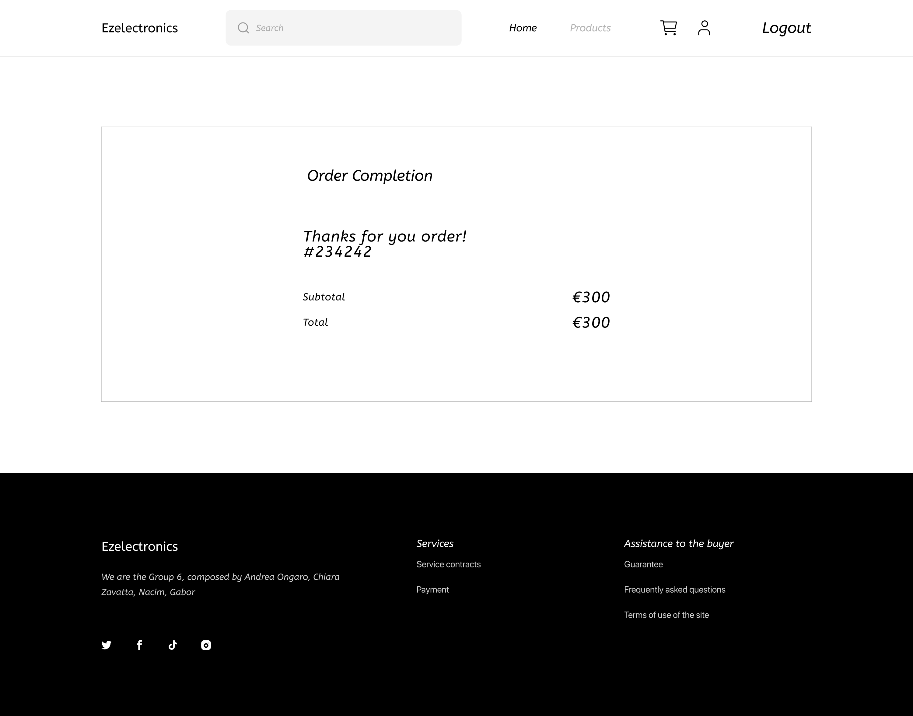

### Product page

This page permits to display of detailed information about a specific product identified by its code and add the product to the cart.

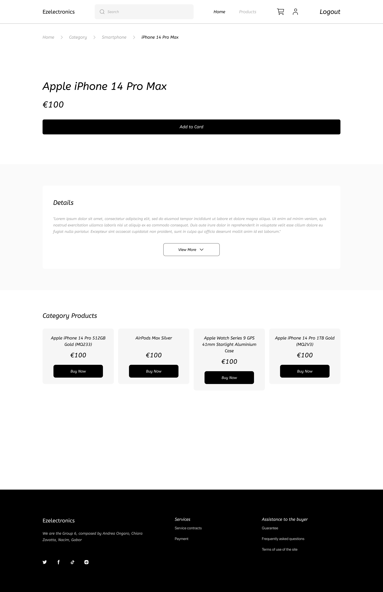

### Sign in page

This page permits managers and customers to log in to their accounts.

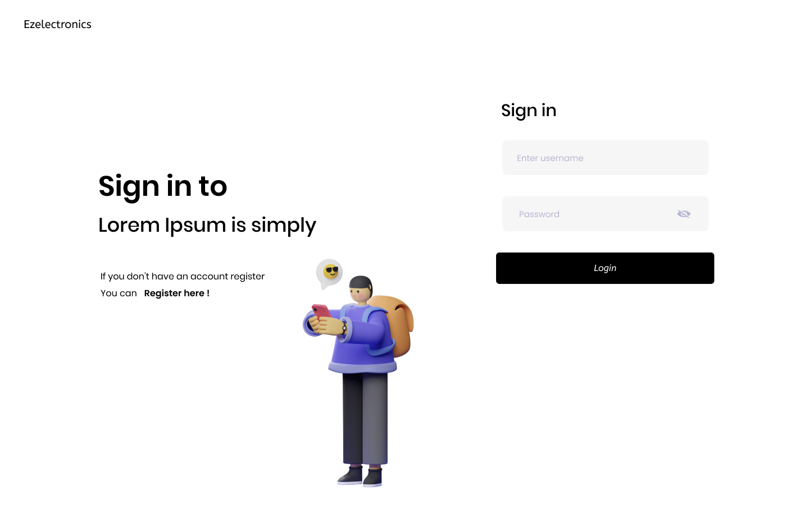

### Sign up page

This page permits a user to create an account as a customer or a manager.

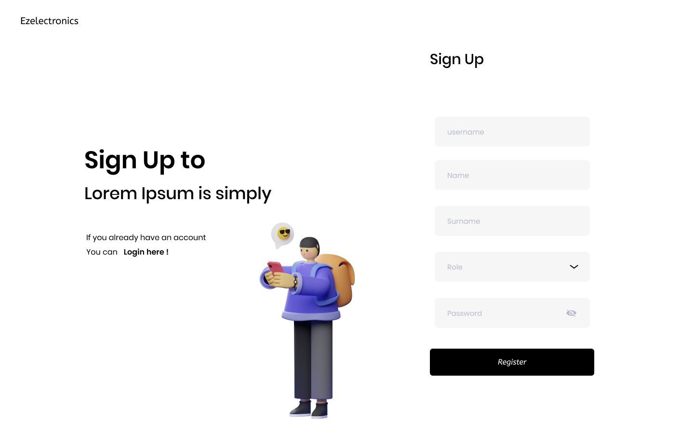

### Create a product page

This page permits the manager to create a product filling its details.

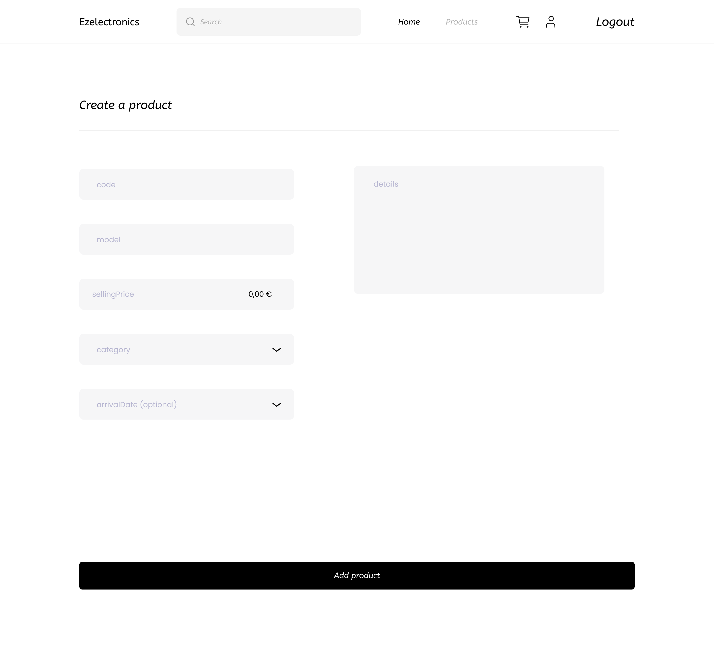

### Register an arrival page

This page permits the manager to register the arrival of the product.

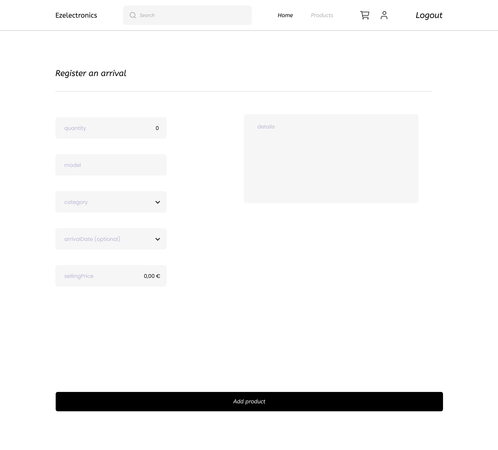

### Product list page

This page permits the manager to:

- View all the products
- Set as sold a product
- Remove a product

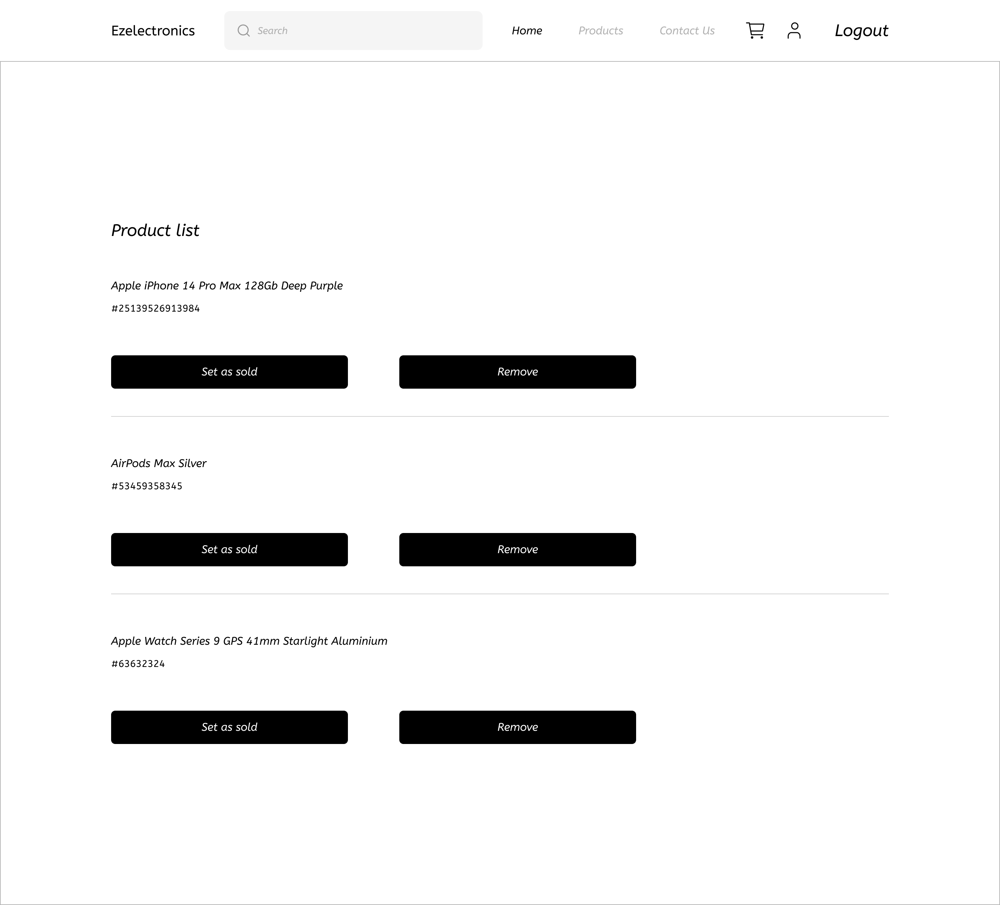

### Cart history page

This page permits the customer to view all the paid carts

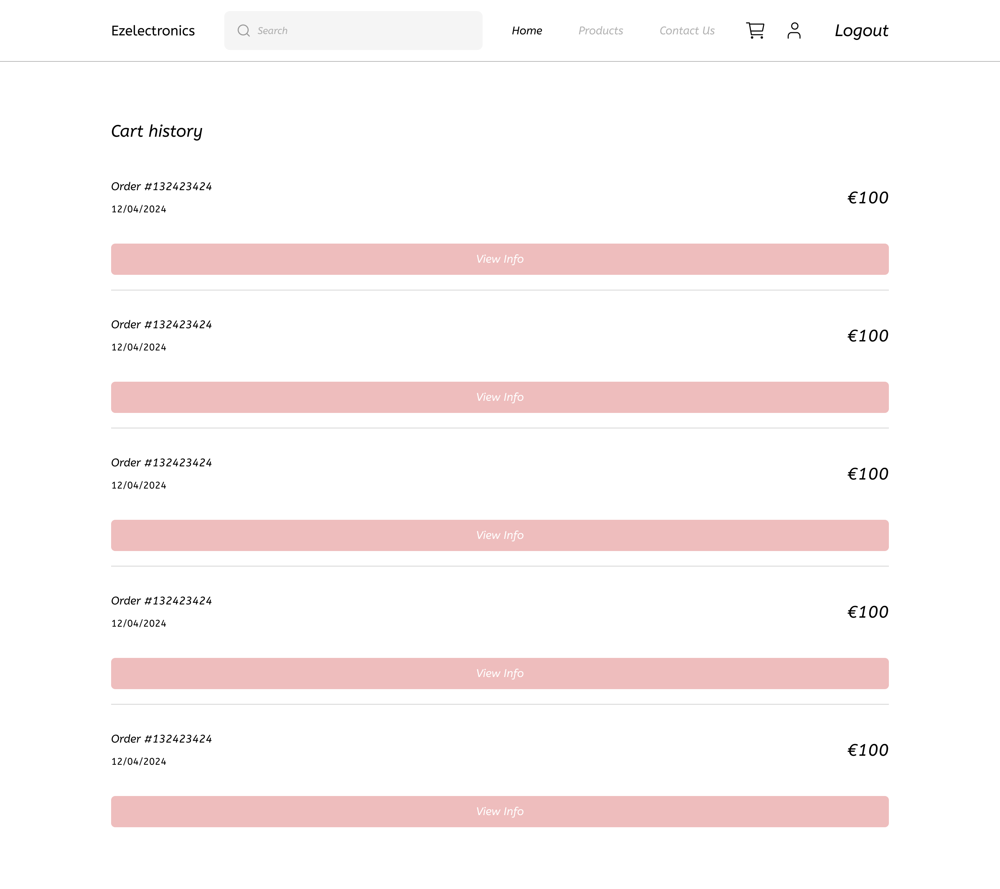

