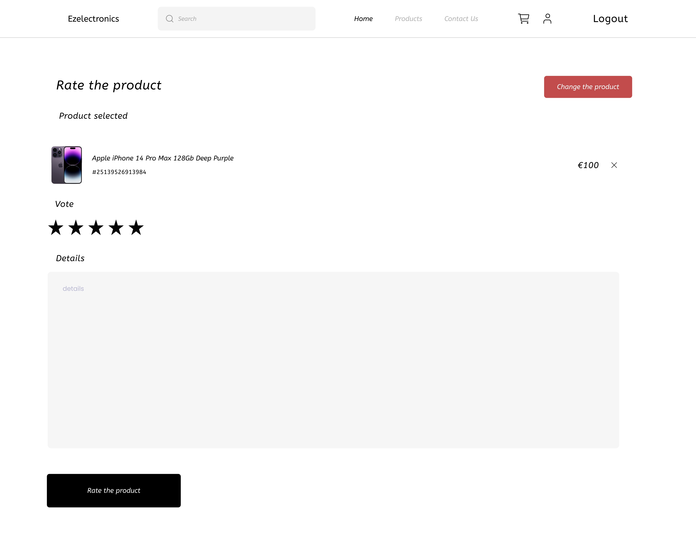

---
runme:
  id: 01HWSQTVF1QTNPMCYKZ7D0EP1F
  version: v3
---

# Graphical User Interface Prototype - FUTURE

Authors: 

- GABOR AMBRUS
- Moulay Nacim Hassani
- CHIARA ZAVATTA
- ONGARO ANDREA

Date: 04/05/2024

Version: v3

# Desktop version

All the pages has the header section that containts:

- Search Bar: Allows users to search for products by entering their code or keywords.
- Home Button: Takes users back to the homepage of the website.
- Product Button: Directs users to the main products page where they can browse or search for products.
- Account Page: Takes users to their account page where they can manage their profile, orders, and other account-related settings.
- Logout Button: Logs the user out of their account. Visible only if the user is logged
- Contact Us Button: Takes to the Contact Us page where the user can contact the advisor. 

### Homepage

This page allows you to view the categories available on the site and click on them to go to the page where the products will be filtered by the selected category. There is also a section where you can preview the products on the site.

### Filter

This page provides options for users to filter products based on various criteria such as category, model and code

### Cart

This page permits to:
- View Cart: Displays the products currently in the user's shopping cart, along with their quantities and prices.
- Clear Cart: Allows users to remove all items from their cart, starting fresh.
- Go to Checkout: Takes users to the checkout page to complete their purchase.
- Paypal service: Conclude the process using Paypal.
- Coupon insertion: Apply coupon to the current order.

### Cart checkout

### Product page

This page permits to displays of detailed information about a specific product identified by its code.

### Sign in page

This page permits different types of user to login into their account.

### Sign up page

This page permits a user to create an account as a customer or a manager. A customer can also choose if he wants to sign up as "private" or "company" and insert some specialized field. 

### Create a product page

This page permits the manager to create a product filling in its details.

### Register an arrival page

This page permits the manager to register the arrival of the product.

### Product list page

This page permits the manager to:
- View all the products
- Set as sold a product
- Remove a product

### Cart history page

This page permits the customer to view all the paid carts.

### Favorites page
This page permits the customer to view all the favorites products

### Cart paid page
This page displays all information about the current cart paid including the addresses, the products, the status of the delivery and the tracking code  

### Contact page
This page allows you to view the most frequently asked questions and, if the answer you are looking for is not present, you can contact an advisor via the form below.

### Rate a product page
This page allows a customer to review the products they have bought by entering a rating and a short description

### Create the address page
This page allows a customer to create their own address by specifying the required fields and choosing whether it is a shipping or billing address.

### Manage addresses page
This page allows a customer to view all his registered addresses on the site

### Manage user
This page allows the technical administrator to preview all users of the site, with the possibility of removing all data in a client's case and accepting or rejecting a manager.

### View User
This page permits to the tech admin to visualize information about the user selected. If not already accepted, you can accept or reject access to the manager.
