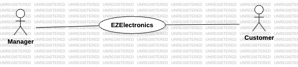
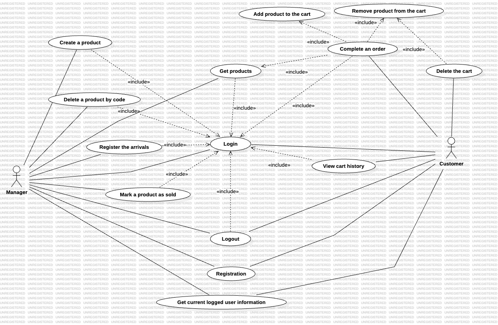
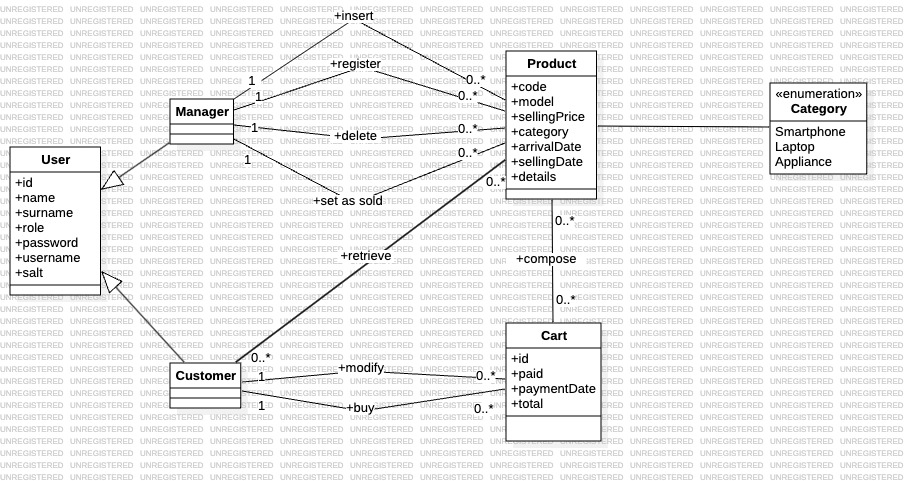
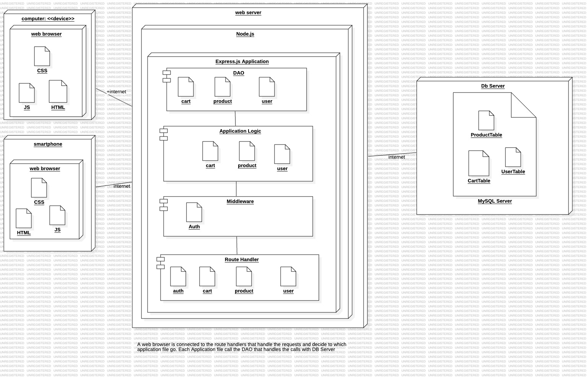

---
runme:
  id: 01HV4H3VEWVMZ6HJ3TT7EQHJGR
  version: v3
---

# Requirements Document - current EZElectronics

Date: 03/05/2024

Version: V1 - description of EZElectronics in CURRENT form (as received by teachers)

| Version number | Change |
| :------------: | :----: |
| 1.0            |       |

# Contents

- [Requirements Document - current EZElectronics](#requirements-document---current-ezelectronics)
- [Contents](#contents)
- [Informal description](#informal-description)
- [Stakeholders](#stakeholders)
- [Context Diagram and interfaces](#context-diagram-and-interfaces)

   - [Context Diagram](#context-diagram)
   - [Interfaces](#interfaces)

- [Stories and personas](#stories-and-personas)
- [Functional and non functional requirements](#functional-and-non-functional-requirements)

   - [Functional Requirements](#functional-requirements)
   - [Non Functional Requirements](#non-functional-requirements)

- [Use case diagram and use cases](#use-case-diagram-and-use-cases)

   - [Use case diagram](#use-case-diagram)
      - [Use case 1, UC1](#use-case-1-uc1---login)
      - [Use case 2, UC2](#use-case-2-uc2---registration)
      - [Use case 3, UC2](#use-case-3-uc3---create-product)
      - [Use case 4, UC2](#use-case-4-uc4---delete-product-by-code)
      - [Use case 5, UC2](#use-case-5-uc5---mark-a-product-as-sold)
      - [Use case 6, UC2](#use-case-6-uc6---register-the-arrivals)
      - [Use case 7, UC2](#use-case-7-uc7---view-the-carts-history)
      - [Use case 8, UC2](#use-case-8-uc8---complete-the-order)
      - [Use case 9, UC9](#use-case-9-uc9---get-the-products)
      - [Use case 10, UC10 - Logout](#use-case-10-uc10---logout)

- [Glossary](#glossary)
- [System Design](#system-design)
- [Deployment Diagram](#deployment-diagram)

# Informal description

EZElectronics (read EaSy Electronics) is a software application designed to help managers of electronics stores to manage their products and offer them to customers through a dedicated website. Managers can assess the available products, record new ones, and confirm purchases. Customers can see available products, add them to a cart and see the history of their past purchases.

# Stakeholders

| Stakeholder name | Description |
| :--------------: | :---------: |
| Customer  | Type of user of the system who can see available products, add them to a cart and see the history of their past purchases            |
| Manager   | Type of user of the system who manage their products and offer them to customers             |
| Competitor | An individual, group, company, or entity that operates within the same market or industry, with the aim of achieving similar goals, such as gaining market share, attracting customers, or generating revenue. |
| Government | A system or organization that has the authority to establish and enforce laws, regulations, and policies within a specific geographic area or jurisdiction. |

# Context Diagram and interfaces

## Context Diagram

## Interfaces

|   Actor   | Logical Interface | Physical Interface |
| :-------: | :---------------: | :----------------: |
| Customer   | GUI                  |   PC, Smartphone, Tablet                |
| Manager   | GUI                  |   PC, Smartphone, Tablet                 |

# Stories and personas

1. **Store Manager - Richard**:

   - Richard is a tech-savvy individual who manages an electronics store and he usually interacts with the website using the company laptop. He is responsible for overseeing inventory and managing product listings. He needs a user-friendly interface with features like product categorization, available products and manage stock levels.

2. **Online Shopper - Alex**:

   - Alex is a frequent online shopper who enjoys browsing for the latest gadgets and electronics. Alex wants to easily browse available products, view detailed descriptions and images, and quickly add items to their cart for purchase. Alex needs a responsive and intuitive website with search filters, clear product descriptions and a straightforward checkout process. He usually interacts with the website using his own smartphone.

3. **Occasional Shopper - Mark**:

   - Mark is a busy professional who occasionally shops for electronics when needed. He prefers a hassle-free experience and values simplicity and efficiency. Mark needs a clean and straightforward interface with prominent product categories, clear navigation, and a smooth checkout process to make his shopping experience quick and convenient. As Alex, He usually interacts with the website using his own smartphone.

# Functional and non functional requirements

## Functional Requirements

|  ID    | Description |
| :---:  | :---------: |
|  FR1   | Authentication & Authorization|
|  FR1.1 | Allows login for a user with the provided credentials.            |
|  FR1.2 | Allows to create a new user with the provided credentials.            |
|  FR1.2.1 | Allows to create a new customer with the provided credentials.            |
|  FR1.2.2 | Allows to create a new manager with the provided credentials.            |
|  FR1.3 | Performs logout for the currently logged in user.            |
|  FR1.4 | Retrieves information about the currently logged in user.            |
|  F2    | Manage products|
|  F2.1  | Create a product |
|  F2.2  | Get all products |
|  F2.3  | Set a product as sold |
|  F2.4  | Get products based on a specific attribute
|  F2.4.1 | Get products based on a specific code |
|  F2.4.2 | Get products based on a specific category |
|  F2.4.2.1 | Get sold products based on a specific category  |
|  F2.4.2.2 | Get not sold products based on a specific category  |
|  F2.4.3 | Get products based on a specific model |
|  F2.4.3.1 | Get sold products based on a specific model  |
|  F2.4.3.2 | Get not sold products based on a specific model  |
|  F2.5 | Registers the arrival of a set of products of the same model. |
|  F2.6  | Delete a specific product based on a code|
|  F3    | Manage carts |
|  F3.1  | Get carts of logged users |
|  F3.2  | Add product to the cart of a logged user |
|  F3.3  | Get paid carts history of a logged users |
|  F3.4  | Remove a product from the cart passing its ID |
|  F3.5  | Delete the current cart of the logged user |
|  F3.6  | Cart Checkout |

## Non Functional Requirements

|   ID    | Type (efficiency, reliability, ..) | Description | Refers to |
| :-----: | :--------------------------------: | :---------: | :-------: |
|  NFR1   |    Usability | Customer should be able to learn how to use the website in 10 minutes. Manager should be able to learn how to use the website in 30 minutes. The system must meet accessabilty guidelines | All FR  |
|  NFR2   |    Efficiency |  All functions on the website must be completed in <0.1 sec for all the functionalities             |   All FR         |
|  NFR3   |    Maintainability  |  To fix a general bugs it should take from 20 to 40 person hours           |  All FR          |
|  NFR4   |    Portability*    | All features should work in all browser - Safari, Chrome, Firefox, Opera and Edge from 5 years ago https://www.stetic.com/market-share/browser/ | All FR |
|  NFR5   |    Security | Password hashed   Authorized access divided for the type of role | FR1 |

\* To ensure portability across different browsers, we'll need to consider potential differences in browser implementations of certain functionalities.

# Use case diagram and use cases

## Use case diagram

### Use case 1, UC1 - Login

| Actors Involved  |                      Manager, Customer                                   |
| :--------------: | :------------------------------------------------------------------: |
|   Precondition   | User logs in with username and password  |
|  Post condition  |  A session for the user is created  |
| Nominal Scenario |         User logs in with username and password         |
|     Variants     |                                            |
|    Exceptions    |  username empty   password empty    wrong pwd or username  |

##### Scenario 1.1 - Login

|  Scenario 1.1  |                                                                            | |
| :------------: | :------------------------------------------------------------------------: | :------------: |
|  Precondition  | User must be logged off | |
| Post condition | A session is created  | |
|     Step#      |                                Description user                               | Description system|
|       1        |      User insert his credentials(username, password)                                         | |
|       2        |                                                                            | System checks the data. Data are correct |
|       3        |                                                                       | FR1.1 Session is created    |

##### Scenario 1.2 - Empty string for username

|  Scenario 1.2 |                                                                            | |
| :------------: | :------------------------------------------------------------------------: | :------------: |
|  Precondition  | User must be logged off | |
| Post condition | A session is not created. Error returned  | |
|     Step#      |                                Description user                               | Description system|
|       1        |      User insert the password                                       | |
|       2        |                                                                            | System checks the data. Username is empty |
|       3        |                                                                       |  Return an error. No session is created   |

##### Scenario 1.3 - Empty string for password

|  Scenario 1.3 |                                                                            | |
| :------------: | :------------------------------------------------------------------------: | :------------: |
|  Precondition  | User must be logged off | |
| Post condition | A session is not created. Error returned  | |
|     Step#      |                                Description user                               | Description system|
|       1        |      User insert the username                                      | |
|       2        |                                                                            | System checks the data. Password is empty |
|       3        |                                                                       |  Return an error. No session is created   |

##### Scenario 1.4 - Wrong credentials

|  Scenario 1.4 |                                                                            | |
| :------------: | :------------------------------------------------------------------------: | :------------: |
|  Precondition  | User must be logged off | |
| Post condition | A session is not created. Error returned  | |
|     Step#      |                                Description user                               | Description system|
|       1        |      User insert the credentials (username, password)                                       | |
|       2        |                                                                            | System checks the data. Username represents a non-existing user or the  password is wrong |
|       3        |                                                                       |  Return an error. No session is created   |

### Use case 2, UC2 - Registration

| Actors Involved  |                      Manager, Customer                                   |
| :--------------: | :------------------------------------------------------------------: |
|   Precondition   |  User doesn't have an account in the system |
|  Post condition  |  An account is created for a user  |
| Nominal Scenario |         Customer registration         |
|     Variants     |                      Manager registration                   |
|    Exceptions    | username represents a user that is already in the database    one of name,surname, password, role are null      Role can be only one between Manager and Customer|

##### Scenario 2.1 - Customer Registration

|  Scenario 2.1  |                                                                            | |
| :------------: | :------------------------------------------------------------------------: | :------------: |
|  Precondition  | User doesn't have an account in the system. User is costumer | |
| Post condition | An account is created for a costumer  | |
|     Step#      |                                Description user                               | Description system|
|       1        |      A user fills  username, name, surname, password and role                                     | |
|       2        |                                                                            | System checks the data. Data are correct |
| 3 | |FR1.2.1 An account is created for the customer|
| 4 | |Return code 200|

##### Scenario 2.2 - Manager Registration

|  Scenario 2.2  |                                                                            | |
| :------------: | :------------------------------------------------------------------------: | :------------: |
|  Precondition  | User doesn't have an account in the system. User is manager | |
| Post condition | An account is created for the manager | |
|     Step#      |                                Description user                               | Description system|
|       1        |      A user fills  username, name, surname, password and role                                     | |
|       2        |                                                                            | System checks the data. Data are correct |
| 3 | |FR1.2.2 An account is created for the manager|
|       4        |                       |  Return code 200    |

##### Scenario 2.3 - User already existing

|  Scenario 2.3  |                                                                            | |
| :------------: | :------------------------------------------------------------------------: | :------------: |
|  Precondition  | User doesn't have an account in the system | |
| Post condition | An account is not created. Error returned  | |
|     Step#      |                                Description user                               | Description system|
|       1        |      A user fills username, name, surname, password and role                                                 | |
|       2        |                                                                            | System checks the data. Username already exists |
|       3        |                                                                       |  Return error 409    |

##### Scenario 2.4 - Null parameters (username, name, surname password)

|  Scenario 2.4 |                                                                            | |
| :------------: | :------------------------------------------------------------------------: | :------------: |
|  Precondition  | User doesn't have an account in the system | |
| Post condition | An account is not created. Error returned  | |
|     Step#      |                                Description user                               | Description system|
|       1        |      A user fills username, name, surname, password and role                                                 | |
|       2        |                                                                            | System checks the data. Username or name or surname or password are empty |
|       3        |                                                                       |  Return error     |

##### Scenario 2.5 - Non-existing role

|  Scenario 2.5 |                                                                            | |
| :------------: | :------------------------------------------------------------------------: | :------------: |
|  Precondition  | User doesn't have an account in the system | |
| Post condition | An account is not created. Error returned  | |
|     Step#      |                                Description user                               | Description system|
|       1        |      A user fills username, name, surname, password and role                                                 | |
|       2        |                                                                            | System checks the data. Role is not one of the admitted: "Manager", "Customer" |
|       3        |                                                                       |  Return error     |

### Use case 3, UC3 - Create Product

| Actors Involved   |  Manager                                                                    |
| :--------------: | :------------------------------------------------------------------: |
|   Precondition   | User must be logged in, User must be a manager |
|  Post condition  |  Product is created  |
| Nominal Scenario |         Creation of the product         |
| Variants |                       |
|    Exceptions    |  The product already exists     code is empty  code is less than 6 characters      sellingPrice is not a number    selling price is not greater than 0    model is empty  category is not one of "Smartphone", "Laptop", "Appliance"     arrival date is present and is not in the right format YYYY-MM-DD   arrivalDate is after the current date |

##### Scenario 3.1 - Creation of the product

|  Scenario 3.1  |                                                                            | |
| :------------: | :------------------------------------------------------------------------: | :------------: |
|  Precondition  | User must be logged in, User must be a manager  | |
| Post condition |  Product is created   | |
|     Step#      |                                Description user                               | Description system|
|       1        |      Manager fills the data product                                        | |
|       2        |                                                                            | System checks the data. Data are correct |
|       3        |                                                                       | FR2.1 - Product is created    |
|  4 | | Return the code of the product|

##### Scenario 3.2 - Product already existing

|  Scenario 3.2  |                                                                            | |
| :------------: | :------------------------------------------------------------------------: | :------------: |
|  Precondition  | User must be logged in, User must be a manager  | |
| Post condition |  Product is not created. Error returned   | |
|     Step#      |                                Description user                               | Description system|
|       1        |      Manager fills the data product                                          | |
|       2        |                                                                            | System checks the data. Code already exists |
|       3        |                                                                       |  Return error 409    |

##### Scenario 3.3 - Code is empty

|  Scenario 3.3  |                                                                            | |
| :------------: | :------------------------------------------------------------------------: | :------------: |
|  Precondition  | Manager must be logged in, User must be a manager  | |
| Post condition |  Product is not created. Error returned   | |
|     Step#      |                                Description user                               | Description system|
|       1        |      Manager fills the data product                         | |
|       2        |                                                                            | System checks the data. Code is empty |
|       3        |                                                                       |  Return error 409    |

##### Scenario 3.4 - arrival date is present and is not in the right format YYYY-MM-DD

|  Scenario 3.4  |                                                                            | |
| :------------: | :------------------------------------------------------------------------: | :------------: |
|  Precondition  | Manager must be logged in, User must be a manager  | |
| Post condition |  Product is created   | |
|     Step#      |                                Description user                               | Description system|
|       1        |      Manager fills the data product                                            | |
|       2        |                                                                            | System checks the data. Arrival date is not in the right format YYYY-MM-DD|
|       3        |                                                                       |  Return error 409    |

##### Scenario 3.5 - Code is less than 6 characters

|  Scenario 3.5  |                                                                            | |
| :------------: | :------------------------------------------------------------------------: | :------------: |
|  Precondition  | Manager must be logged in, User must be a manager  | |
| Post condition |  Product is not created. Error returned   | |
|     Step#      |                                Description user                               | Description system|
|       1        |      Manager fills the data product.        | |
|       2        |                                                                            | System checks the data. Code is less than 6 characters |
|       3        |                                                                       |  Return error 409    |

##### Scenario 3.6 - sellingPrice is not a number

|  Scenario 3.6  |                                                                            | |
| :------------: | :------------------------------------------------------------------------: | :------------: |
|  Precondition  | Manager must be logged in, User must be a manager  | |
| Post condition |  Product is not created. Error returned   | |
|     Step#      |                                Description user                               | Description system|
|       1        |      Manager fills the data product                                          | |
|       2        |                                                                            | System checks the data. sellingPrice is not a number |
|       3        |                                                                       |  Return error 409    |

##### Scenario 3.7 - model is empty

|  Scenario 3.7  |                                                                            | |
| :------------: | :------------------------------------------------------------------------: | :------------: |
|  Precondition  | Manager must be logged in, User must be a manager  | |
| Post condition |  Product is not created. Error returned   | |
|     Step#      |                                Description user                               | Description system|
|       1        |      Manager fills the data product                                            | |
|       2        |                                                                            | System checks the data. Model is empty |
|       3        |                                                                       |  Return error 409    |

##### Scenario 3.8 -  selling price is not greater than 0

|  Scenario 3.8  |                                                                            | |
| :------------: | :------------------------------------------------------------------------: | :------------: |
|  Precondition  | Manager must be logged in, User must be a manager  | |
| Post condition |  Product is not created. Error returned   | |
|     Step#      |                                Description user                               | Description system|
|       1        |      Manager fills the data product                           | |
|       2        |                                                                            | System checks the data.  selling price is not greater than 0 |
|       3        |                                                                       |  Return error 409    |

##### Scenario 3.9 -  category is not one of "Smartphone", "Laptop", "Appliance"

|  Scenario 3.9  |                                                                            | |
| :------------: | :------------------------------------------------------------------------: | :------------: |
|  Precondition  | Manager must be logged in, User must be a manager  | |
| Post condition |  Product is not created. Error returned   | |
|     Step#      |                                Description user                               | Description system|
|       1        |      Manager fills the data product                           | |
|       2        |                                                                            | System checks the data.  category is not one of "Smartphone", "Laptop", "Appliance" |
|       3        |                                                                       |  Return error 409    |

##### Scenario 3.10 - Arrival date is after the current date

|  Scenario 3.10  |                                                                            | |
| :------------: | :------------------------------------------------------------------------: | :------------: |
|  Precondition  | Manager must be logged in, User must be a manager  | |
| Post condition |  Product is not created. Error returned  | |
|     Step#      |                                Description user                               | Description system|
|       1        |      Manager fills the data product (quantity sellingPrice, model, category, arrivalDate, sellingDate, details)                                           | |
|       2        |                                                                            | System checks the data. Arrival date is after the current date |
|       3        |                                                                       |  Return error |

### Use case 4, UC4 - Delete product by code

| Actors Involved  |              Manager                                           |
| :--------------: | :------------------------------------------------------------------: |
|   Precondition   | User must be logged in, User must be a manager |
|  Post condition  | Product deleted |
| Nominal Scenario |         Remove product by code      |
|     Variants     |                                     |
|    Exceptions    | The code does not represent a product in the database                      |

##### Scenario 4.1 - Product removal

|  Scenario 4.1  |                                                                            | |
| :------------: | :------------------------------------------------------------------------: | :------------: |
|  Precondition  | Manager must be logged in, User must be a manager  | |
| Post condition |  Product removed   | |
|     Step#      |                                Description user                               | Description system|
|       1        |      Manager selects the code of the product he wants to delete                               | |
|       2        |                                                                            | System checks the code of the product. The product exists |
|       3        |                                                                       | FR2.6 A product is removed    |
|       3        |                                                                       |  Return code 200    |

##### Scenario 4.2 - Non-existing product removal

|  Scenario 4.2  |                                                                            | |
| :------------: | :------------------------------------------------------------------------: | :------------: |
|  Precondition  | User must be logged in, User must be a manager  | |
| Post condition | Product is not removed. Error returned| |
|     Step#      |                                Description user                               | Description system|
|       1        |      Manager selects the code of the product he wants to delete                              | |
|       2        |                                                                            | System checks the code of the product. The code does not represent a product in the database |
|       3        |                                                                       |  Return error code 404    |

### Use case 5, UC5 - Mark a product as sold

| Actors Involved  |                  Manager                                       |
| :--------------: | :------------------------------------------------------------------: |
|   Precondition   | User must be logged in, User must be a manager|
|  Post condition  |  Product is set sold  |
| Nominal Scenario |         Mark a product as sold     |
|     Variants     |                                        |
|    Exceptions    |  Code does not represent a product in the database   sellingDate is after the current date     sellingDate is before the product's arrivalDate    product is already set as sold                       |

##### Scenario 5.1 - Product marked as sold

|  Scenario 5.1  |                                                                            | |
| :------------: | :------------------------------------------------------------------------: | :------------: |
|  Precondition  | User must be logged in, User must be a manager  | |
| Post condition |  Product marked as sold   | |
|     Step#      |                                Description user                               | Description system|
|       1        |      Manager selects the code of the product to set as sold                               | |
|       2        |                                                                            | System checks the data inserted (code, optional selling date). The product exists. If the date is present the constraints are fulfilled and the product is not already sold |
|       3        |                                                                       | FR2.3 A product is marked as sold    |
|       4        |                                                                       |  Return code 200    |

##### Scenario 5.2 - Code does not represent a product in the database

|  Scenario 5.2  |                                                                            | |
| :------------: | :------------------------------------------------------------------------: | :------------: |
|  Precondition  | User must be logged in, User must be a manager  | |
| Post condition |  Product is not set as sold. Error returned   | |
|     Step#      |                                Description user                               | Description system|
|       1        |      Manager selects the code of the product to set as sold                               | |
|       2        |                                                                            | System checks the code of the product. The code does not represent a product in the database |
|       3        |                                                                       |  Return error code    |

##### Scenario 5.3 - sellingDate is before the product's arrivalDate

|  Scenario 5.3  |                                                                            | |
| :------------: | :------------------------------------------------------------------------: | :------------: |
|  Precondition  | User must be logged in, User must be a manager  | |
| Post condition |  Product is not set as sold. Error returned   | |
|     Step#      |                                Description user                               | Description system|
|       1        |      Manager selects the code of the product to set as sold and adds the selling date                               | |
|       2        |                                                                            | System checks the code of the product, the date constraints are not fulfilled. sellingDate is before the product's arrivalDate  |
|       3        |                                                                       |  Return error code    |

##### Scenario 5.4 - sellingDate is after the current date

|  Scenario 5.4  |                                                                            | |
| :------------: | :------------------------------------------------------------------------: | :------------: |
|  Precondition  | User must be logged in, User must be a manager  | |
| Post condition |  Product is not set as sold. Error returned   | |
|     Step#      |                                Description user                               | Description system|
|       1        |      Manager selects the code of the product to set as sold and adds the selling date                               | |
|       2        |                                                                            | System checks the code of the product, the date constraints are not fulfilled. Selling date is after the current date  |
|       3        |                                                                       |  Return error code    |

##### Scenario 5.5 - Product is already set as sold

|  Scenario 5.5  |                                                                            | |
| :------------: | :------------------------------------------------------------------------: | :------------: |
|  Precondition  | User must be logged in, User must be a manager  | |
| Post condition |  Product is not set as sold. Error returned   | |
|     Step#      |                                Description user                               | Description system|
|       1        |      Manager selects the code of the product to set as sold                                | |
|       2        |                                                                            | System checks the code of the product. The product exists, but it is already sold. |
|       3        |                                                                       |  Return error code    |

### Use case 6, UC6 - Register the arrivals

| Actors Involved  |       Manager                                                  |
| :--------------: | :------------------------------------------------------------------: |
|   Precondition   |  User must be logged in, User must be a manager|
|  Post condition  |  Arrivals are registered  |
| Nominal Scenario |         Manager register the arrival    |
|     Variants     |                       |
|    Exceptions    | Model is empty    Category must be one of "Smartphone", "Laptop", "Appliance"    Details is empty   Quantity is not greater than 0    sellingPrice is not greater than 0   Arrival date is after the current date|

##### Scenario 6.1 - Arrival registration

|  Scenario 6.1  |                                                                            | |
| :------------: | :------------------------------------------------------------------------: | :------------: |
|  Precondition  | Manager must be logged in, User must be a manager  | |
| Post condition |  Arrival registration is  completed   | |
|     Step#      |                                Description user                               | Description system|
|       1        |      Manager fills the data product (quantity sellingPrice, model, category, arrivalDate, sellingDate, details)                                           | |
|       2        |                                                                            | System checks the data. Data are correct |
|       3        |                                                                       | FR2.5 Arrival registration is completed    |
|       4        |                                                                       |   Return code 200    |

##### Scenario 6.2 - Model is empty

|  Scenario 6.2  |                                                                            | |
| :------------: | :------------------------------------------------------------------------: | :------------: |
|  Precondition  | Manager must be logged in, User must be a manager  | |
| Post condition |  Arrival registration is not completed. Error returned  | |
|     Step#      |                                Description user                               | Description system|
|       1        |      Manager fills the data product (quantity sellingPrice, model, category, arrivalDate, sellingDate, details)                                           | |
|       2        |                                                                            | System checks the data. Model is empty |
|       3        |                                                                       |  Return error   |

##### Scenario 6.3 - Category is not one of "Smartphone", "Laptop", "Appliance"

|  Scenario 6.3  |                                                                            | |
| :------------: | :------------------------------------------------------------------------: | :------------: |
|  Precondition  | Manager must be logged in, User must be a manager  | |
| Post condition |  Arrival registration is not completed. Error returned  | |
|     Step#      |                                Description user                               | Description system|
|       1        |      Manager fills the data product (quantity sellingPrice, model, category, arrivalDate, sellingDate, details)                                           | |
|       2        |                                                                            | System checks the data. Category does not belong to one of "Smartphone", "Laptop", "Appliance" |
|       3        |                                                                       |  Return error   |

##### Scenario 6.4 - Quantity is not greater than 0

|  Scenario 6.4  |                                                                            | |
| :------------: | :------------------------------------------------------------------------: | :------------: |
|  Precondition  | Manager must be logged in, User must be a manager  | |
| Post condition |  Arrival registration is not completed. Error returned  | |
|     Step#      |                                Description user                               | Description system|
|       1        |      Manager fills the data product (quantity sellingPrice, model, category, arrivalDate, sellingDate, details)                                           | |
|       2        |                                                                            | System checks the data. Quantity isn't greater than 0 |
|       3        |                                                                       |  Return error   |

##### Scenario 6.5 - sellingPrice is not greater than 0

|  Scenario 6.5  |                                                                            | |
| :------------: | :------------------------------------------------------------------------: | :------------: |
|  Precondition  | Manager must be logged in, User must be a manager  | |
| Post condition |  Arrival registration is not completed. Error returned  | |
|     Step#      |                                Description user                               | Description system|
|       1        |      Manager fills the data product (quantity sellingPrice, model, category, arrivalDate, sellingDate, details)                                           | |
|       2        |                                                                            | System checks the data. sellingPrice isn't greater than 0 |
|       3        |                                                                       |  Return error   |

##### Scenario 6.6 - Arrival date is after the current date

|  Scenario 6.6  |                                                                            | |
| :------------: | :------------------------------------------------------------------------: | :------------: |
|  Precondition  | Manager must be logged in, User must be a manager  | |
| Post condition |  Arrival registration is not completed. Error returned  | |
|     Step#      |                                Description user                               | Description system|
|       1        |      Manager fills the data product (quantity sellingPrice, model, category, arrivalDate, sellingDate, details)                                           | |
|       2        |                                                                            | System checks the data. Arrival date is after the current date |
|       3        |                                                                       |  Return error   |

### Use case 7, UC7 - View the carts history

| Actors Involved  |              Customer                                           |
| :--------------: | :------------------------------------------------------------------: |
|   Precondition   | User must be logged in, User must be a customer |
|  Post condition  | User get the carts |
| Nominal Scenario |         Get cart of the logged in user      |
|     Variants     |         No carts                            |
|    Exceptions    |                    |

##### Scenario 7.1 - Customer sees the paid carts history

|  Scenario 7.1  |                                                                            | |
| :------------: | :------------------------------------------------------------------------: | :------------: |
|  Precondition  | User must be logged in, User must be a customer  | |
| Post condition |  Customer sees the paid carts  | |
|     Step#      |                                Description user                               | Description system|
|       1        |      Customer requests the list of the carts                      | |
|       2        |                                                                            | FR3.3 System returns the list of the carts that have been paid for  |

##### Scenario 7.2 - Customer sees an empty list

|  Scenario 7.2  |                                                                            | |
| :------------: | :------------------------------------------------------------------------: | :------------: |
|  Precondition  | User must be logged in, User must be a customer  | |
| Post condition |  Customer sees an empty list  | |
|     Step#      |                                Description user                               | Description system|
|       1        |      Customer requests the list of the carts                      | |
|       2        |                                                                   | FR3.3 - System gets the list of the carts. The list is empty |
|       3        |                                                                   |  Return code 200    |

### Use case 8, UC8 - Complete an order

| Actors Involved  |              Customer                                           |
| :--------------: | :------------------------------------------------------------------: |
|   Precondition   | User must be logged in, User must be a customer |
|  Post condition  | User completed the order |
| Nominal Scenario | User completed the order  |
|     Variants     | User removes the product from the cart   User gets the product based on the code    User gets all the products based on the model    User gets all the products based on the model and set sold as "no"     User gets all the product based on the category    User gets all the products based on the category and set sold as "no" |
|    Exceptions    | Code does not represent an existing product   Code represents a product that is already in another cart  Code represents a product that has already been sold   the category is not one of "Smartphone", "Laptop", "Appliance"   The model  is empty    The cart is empty   The cart does not exists                 |

##### Scenario 8.1 - Complete the order

|  Scenario 8.1  |                                                                            | |
| :------------: | :------------------------------------------------------------------------: | :------------: |
|  Precondition  | User must be logged in, User must be a customer  | |
| Post condition | Order completed  | |
|     Step#      |                                Description user                               | Description system|
|       1        |   User wants to buy a product        | |
|       2        |   User searches for all the products                                                                     | |
| 3 | | F2.4 - System gets all the products
| 4 | User selects a product |
| 5 ||  FR3.2 - System adds the product to the cart
| 6 | User wants to conclude the order | |
| 7 || F3.6 - System concludes the checkout of the order

##### Scenario 8.2 - User removes the product from the cart

|  Scenario 8.2  |                                                                            | |
| :------------: | :------------------------------------------------------------------------: | :------------: |
|  Precondition  | User must be logged in, User must be a logged user  | |
| Post condition | Order completed  | |
|     Step#      |                                Description user                               | Description system|
|       1        |   User wants to buy a product        | |
|       2        |   User searches for the products based on model                                                                         | |
| 3 | | F2.4.3 - System gets the products based on model
| 4 | User selects a product |
| 5 ||  FR3.2 - System adds the product to the cart
| 6 | User decides to remove a product |
| 7 | | FR3.4 - System removes the product from the cart

##### Scenario 8.3 - User selects the unsold products based on the category

|  Scenario 8.3  |                                                                            | |
| :------------: | :------------------------------------------------------------------------: | :------------: |
|  Precondition  | User must be logged in, User must be a customer  | |
| Post condition | Order completed | |
|     Step#      |                                Description user                               | Description system|
|       1        |   User wants to buy a product        | |
|       2        |   User searches for the products based on the category                                                                         | |
| 3 | | F2.4.2.2 - System gets the unsold products based on category
| 4 | User selects a product |
| 5 ||  FR3.2 - System add the product to the cart
| 6 | User wants to conclude the order | |
| 7 || F3.6 - System concludes the checkout of the order

##### Scenario 8.4 - User selects the products based on the code

|  Scenario 8.4  |                                                                            | |
| :------------: | :------------------------------------------------------------------------: | :------------: |
|  Precondition  | User must be logged in, User must be a customer  | |
| Post condition | Order completed | |
|     Step#      |                                Description user                               | Description system|
|       1        |   User wants to buy a product        | |
|       2        |   User searches for the products based on the code                                                                         | |
| 3 | | F2.4.1 - System gets the products based on code
| 4 | User selects a product |
| 5 ||  FR3.2 - System add the product to the cart
| 6 | User wants to conclude the order | |
| 7 || F3.6 - System concludes the checkout of the order

##### Scenario 8.5 - User selects the unsold products based on the model

|  Scenario 8.5  |                                                                            | |
| :------------: | :------------------------------------------------------------------------: | :------------: |
|  Precondition  | User must be logged in, User must be a customer  | |
| Post condition | Order completed | |
|     Step#      |                                Description user                               | Description system|
|       1        |   User wants to buy a product        | |
|       2        |   User searches for the unsold products based on the model                                                                         | |
| 3 | | F2.4.3.2 - System gets the unsold products based on model
| 4 | User selects a product |
| 5 ||  FR3.2 - System add the product to the cart
| 6 | User wants to conclude the order | |
| 7 || F3.6 - System concludes the checkout of the order

##### Scenario 8.6 - Code does not represent a product in the database

|  Scenario 8.6  |                                                                            | |
| :------------: | :------------------------------------------------------------------------: | :------------: |
|  Precondition  | User must be logged in,  User must be a customer | |
| Post condition | Return an error  | |
|     Step#      |                                Description user                               | Description system|
|       1        |   User wants to buy a product        | |
|       2        |   User searches for the product based on the code  
|       3       |                                                                            | System checks the data. Code does not represent a product in the database  |
| 3 | | Return error

##### Scenario 8.7 - Code represents a product in another cart

|  Scenario 8.7  |                                                                            | |
| :------------: | :------------------------------------------------------------------------: | :------------: |
|  Precondition  | User must be logged in, User must be a customer  | |
| Post condition | Return an error  | |
|     Step#      |                                Description user                               | Description system|
|       1        |   The user select a product          | |
|       2        |                                                                            | System checks the data. Code of the product represents a product in another cart  |
| 3 | | Return error

##### Scenario 8.8 - Category error

|  Scenario 8.8  |                                                                            | |
| :------------: | :------------------------------------------------------------------------: | :------------: |
|  Precondition  | User must be logged in,  User must be a customer  | |
| Post condition | Return an error  | |
|     Step#      |                                Description user                               | Description system|
|       1        |   The user select the category he want          | |
|       2        |                                                                            | System checks the data. The category is not one of the admitted  |
| 3 | | Return error

##### Scenario 8.9 - Model error

|  Scenario 8.9  |                                                                            | |
| :------------: | :------------------------------------------------------------------------: | :------------: |
|  Precondition  | User must be logged in,  User must be a customer  | |
| Post condition | Return an error  | |
|     Step#      |                                Description user                               | Description system|
|       1        |   The user select the model he wants         | |
|       2        |                                                                            | System checks the data. The model does not exist  |
| 3 | | Return error

##### Scenario 8.10 - The cart is empty

|  Scenario 8.10  |                                                                            | |
| :------------: | :------------------------------------------------------------------------: | :------------: |
|  Precondition  | User must be logged in,  User must be a customer  | |
| Post condition | Return an error  | |
|     Step#      |                                Description user                               | Description system|
|       1        |   The user want to complete the order       | |
|       2        |                                     | System checks the cart. Cart is empty |
| 3 | | Return error

##### Scenario 8.11 - The cart does not exist

|  Scenario 8.11  |                                                                            | |
| :------------: | :------------------------------------------------------------------------: | :------------: |
|  Precondition  | User must be logged in,  User must be a customer  | |
| Post condition | Return an error  | |
|     Step#      |                                Description user                               | Description system|
|       1        |   The user want to complete the order       | |
|       2        |                                     | System checks the cart. The cart does not exist |
| 3 | | Return error

### Use case 9, UC9 - Get the products

| Actors Involved  |              Customer, Manager                                           |
| :--------------: | :------------------------------------------------------------------: |
|   Precondition   | User must be logged in |
|  Post condition  | User get the products |
| Nominal Scenario | User get the products  |
|     Variants     | User gets the product based on the code    User gets all the products based on the model     User gets all the products based on the model and set sold as "no"      User gets all the products based on the model and set sold as "yes"      User gets all the product based on the category     User gets all the products based on the category and set sold as "no"     User gets all the products based on the category and set sold as "yes"          |
|    Exceptions    | Code does not represent an existing product     Code represents a product that has already been sold  the category must be one of "Smartphone", "Laptop", "Appliance"    the model is empty     The cart is empty     The cart does not exists  |

##### Scenario 9.1 - User searches for the products

|  Scenario 9.1  |                                                                            | |
| :------------: | :------------------------------------------------------------------------: | :------------: |
|  Precondition  | User must be logged in | |
| Post condition | Return the array of the products | |
|     Step#      |                                Description user                               | Description system|
|       1        |  User searches for all the products                                                                       | |
| 2 | | F2.2 - System gets all the products. Return the array

##### Scenario 9.2 - User searches for a product based on a specific code

|  Scenario 9.2  |                                                                            | |
| :------------: | :------------------------------------------------------------------------: | :------------: |
|  Precondition  | User must be logged in | |
| Post condition | Return the array of the products | |
|     Step#      |                                Description user                               | Description system|
|       1        |  User searches for a product based on a specific code                                                                        | |
| 2 | | F2.4.1 - System gets the product. Return the product

##### Scenario 9.3 - User searches for the products based on the category

|  Scenario 9.3  |                                                                            | |
| :------------: | :------------------------------------------------------------------------: | :------------: |
|  Precondition  | User must be logged in | |
| Post condition | Return the array of the products | |
|     Step#      |                                Description user                               | Description system|
|       1        |  User searches for the products based on the category                                                           | |
| 2 | | F2.4.2 - System gets the products. Return the array

##### Scenario 9.4 - User searches for the unsold products base on the category

|  Scenario 9.4  |                                                                            | |
| :------------: | :------------------------------------------------------------------------: | :------------: |
|  Precondition  | User must be logged in | |
| Post condition | Return the array of the products | |
|     Step#      |                                Description user                               | Description system|
|       1        |  User searches for the unsold products base on the category                                                          | |
| 2 | | F2.4.2.2 - System gets the products. Return the array

##### Scenario 9.5 - User searches for the sold products base on the category

|  Scenario 9.1  |                                                                            | |
| :------------: | :------------------------------------------------------------------------: | :------------: |
|  Precondition  | User must be logged in | |
| Post condition | Return the array of the products | |
|     Step#      |                                Description user                               | Description system|
|       1        |  - User searches for the unsold products base on the category                                                            | |
| 2 | | F2.4.2.1 - System gets all the products. Return the array

##### Scenario 9.6 - User searches for the products based on a specific model

|  Scenario 9.6  |                                                                            | |
| :------------: | :------------------------------------------------------------------------: | :------------: |
|  Precondition  | User must be logged in | |
| Post condition | Return the array of the products | |
|     Step#      |                                Description user                               | Description system|
|       1        |  User searches for the products based on a specific model                                            | |
| 2 | | F2.4.3 - System gets the products. Return the array

##### Scenario 9.7 - User searches for the unsold products based on a specific model

|  Scenario 9.7  |                                                                            | |
| :------------: | :------------------------------------------------------------------------: | :------------: |
|  Precondition  | User must be logged in | |
| Post condition | Return the array of the products | |
|     Step#      |                                Description user                               | Description system|
|       1        |  User searches for the products based on a specific model                                                                                 | |
| 2 | | F2.4.3.2 - System gets the products. Return the array

##### Scenario 9.8 - User searches for the sold products based on a specific model

|  Scenario 9.1  |                                                                            | |
| :------------: | :------------------------------------------------------------------------: | :------------: |
|  Precondition  | User must be logged in | |
| Post condition | Return the array of the products | |
|     Step#      |                                Description user                               | Description system|
|       1        |  User searches for the sold products based on a specific model                                                                                 | |
| 2 | | F2.4.3.1 - System gets all the products. Return the array

### Use case 10, UC10 - Logout

| Actors Involved  |              Customer, Manager                                           |
| :--------------: | :------------------------------------------------------------------: |
|   Precondition   | User must be logged in |
|  Post condition  | User is logged out |
| Nominal Scenario | User perfoms the logout  |
|     Variants     |  |
|    Exceptions    | |

##### Scenario 10.1 - User performs the logout

|  Scenario 10.1  |                                                                            | |
| :------------: | :------------------------------------------------------------------------: | :------------: |
|  Precondition  | User must be logged in | |
| Post condition |  | |
|     Step#      |                                Description user                               | Description system|
|       1        |  User performs the logout                                                        | |
| 2 | | F1.3 - Systems logs out

### Use case 11, UC11 - Delete the cart

| Actors Involved  |              Customer                                           |
| :--------------: | :------------------------------------------------------------------: |
|   Precondition   | User must be logged in, User must be a customer |
|  Post condition  | Cart is cleared |
| Nominal Scenario | Clear the cart  |
|     Variants     |  |
|    Exceptions    | User does not have a cart   Cart id empty   Cart id not valid   the cart does not belong to the logged in user   |

##### Scenario 11.1 - Clear the cart

|  Scenario 11.1  |                                                                            | |
| :------------: | :------------------------------------------------------------------------: | :------------: |
|  Precondition  | User must be logged in, User must be a customer |
|  Post condition  | Cart is cleared |
|     Step#      |                                Description user                               | Description system|
|       1        |  User clears the cart                                                    | |
| 2 | | F3.5 - System clears the cart. return code  200|

##### Scenario 11.2 - Cart id empty 

|  Scenario 11.2  |                                                                            | |
| :------------: | :------------------------------------------------------------------------: | :------------: |
|  Precondition  | User must be logged in, User must be a customer |
|  Post condition  | Cart is not cleared |
|     Step#      |                                Description user                               | Description system|
|       1        |  User clears the cart by id                                                 | |
| 2 | | System checks the id. Id is empty. Return error |

##### Scenario 11.3 - Cart id not valid

|  Scenario 11.3  |                                                                            | |
| :------------: | :------------------------------------------------------------------------: | :------------: |
|  Precondition  | User must be logged in, User must be a customer |
|  Post condition  | Cart is not cleared |
|     Step#      |                                Description user                               | Description system|
|       1        |  User clears the cart by id                                                   | |
| 2 | | System checks the id. Cart id not valid. Return error |

##### Scenario 11.4 - the cart does not belong to the logged in user

|  Scenario 11.4  |                                                                            | |
| :------------: | :------------------------------------------------------------------------: | :------------: |
|  Precondition  | User must be logged in, User must be a customer |
|  Post condition  | Cart is not cleared |
|     Step#      |                                Description user                               | Description system|
|       1        |  User clears the cart by id                                                   | |
| 2 | | System checks the id. the cart does not belong to the logged in user. Return error |

##### Scenario 11.5 - User does not have a cart

|  Scenario 11.5 |                                                                            | |
| :------------: | :------------------------------------------------------------------------: | :------------: |
|  Precondition  | User must be logged in, User must be a customer |
|  Post condition  | Cart is not cleared |
|     Step#      |                                Description user                               | Description system|
|       1        |  User clears the cart                                               | |
| 2 | | System checks the cart. User does not have a cart. Return error 404 |

### Use case 12, UC12 - Get current logged user information

| Actors Involved  |              Customer, Manager                                          |
| :--------------: | :------------------------------------------------------------------: |
|   Precondition   | User must be logged in |
|  Post condition  | Get current logged user information |
| Nominal Scenario | Get current logged user information |
|     Variants     |  |
|    Exceptions    | |

##### Scenario 12.1 - Get current logged user information

|  Scenario 12.1  |                                                                            | |
| :------------: | :------------------------------------------------------------------------: | :------------: |
|  Precondition  | User must be logged in |
|  Post condition  | Get current logged user information  |
|     Step#      |                                Description user                               | Description system|
|       1        |  User selects his current information                                                   | |
| 2 | | F1.4 - System return the information of the user|

# Glossary

### Customer

An user who can see available products, add and remove them from a cart  and see the history of his past purchases.

### Manager

An user who can assess the available products, record new arrivals, set as sold and remove products.

### Cart

An object referred to a single user which can contain zero or more products inside it. It can be bought by a user only if it has at least one product inside it.

### Product

The physical product

# Deployment Diagram

