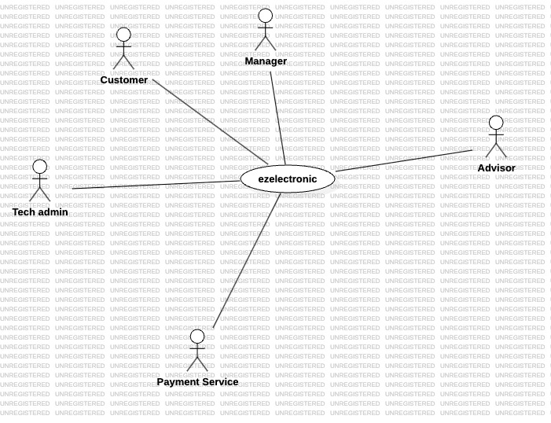
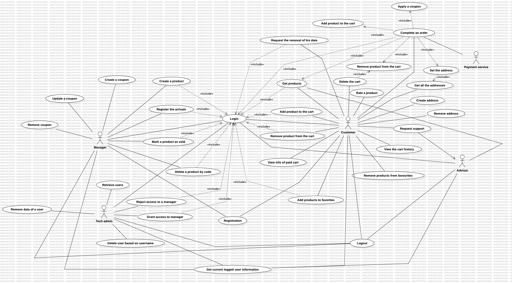
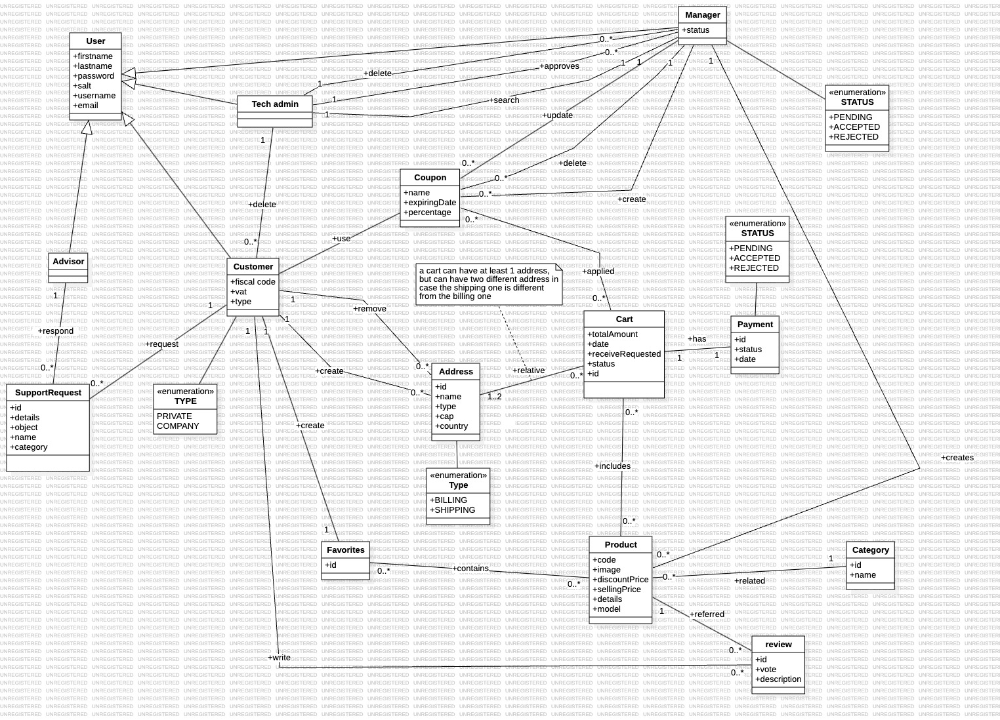

---
runme:
  id: 01HVX8PYR7B6VF6EBDX5M75D55
  version: v3
---

# Requirements Document - future EZElectronics

Date:

Version: V1 - description of EZElectronics in FUTURE form (as proposed by the team)

| Version number | Change |
| :------------: | :----: |
|                |        |

# Contents

- [Requirements Document - future EZElectronics](#requirements-document---future-ezelectronics)
- [Contents](#contents)
- [Informal description](#informal-description)
- [Stakeholders](#stakeholders)
- [Context Diagram and interfaces](#context-diagram-and-interfaces)

   - [Context Diagram](#context-diagram)
   - [Interfaces](#interfaces)

- [Stories and personas](#stories-and-personas)
- [Functional and non functional requirements](#functional-and-non-functional-requirements)

   - [Functional Requirements](#functional-requirements)
   - [Non Functional Requirements](#non-functional-requirements)

- [Use case diagram and use cases](#use-case-diagram-and-use-cases)

   - [Use case diagram](#use-case-diagram)
      - [Use case 1, UC1](#use-case-1-uc1---login)
      - [Use case 2, UC2](#use-case-2-uc2---registration)
      - [Use case 3, UC2](#use-case-3-uc3---create-product)
      - [Use case 4, UC2](#use-case-4-uc4---delete-product-by-code)
      - [Use case 5, UC2](#use-case-5-uc5---mark-a-product-as-sold)
      - [Use case 6, UC2](#use-case-6-uc6---register-the-arrivals)
      - [Use case 7, UC2](#use-case-7-uc7---view-the-carts-history)
      - [Use case 8, UC2](#use-case-8-uc8---complete-the-order)
      - [Use case 9, UC9](#use-case-9-uc9---get-the-products)
      - [Use case 10, UC10 - Logout](#use-case-10-uc10---logout)

- [Glossary](#glossary)
- [System Design](#system-design)
- [Deployment Diagram](#deployment-diagram)

# Informal description

EZElectronics (pronounced EaSy Electronics) is a versatile software application tailored to assist managers of electronics stores in efficiently managing their product inventory and facilitating seamless customer transactions via a dedicated website. With support for multiple user roles, including managers and customers, EZElectronics offers a comprehensive suite of features to enhance the retail experience.
For managers, EZElectronics provides a robust array of functionalities, including effortless access to and evaluation of available products, seamless addition of new items to the inventory, streamlined management of purchases and transactions, and the generation of detailed invoices for completed transactions. Moreover, EZElectronics ensures compliance with GDPR regulations by offering users the option to request the deletion of their data, thereby prioritizing data privacy and security.
Tech Admins play a pivotal role in maintaining a trustworthy website environment. They oversee the acceptance of new managers and verify their identities to ensure the integrity of the platform. Additionally, Tech Admins manage user accounts, ensuring that only authorized individuals have access to sensitive information, thus fostering a secure online environment for both managers and customers.
Customers, on the other hand, are treated to a user-friendly interface packed with features designed to enhance their shopping experience. From browsing through a curated list of available products to adding desired items to a personalized cart for easy checkout, EZElectronics makes shopping a breeze. Customers can also conveniently view their purchase history for reference, curate a list of favorite products for quick access, and provide valuable feedback through the product rating system. Additionally, online advisors are available to assist registered customers with personalized advice, helping them choose the best items to suit their needs. With their expert guidance, customers can make informed purchasing decisions, ensuring a satisfying shopping experience every time.
With EZElectronics, both managers and customers can enjoy a streamlined and intuitive platform tailored to meet their specific needs while adhering to regulatory standards such as GDPR. Whether you're managing an electronics store, overseeing website integrity as a Tech Admin, or seeking expert advice from an online advisor, EZElectronics has got you covered, providing a seamless and enjoyable experience for all.

# Stakeholders

| Stakeholder name | Description |
| :--------------: | :---------: |
| Customer  | Type of user of the system who can see available products, add them to a cart and see the history of their past purchases. He can also rate the products ordered |
| Manager   | Type of user of the system who manage their products and offer them to customers             |
| Tech admin | Type of user that cannot be created through the website - accept the managers |
| Payment service | A payment service refers to a platform, system, or provider that facilitates the transfer of funds between individuals, businesses, or entities. |
| Delivery service | A delivery service is a business or organization that provides transportation and logistics solutions for the movement of goods from one location to another.  |
| Competitor | An individual, group, company, or entity that operates within the same market or industry, with the aim of achieving similar goals, such as gaining market share, attracting customers, or generating revenue. |
| Government | A system or organization that has the authority to establish and enforce laws, regulations, and policies within a specific geographic area or jurisdiction. |
| Online advisor | A person who answers to users who want to have electronics advice|

# Context Diagram and interfaces

## Context Diagram

## Interfaces

|   Actor   | Logical Interface | Physical Interface |
| :-------: | :---------------: | :----------------: |
| Customer   | GUI                  |   PC, Smartphone, Tablet                |
| Manager   | GUI                  |   PC, Smartphone, Tablet                 |
| Admin    | GUI  |   PC, Smartphone, Tablet                 |
| Payment service | Internet | Documentation paypal api https://developer.paypal.com/api/rest/ |
| Advisor   | GUI                  |   PC, Smartphone, Tablet                |

# Stories and personas

#### Chiara - Store Manager

Chiara want to effortlessly access and evaluate available products, seamlessly add new items to her inventory, and generate detailed invoices for completed transactions with just a few clicks. She would appreciate the feature of data privacy and security. The option to request the deletion of customer data ensured compliance with GDPR regulations, giving her peace of mind knowing that her customers' information will be safe.

#### Nacim - Tech Admin

Nacim would like to handle the acceptance of new managers, verifying their identities to uphold the platform's integrity. Managing user accounts and ensuring that only authorized individuals had access to sensitive information would be top priorities for Nacim. By fostering a secure online environment, Nacim will ensure that both managers and customers could trust EZElectronics with their data.

#### Andrea - Tech-Savvy Customer

Andrea is always on the lookout for the latest gadgets and electronics. He would like to easily find the gadgets he'd been eyeing just browsing through the platform's curated list of products.
Andrea want to add items to his cart and proceed to checkout easily. He would appreciate the option to add items to a personalized favorite list and receive personalized advice from online advisors. Whenever he will have doubts about which product to choose, he would like to rely on their expertise to make informed decisions.

#### Gabor - Online Advisor

Gabor is an electronics enthusiast and would like to turn his passion into a job. As an online advisor for EZElectronics, Gabor's role will be to provide personalized advice to registered customers, helping them choose the best items to suit their needs.
Every day, Gabor will interact with customers, offering recommendations based on their preferences, budget, and intended use for the product.

# Functional and non functional requirements

## Functional Requirements

|  ID    | Description |
| :---:  | :---------: |
|  FR1   | Authentication & Authorization|
|  FR1.1 | Allows login for a user with the provided credentials.            |
|  FR1.2 | Allows to create a new user with the provided credentials.            |
|  FR1.2.1 | Allows to create a new customer with the provided credentials.            |
|  FR1.2.2 | Allows to create a new manager with the provided credentials.            |
|  FR1.2.3 | Sends a key to verify the email            |
| FR1.2.4 | Email verification |
|  FR1.3 | Performs logout for the currently logged in user.            |
|  FR1.4 | Retrieves information about the currently logged in user.            |
|  F2    | Manage products|
|  F2.1  | Create a product |
|  F2.2  | Get all products |
|  F2.3  | Set a product as sold |
|  F2.4  | Get products based on a specific attribute
|  F2.4.1 | Get products based on a specific code |
|  F2.4.2 | Get products based on a specific category |
|  F2.4.2.1 | Get sold products based on a specific category  |
|  F2.4.2.2 | Get not sold products based on a specific category  |
|  F2.4.3 | Get products based on a specific model |
|  F2.4.3.1 | Get sold products based on a specific model  |
|  F2.4.3.2 | Get not sold products based on a specific model  |
|  F2.5 | Registers the arrival of a set of products of the same model. |
|  F2.6  | Delete a specific product based on a code|
|  F3    | Manage carts |
|  F3.2  | Add product to the cart of a logged user |
|  F3.3  | Get paid carts history of a logged users |
|  F3.4  | Remove a product from the cart passing its ID |
|  F3.5  | Delete the current cart of the logged user |
|  F3.6  | Cart Checkout |
|  F3.6.1  | Pay for the current cart using Paypal|
|  F3.7 | View info of a paid cart |
| F3.8 | Set an address for the current cart |
| F3.8.1 | Set a billing address |
| F3.8.2 | Set a shipping address |
|  F4    | Rate a paid product |
|  F5  | Handle the list of favorites |
| F5.1 | Add a product to the list |
| F5.2 | Remove a product to the list |
|  F6 | Request support |
|  F6.1    | Sending back to a FAQ page for technical support|
| F6.2 | Send message to request technical support |
| F7 | Manage users |
|  F7.1 | Retrieve all users |
|  F7.2 | Retrieve a user based on a specific username |
|  F7.3 | Retrieve all users based on a specific role |
|  F7.4 | Delete a specific user based on his username |
|  F7.5 | Approve a manager |
|  F7.6 | Reject a manager |
| F7.7 | Remove data of a specific user |
| F8 | Manage address |
| F8.1 | Creation of an address |
| F8.2 | Remove an address |
| F8.3 | Retrieve an address by ID |
| F8.4 | Retrieve an address by username |
| F8.5 | Retrieve an address by type and username |
| F9 | Manage coupon | 
| F9.1 | Creation of a coupon |
| F9.2 | Updating a coupon | 
| F9.3 | Remove a coupon | 
| F9.4 | Apply a coupon to a cart | 

## Non Functional Requirements

|   ID    | Type (efficiency, reliability, ..) | Description | Refers to |
| :-----: | :--------------------------------: | :---------: | :-------: |
|  NFR1   |    Usability | Customer, tech admin and advisor should be able to learn how to use the website in 10 minutes. Manager should be able to learn how to use the website in 30 minutes. The system must meet accessabilty guidelines.  | All FR  |
|  NFR2   |    Efficiency |  All functions on the website must be completed in <0.1 sec for all the functionalities and 0.5 for the payments            |   All FR         |
|  NFR3   |    Maintainability  |  To fix a general bugs it should take from 20 to 40 person hours           |  All FR          |
|  NFR4   |    Portability*    | All features should work in all browser - Safari, Chrome, Firefox, Opera and Edge from 5 years ago https://www.stetic.com/market-share/browser/ | All FR |
|  NFR5   |    Security | Password hashed   Authorized access divided for the type of role | FR1 |

# Use case diagram and use cases

## Use case diagram

### Use case 1, UC1 - Login

| Actors Involved  |                      Manager, Customer, Tech Admin, Advisor                                  |
| :--------------: | :------------------------------------------------------------------: |
|   Precondition   | User logs in with username and password  |
|  Post condition  |  A session for the user is created  |
| Nominal Scenario |         User logs in with username and password         |
|     Variants     |                                            |
|    Exceptions    |  username is empty   password is empty     wrong pwd or username  email not confirmed  |

##### Scenario 1.1 - Login

|  Scenario 1.1  |                                                                            | |
| :------------: | :------------------------------------------------------------------------: | :------------: |
|  Precondition  | User must be logged off | |
| Post condition | A session is created  | |
|     Step#      |                                Description user                               | Description system|
|       1        |      User inserts his credential s(username, password)                                         | |
|       2        |                                                                            | System checks the data. Data are correct |
|       3       |                                                                       | FR1.1 Session is created    |

##### Scenario 1.2 - Empty string for username

|  Scenario 1.2 |                                                                            | |
| :------------: | :------------------------------------------------------------------------: | :------------: |
|  Precondition  | User must be logged off | |
| Post condition | A session is not created. Error returned  | |
|     Step#      |                                Description user                               | Description system|
|       1        |      User inserts the password                                       | |
|       2        |                                                                            | System checks the data. Username is empty |
|       3        |                                                                       |  Return an error. No session is created   |

##### Scenario 1.3 - Empty string for password

|  Scenario 1.3 |                                                                            | |
| :------------: | :------------------------------------------------------------------------: | :------------: |
|  Precondition  | User must be logged off | |
| Post condition | A session is not created. Error returned  | |
|     Step#      |                                Description user                               | Description system|
|       1        |      User inserts the username                                      | |
|       2        |                                                                            | System checks the data. Password is empty |
|       3        |                                                                       |  Return an error. No session is created   |

##### Scenario 1.4 - Wrong credentials

|  Scenario 1.4 |                                                                            | |
| :------------: | :------------------------------------------------------------------------: | :------------: |
|  Precondition  | User must be logged off | |
| Post condition | A session is not created. Error returned  | |
|     Step#      |                                Description user                               | Description system|
|       1        |      User inserts the credentials (username, password)                                       | |
|       2        |                                                                            | System checks the data. Username represents a non-existing user or the  password is wrong |
|       3        |                                                                       |  Return an error. No session is created   |

### Use case 2, UC2 - Registration

| Actors Involved  |                      Manager, Customer                                   |
| :--------------: | :------------------------------------------------------------------: |
|   Precondition   |  User doesn't have an account in the system |
|  Post condition  |  An account is created for a user  |
| Nominal Scenario |         Customer registration         |
|     Variants     |                      Manager registration                   |
|    Exceptions    | username represents a user that is already in the database     name,surname, password, role are null     Role is not one between Manager and Customer    Email is not verified     User is already registered with the same email   Type must be one between Private and Company|

##### Scenario 2.1 - Customer Registration

|  Scenario 2.1  |                                                                            | |
| :------------: | :------------------------------------------------------------------------: | :------------: |
|  Precondition  | User doesn't have an account in the system. User is customer | |
| Post condition | An account is created for a customer  | |
|     Step#      |                                Description user                               | Description system|
|       1        |      A user fills username, name, surname, password, role and type                                                 | |
|       2        |                                                                            | System checks the data. Data are correct |
| 3 | |FR1.2.3 - System sends verification email with a key|
| 4 | User resends the key | |
| 5 | |FR1.2.4 - Email is verified|
| 6 | |FR1.2.1 An account is created for the customer|
|       7      |                       |  Return code 200    |

##### Scenario 2.2 - Manager Registration

|  Scenario 2.2  |                                                                            | |
| :------------: | :------------------------------------------------------------------------: | :------------: |
|  Precondition  | User doesn't have an account in the system. User is manager | |
| Post condition | An account is created for the manager | |
|     Step#      |                                Description user                               | Description system|
|       1        |       A user fills username, name, surname, password, role and type                                                 | |
|       2        |                                                                            | System checks the data. Data are correct |
| 3 | | F1.2.3 - System sends verification email with a key|
| 4 | User resends the key | |
| 5 | |FR1.2.4 - Email is verified|
| 6 | |FR1.2.2 An account is created for the manager|
|       7      |                       |  Return code 200    |

##### Scenario 2.3 - Username already exists

|  Scenario 2.3  |                                                                            | |
| :------------: | :------------------------------------------------------------------------: | :------------: |
|  Precondition  | User doesn't have an account in the system | |
| Post condition | An account is not created. Error returned  | |
|     Step#      |                                Description user                               | Description system|
|       1        |       A user fills username, name, surname, password, role and type                                                            | |
|       2        |                                                                            | System checks the data. Username already exists |
|       3        |                                                                       |  Return error 409    |

##### Scenario 2.4 - Null parameters (username, name, surname password)

|  Scenario 2.4 |                                                                            | |
| :------------: | :------------------------------------------------------------------------: | :------------: |
|  Precondition  | User doesn't have an account in the system | |
| Post condition | An account is not created. Error returned  | |
|     Step#      |                                Description user                               | Description system|
|       1        |      A user fills username, name, surname, password, role and type                                                             | |
|       2        |                                                                            | System checks the data. Username or name or surname or password are empty |
|       3        |                                                                       |  Return error     |

##### Scenario 2.5 - Non-existing role

|  Scenario 2.5 |                                                                            | |
| :------------: | :------------------------------------------------------------------------: | :------------: |
|  Precondition  | User doesn't have an account in the system | |
| Post condition | An account is not created. Error returned  | |
|     Step#      |                                Description user                               | Description system|
|       1        |       A user fills username, name, surname, password, role and type                                                          | |
|       2        |                                                                            | System checks the data. Role is not one of the admitted: "Manager", "Customer" |
|       3        |                                                                       |  Return error     |

##### Scenario 2.6 - Email not confirmed

|  Scenario 2.6 |                                                                            | |
| :------------: | :------------------------------------------------------------------------: | :------------: |
|  Precondition  | User doesn't have an account in the system | |
| Post condition | An account is not created. Error returned  | |
|     Step#      |                                Description user                               | Description system|
|       1        |      A user fills username, name, surname, password, role and type                                                 | |
|       2        |                                                                            | System checks the data.  Data are correct |
| 3 | |System sends verification email with a key|
| 4 | User does not resend the key | |
| 5 | |Email is not verified|
| 6 | |Return error|

##### Scenario 2.7 - User is already registered with the same email

|  Scenario 2.7 |                                                                            | |
| :------------: | :------------------------------------------------------------------------: | :------------: |
|  Precondition  | User doesn't have an account in the system | |
| Post condition | An account is not created. Error returned  | |
|     Step#      |                                Description user                               | Description system|
|       1        |      A user fills username, name, surname, password, role and type                                    | |
|       2        |                                                                            | System checks the data.  Email is already registered |
| 3 | |Account is  not created|
| 4 |  | Return error |

##### Scenario 2.8 - Type must be private or company

|  Scenario 2.8 |                                                                            | |
| :------------: | :------------------------------------------------------------------------: | :------------: |
|  Precondition  | User doesn't have an account in the system | |
| Post condition | An account is not created. Error returned  | |
|     Step#      |                                Description user                               | Description system|
|       1        |      A user fills username, name, surname, password, role and type              | |
|       2        |                                                                            | System checks the data. The type of user selected is not one of private or company  |
| 3 | |Account is  not created|
| 4 |  | Return error |

### Use case 3, UC3 - Create Product

| Actors Involved   |  Manager                                                                    |
| :--------------: | :------------------------------------------------------------------: |
|   Precondition   | User must be logged in, User must be a manager |
|  Post condition  |  Product is created  |
| Nominal Scenario |         Creation of the product         |
| Variants |                       |
|    Exceptions    |  The product already exists    code is empty   code is less than 6 characters     sellingPrice is not a number  selling price is not greater than 0   model is empty    category is not one of "Smartphone", "Laptop", "Appliance"   arrival date is present and is not in the right format YYYY-MM-DD   arrivalDate is after the current date |

##### Scenario 3.1 - Creation of the product

|  Scenario 3.1  |                                                                            | |
| :------------: | :------------------------------------------------------------------------: | :------------: |
|  Precondition  | User must be logged in, User must be a manager  | |
| Post condition |  Product is created   | |
|     Step#      |                                Description user                               | Description system|
|       1        |      Manager fills the data product (code, sellingPrice, model, category, discountPrice, arrivalDate, sellingDate, details)                                       | |
|       2        |                                                                            | System checks the data. Data are correct |
|       3        |                                                                       | FR2.1 - Product is created    |
|  4 | | Return the code of the product|

##### Scenario 3.2 - Product already existing

|  Scenario 3.2  |                                                                            | |
| :------------: | :------------------------------------------------------------------------: | :------------: |
|  Precondition  | User must be logged in, User must be a manager  | |
| Post condition |  Product is not created. Error returned   | |
|     Step#      |                                Description user                               | Description system|
|       1        |      Manager fills the data product (code, sellingPrice, model, category, arrivalDate, sellingDate, discountPrice details)                                           | |
|       2        |                                                                            | System checks the data. Code already exists |
|       3        |                                                                       |  Return error 409    |

##### Scenario 3.3 - Code is empty

|  Scenario 3.3  |                                                                            | |
| :------------: | :------------------------------------------------------------------------: | :------------: |
|  Precondition  | Manager must be logged in, User must be a manager  | |
| Post condition |  Product is not created. Error returned   | |
|     Step#      |                                Description user                               | Description system|
|       1        |      Manager fills the data product                         | |
|       2        |                                                                            | System checks the data. Code is empty |
|       3        |                                                                       |  Return error 409    |

##### Scenario 3.4 - arrival date is present and is not in the right format YYYY-MM-DD

|  Scenario 3.4  |                                                                            | |
| :------------: | :------------------------------------------------------------------------: | :------------: |
|  Precondition  | Manager must be logged in, User must be a manager  | |
| Post condition |  Product is created   | |
|     Step#      |                                Description user                               | Description system|
|       1        |      Manager fills the data product                                            | |
|       2        |                                                                            | System checks the data. Arrival date is not in the right format YYYY-MM-DD|
|       3        |                                                                       |  Return error 409    |

##### Scenario 3.5 - Code is less than 6 characters

|  Scenario 3.5  |                                                                            | |
| :------------: | :------------------------------------------------------------------------: | :------------: |
|  Precondition  | Manager must be logged in, User must be a manager  | |
| Post condition |  Product is not created. Error returned   | |
|     Step#      |                                Description user                               | Description system|
|       1        |      Manager fills the data product.        | |
|       2        |                                                                            | System checks the data. Code is less than 6 characters |
|       3        |                                                                       |  Return error 409    |

##### Scenario 3.6 - sellingPrice is not a number

|  Scenario 3.6  |                                                                            | |
| :------------: | :------------------------------------------------------------------------: | :------------: |
|  Precondition  | Manager must be logged in, User must be a manager  | |
| Post condition |  Product is not created. Error returned   | |
|     Step#      |                                Description user                               | Description system|
|       1        |      Manager fills the data product                                          | |
|       2        |                                                                            | System checks the data. sellingPrice is not a number |
|       3        |                                                                       |  Return error 409    |

##### Scenario 3.7 - model is empty

|  Scenario 3.7  |                                                                            | |
| :------------: | :------------------------------------------------------------------------: | :------------: |
|  Precondition  | Manager must be logged in, User must be a manager  | |
| Post condition |  Product is not created. Error returned   | |
|     Step#      |                                Description user                               | Description system|
|       1        |      Manager fills the data product                                            | |
|       2        |                                                                            | System checks the data. Model is empty |
|       3        |                                                                       |  Return error 409    |

##### Scenario 3.8 -  selling price is not greater than 0

|  Scenario 3.8  |                                                                            | |
| :------------: | :------------------------------------------------------------------------: | :------------: |
|  Precondition  | Manager must be logged in, User must be a manager  | |
| Post condition |  Product is not created. Error returned   | |
|     Step#      |                                Description user                               | Description system|
|       1        |      Manager fills the data product                           | |
|       2        |                                                                            | System checks the data.  selling price is not greater than 0 |
|       3        |                                                                       |  Return error 409    |

##### Scenario 3.9 -  category is not one of "Smartphone", "Laptop", "Appliance"

|  Scenario 3.9  |                                                                            | |
| :------------: | :------------------------------------------------------------------------: | :------------: |
|  Precondition  | Manager must be logged in, User must be a manager  | |
| Post condition |  Product is not created. Error returned   | |
|     Step#      |                                Description user                               | Description system|
|       1        |      Manager fills the data product                           | |
|       2        |                                                                            | System checks the data.  category is not one of "Smartphone", "Laptop", "Appliance" |
|       3        |                                                                       |  Return error 409    |

##### Scenario 3.10 - Arrival date is after the current date

|  Scenario 3.10  |                                                                            | |
| :------------: | :------------------------------------------------------------------------: | :------------: |
|  Precondition  | Manager must be logged in, User must be a manager  | |
| Post condition |  Product is not created. Error returned  | |
|     Step#      |                                Description user                               | Description system|
|       1        |      Manager fills the data product (quantity sellingPrice, model, category, arrivalDate, sellingDate, details)                                           | |
|       2        |                                                                            | System checks the data. Arrival date is after the current date |
|       3        |                                                                       |  Return error |

### Use case 4, UC4 - Deleting product by code

| Actors Involved  |              Manager                                           |
| :--------------: | :------------------------------------------------------------------: |
|   Precondition   | User must be logged in, User must be a manager |
|  Post condition  | Product deleted |
| Nominal Scenario |         Remove product by code      |
|     Variants     |                                     |
|    Exceptions    | The code does not represent a product in the database                      |

##### Scenario 4.1 - Product removal

|  Scenario 4.1  |                                                                            | |
| :------------: | :------------------------------------------------------------------------: | :------------: |
|  Precondition  | Manager must be logged in, User must be a manager  | |
| Post condition |  Product removed   | |
|     Step#      |                                Description user                               | Description system|
|       1        |      Manager selects the code of the product he wants to delete                               | |
|       2        |                                                                            | System checks the code of the product. The product exists |
|       3        |                                                                       | FR2.6 A product is removed    |
|       3        |                                                                       |  Return code 200    |

##### Scenario 4.2 - Non-existing product removal

|  Scenario 4.2  |                                                                            | |
| :------------: | :------------------------------------------------------------------------: | :------------: |
|  Precondition  | User must be logged in, User must be a manager  | |
| Post condition | Product is not removed. Error returned| |
|     Step#      |                                Description user                               | Description system|
|       1        |      Manager selects the code of the product he wants to delete                              | |
|       2        |                                                                            | System checks the code of the product. The code does not represent a product in the database |
|       3        |                                                                       |  Return error code 404    |

### Use case 5, UC5 - Mark a product as sold

| Actors Involved  |                  Manager                                       |
| :--------------: | :------------------------------------------------------------------: |
|   Precondition   | User must be logged in, User must be a manager|
|  Post condition  |  Product is set sold  |
| Nominal Scenario |         Mark a product as sold     |
|     Variants     |                                        |
|    Exceptions    |  Code does not represent a product in the database   sellingDate is after the current date     sellingDate is before the product's arrivalDate     product is already set as sold                       |

##### Scenario 5.1 - Product marked as sold

|  Scenario 5.1  |                                                                            | |
| :------------: | :------------------------------------------------------------------------: | :------------: |
|  Precondition  | User must be logged in, User must be a manager  | |
| Post condition |  Product marked as sold   | |
|     Step#      |                                Description user                               | Description system|
|       1        |      Manager selects the code of the product to set as sold                               | |
|       2        |                                                                            | System checks the data inserted (code, optional selling date). The product exists. If the date is present the constraints are fulfilled and the product is not already sold |
|       3        |                                                                       | FR2.3 A product is marked as sold    |
|       4        |                                                                       |  Return code 200    |

##### Scenario 5.2 - Code does not represent a product in the database

|  Scenario 5.2  |                                                                            | |
| :------------: | :------------------------------------------------------------------------: | :------------: |
|  Precondition  | User must be logged in, User must be a manager  | |
| Post condition |  Product is not set as sold. Error returned   | |
|     Step#      |                                Description user                               | Description system|
|       1        |      Manager selects the code of the product to set as sold                               | |
|       2        |                                                                            | System checks the code of the product. The code does not represent a product in the database |
|       3        |                                                                       |  Return error code    |

##### Scenario 5.3 - sellingDate is before the product's arrivalDate

|  Scenario 5.3  |                                                                            | |
| :------------: | :------------------------------------------------------------------------: | :------------: |
|  Precondition  | User must be logged in, User must be a manager  | |
| Post condition |  Product is not set as sold. Error returned   | |
|     Step#      |                                Description user                               | Description system|
|       1        |      Manager selects the code of the product to set as sold and adds the selling date                               | |
|       2        |                                                                            | System checks the code of the product, the date constraints are not fulfilled. sellingDate is before the product's arrivalDate  |
|       3        |                                                                       |  Return error code    |

##### Scenario 5.4 - sellingDate is after the current date

|  Scenario 5.4  |                                                                            | |
| :------------: | :------------------------------------------------------------------------: | :------------: |
|  Precondition  | User must be logged in, User must be a manager  | |
| Post condition |  Product is not set as sold. Error returned   | |
|     Step#      |                                Description user                               | Description system|
|       1        |      Manager selects the code of the product to set as sold and adds the selling date                               | |
|       2        |                                                                            | System checks the code of the product, the date constraints are not fulfilled. Selling date is after the current date  |
|       3        |                                                                       |  Return error code    |

##### Scenario 5.5 - Product is already set as sold

|  Scenario 5.5  |                                                                            | |
| :------------: | :------------------------------------------------------------------------: | :------------: |
|  Precondition  | User must be logged in, User must be a manager  | |
| Post condition |  Product is not set as sold. Error returned   | |
|     Step#      |                                Description user                               | Description system|
|       1        |      Manager selects the code of the product to set as sold                                | |
|       2        |                                                                            | System checks the code of the product. The product exists, but it is already sold. |
|       3        |                                                                       |  Return error code    |

### Use case 6, UC6 - Register the arrivals

| Actors Involved  |       Manager                                                  |
| :--------------: | :------------------------------------------------------------------: |
|   Precondition   |  User must be logged in, User must be a manager|
|  Post condition  |  Arrivals are registered  |
| Nominal Scenario |         Manager register the arrival    |
|     Variants     |                       |
|    Exceptions    | Model is empty     Category must be one of "Smartphone", "Laptop", "Appliance"    Details is empty    Quantity is not greater than 0    sellingPrice is not greater than 0     Arrival date is after the current date|

##### Scenario 6.1 - Arrival registration

|  Scenario 6.1  |                                                                            | |
| :------------: | :------------------------------------------------------------------------: | :------------: |
|  Precondition  | Manager must be logged in, User must be a manager  | |
| Post condition |  Arrival registration is  completed   | |
|     Step#      |                                Description user                               | Description system|
|       1        |      Manager fills the data product (quantity sellingPrice, model, category, arrivalDate, sellingDate, details)                                           | |
|       2        |                                                                            | System checks the data. Data are correct |
|       3        |                                                                       | FR2.5 Arrival registration is completed    |
|       4        |                                                                       |   Return code 200    |

##### Scenario 6.2 - Model is empty

|  Scenario 6.2  |                                                                            | |
| :------------: | :------------------------------------------------------------------------: | :------------: |
|  Precondition  | Manager must be logged in, User must be a manager  | |
| Post condition |  Arrival registration is not completed. Error returned  | |
|     Step#      |                                Description user                               | Description system|
|       1        |      Manager fills the data product (quantity sellingPrice, model, category, arrivalDate, sellingDate, details)                                           | |
|       2        |                                                                            | System checks the data. Model is empty |
|       3        |                                                                       |  Return error   |

##### Scenario 6.3 - Category must be one of "Smartphone", "Laptop", "Appliance"

|  Scenario 6.3  |                                                                            | |
| :------------: | :------------------------------------------------------------------------: | :------------: |
|  Precondition  | Manager must be logged in, User must be a manager  | |
| Post condition |  Arrival registration is not completed. Error returned  | |
|     Step#      |                                Description user                               | Description system|
|       1        |      Manager fills the data product (quantity sellingPrice, model, category, arrivalDate, sellingDate, details)                                           | |
|       2        |                                                                            | System checks the data. Category does not belong to one of "Smartphone", "Laptop", "Appliance" |
|       3        |                                                                       |  Return error   |

##### Scenario 6.4 - Quantity must be greater than 0

|  Scenario 6.4  |                                                                            | |
| :------------: | :------------------------------------------------------------------------: | :------------: |
|  Precondition  | Manager must be logged in, User must be a manager  | |
| Post condition |  Arrival registration is not completed. Error returned  | |
|     Step#      |                                Description user                               | Description system|
|       1        |      Manager fills the data product (quantity sellingPrice, model, category, arrivalDate, sellingDate, details)                                           | |
|       2        |                                                                            | System checks the data. Quantity isn't greater than 0 |
|       3        |                                                                       |  Return error   |

##### Scenario 6.5 - sellingPrice must be greater than 0

|  Scenario 6.5  |                                                                            | |
| :------------: | :------------------------------------------------------------------------: | :------------: |
|  Precondition  | Manager must be logged in, User must be a manager  | |
| Post condition |  Arrival registration is not completed. Error returned  | |
|     Step#      |                                Description user                               | Description system|
|       1        |      Manager fills the data product (quantity sellingPrice, model, category, arrivalDate, sellingDate, details)                                           | |
|       2        |                                                                            | System checks the data. sellingPrice isn't greater than 0 |
|       3        |                                                                       |  Return error   |

##### Scenario 6.6 - Arrival date is after the current date

|  Scenario 6.6  |                                                                            | |
| :------------: | :------------------------------------------------------------------------: | :------------: |
|  Precondition  | Manager must be logged in, User must be a manager  | |
| Post condition |  Arrival registration is not completed. Error returned  | |
|     Step#      |                                Description user                               | Description system|
|       1        |      Manager fills the data product (quantity sellingPrice, model, category, arrivalDate, sellingDate, details)                                           | |
|       2        |                                                                            | System checks the data. Arrival date is after the current date |
|       3        |                                                                       |  Return error   |

### Use case 7, UC7 - View the carts history

| Actors Involved  |              Customer                                           |
| :--------------: | :------------------------------------------------------------------: |
|   Precondition   | User must be logged in, User must be a customer |
|  Post condition  | User get the carts |
| Nominal Scenario |         Get cart of the logged in user      |
|     Variants     |         No carts                            |
|    Exceptions    |                    |

##### Scenario 7.1 - Customer sees the paid carts history

|  Scenario 7.1  |                                                                            | |
| :------------: | :------------------------------------------------------------------------: | :------------: |
|  Precondition  | User must be logged in, User must be a customer  | |
| Post condition |  Customer sees the paid carts  | |
|     Step#      |                                Description user                               | Description system|
|       1        |      Customer requests the list of the carts                      | |
|       2        |                                                                            | FR3.3 System returns the list of the carts that have been paid for  |

##### Scenario 7.2 - Customer sees an empty list

|  Scenario 7.2  |                                                                            | |
| :------------: | :------------------------------------------------------------------------: | :------------: |
|  Precondition  | User must be logged in, User must be a customer  | |
| Post condition |  Customer sees an empty list  | |
|     Step#      |                                Description user                               | Description system|
|       1        |      Customer requests the list of the carts                      | |
|       2        |                                                                   | FR3.3 - System gets the list of the carts. The list is empty |
|       3        |                                                                   |  Return code 200    |

### Use case 8, UC8 - Complete an order

| Actors Involved  |              Customer                                           |
| :--------------: | :------------------------------------------------------------------: |
|   Precondition   | User must be logged in, User must be a customer |
|  Post condition  | User completed the order |
| Nominal Scenario | User completed the order  |
|     Variants     | User removes the product from the cart  User gets the product based on the code    User gets all the products based on the model    User gets all the products based on the model and set sold as "no"     User gets all the product based on the category    User gets all the products based on the category and set sold as "no"   User does not have the billing address   User does not have the shipping address   User apply a discount code   User apply a not valid discount code|
|    Exceptions    | Code does not represent an existing product   Code represents a product that is already in another cart    Code represents a product that has already been sold   the category is not one of "Smartphone", "Laptop", "Appliance"   the model is empty    The cart is empty   The cart does not exists   Payment service client error    Payment service server error  |

##### Scenario 8.1 - Complete the order

|  Scenario 8.1  |                                                                            | |
| :------------: | :------------------------------------------------------------------------: | :------------: |
|  Precondition  | User must be logged in, User must be a customer  | |
| Post condition | Order completed  | |
|     Step#      |                                Description user                               | Description system|
|       1        |   User wants to buy a product        | |
|       2        |   User searches for all the products                                                                     | |
| 3 | | F2.4 - System gets all the products
| 4 | User selects a product |
| 5 ||  FR3.2 - System adds the product to the cart
| 6 ||  FR8.5 - System gets all the billing address of current user |
| 7 | User choose the billing address | |
| 8 | | FR3.8 - System sets the billing address |
| 9 ||  FR8.5 - System gets all the shipping address of current user |
| 10 | User chooses the shipping address | |
| 11 | | FR3.8 - System sets the shipping address |
| 12 | User pays the order | |
| 13 || F3.6.1 - Pay the for current cart using paypal. Payment complete |
| 14 || F3.6 - Cart checkout |
| 15 || Return the information of the last paid cart |

##### Scenario 8.2 - User removes the product from the cart

|  Scenario 8.2  |                                                                            | |
| :------------: | :------------------------------------------------------------------------: | :------------: |
|  Precondition  | User must be logged in, User must be a logged user  | |
| Post condition | Order completed  | |
|     Step#      |                                Description user                               | Description system|
|       1        |   User wants to buy a product        | |
|       2        |   User searches for the products based on model                                                                         | |
| 3 | | F2.4.3 - System gets the products based on model
| 4 | User selects a product |
| 5 ||  FR3.2 - System adds the product to the cart
| 6 | User decides to remove a product |
| 7 | | FR3.4 - System removes the product from the cart

##### Scenario 8.3 - User selects the unsold products based on the category

|  Scenario 8.3  |                                                                            | |
| :------------: | :------------------------------------------------------------------------: | :------------: |
|  Precondition  | User must be logged in, User must be a customer  | |
| Post condition | Order completed | |
|     Step#      |                                Description user                               | Description system|
|       1        |   User wants to buy a product        | |
|       2        |   User searches for the products based on the category                                                                         | |
| 3 | | F2.4.2.2 - System gets the unsold products based on category
| 4 | User selects a product |
| 5 ||  FR3.2 - System add the product to the cart
| 6 ||  FR8.5 - System gets all the billing address of current user |
| 7 | User choose the billing address | |
| 8 | | FR3.8 - System sets the billing address |
| 9 ||  FR8.5 - System gets all the shipping address of current user |
| 10 | User chooses the shipping address | |
| 11 | | FR3.8 - System sets the shipping address |
| 12 | User pays the order | |
| 13 || F3.6.1 - Pay the for current cart using paypal. Payment complete |
| 14 || F3.6 - Cart checkout |
| 15 || Return the information of the last paid cart |

##### Scenario 8.4 - User selects the products based on the code

|  Scenario 8.4  |                                                                            | |
| :------------: | :------------------------------------------------------------------------: | :------------: |
|  Precondition  | User must be logged in, User must be a customer  | |
| Post condition | Order completed | |
|     Step#      |                                Description user                               | Description system|
|       1        |   User wants to buy a product        | |
|       2        |   User searches for the products based on the code                                                                         | |
| 3 | | F2.4.1 - System gets the products based on code
| 4 | User selects a product |
| 5 ||  FR3.2 - System adds the product to the cart
| 6 ||  FR8.5 - System gets all the billing address of current user |
| 7 | User choose the billing address | |
| 8 | | FR3.8 - System sets the billing address |
| 9 ||  FR8.5 - System gets all the shipping address of current user |
| 10 | User chooses the shipping address | |
| 11 | | FR3.8 - System sets the shipping address |
| 12 | User pays the order | |
| 13 || F3.6.1 - Pay the for current cart using paypal. Payment complete |
| 14 || F3.6 - Cart checkout |
| 15 || Return the information of the last paid cart |

##### Scenario 8.5 - User selects the unsold products based on the model

|  Scenario 8.5  |                                                                            | |
| :------------: | :------------------------------------------------------------------------: | :------------: |
|  Precondition  | User must be logged in, User must be a customer  | |
| Post condition | Order completed | |
|     Step#      |                                Description user                               | Description system|
|       1        |   User wants to buy a product        | |
|       2        |   User searches for the unsold products based on the model                                                                         | |
| 3 | | F2.4.3.2 - System gets the unsold products based on model
| 4 | User selects a product |
| 5 ||  FR3.2 - System add the product to the cart
| 6 ||  FR8.5 - System gets all the billing address of current user |
| 7 | User choose the billing address | |
| 8 | | FR3.8 - System sets the billing address |
| 9 ||  FR8.5 - System gets all the shipping address of current user |
| 10 | User chooses the shipping address | |
| 11 | | FR3.8 - System sets the shipping address |
| 12 | User pays the order | |
| 13 || F3.6.1 - Pay the for current cart using paypal. Payment complete |
| 14 || F3.6 - Cart checkout |
| 15 || Return the information of the last paid cart |

##### Scenario 8.6 - Code does not represent a product in the database

|  Scenario 8.6  |                                                                            | |
| :------------: | :------------------------------------------------------------------------: | :------------: |
|  Precondition  | User must be logged in,  User must be a customer | |
| Post condition | Return an error  | |
|     Step#      |                                Description user                               | Description system|
|       1        |   User wants to buy a product        | |
|       2        |   User searches for the product based on the code  
|       3       |                                                                            | System checks the data. Code does not represent a product in the database  |
| 3 | | Return error

##### Scenario 8.7 - Code represents a product in another cart

|  Scenario 8.7  |                                                                            | |
| :------------: | :------------------------------------------------------------------------: | :------------: |
|  Precondition  | User must be logged in, User must be a customer  | |
| Post condition | Return an error  | |
|     Step#      |                                Description user                               | Description system|
|       1        |   The user select a product          | |
|       2        |                                                                            | System checks the data. Code of the product represents a product in another cart  |
| 3 | | Return error

##### Scenario 8.8 - Category error

|  Scenario 8.8  |                                                                            | |
| :------------: | :------------------------------------------------------------------------: | :------------: |
|  Precondition  | User must be logged in,  User must be a customer  | |
| Post condition | Return an error  | |
|     Step#      |                                Description user                               | Description system|
|       1        |   The user select the category he want          | |
|       2        |                                                                            | System checks the data. The category is not one of the admitted  |
| 3 | | Return error

##### Scenario 8.9 - Model error

|  Scenario 8.9  |                                                                            | |
| :------------: | :------------------------------------------------------------------------: | :------------: |
|  Precondition  | User must be logged in,  User must be a customer  | |
| Post condition | Return an error  | |
|     Step#      |                                Description user                               | Description system|
|       1        |   The user select the model he wants         | |
|       2        |                                                                            | System checks the data. The model does not exist  |
| 3 | | Return error

##### Scenario 8.10 - The cart is empty

|  Scenario 8.10  |                                                                            | |
| :------------: | :------------------------------------------------------------------------: | :------------: |
|  Precondition  | User must be logged in,  User must be a customer  | |
| Post condition | Return an error  | |
|     Step#      |                                Description user                               | Description system|
|       1        |   The user want to complete the order       | |
|       2        |                                     | System checks the cart. Cart is empty |
| 3 | | Return error

##### Scenario 8.11 - The cart does not exist

|  Scenario 8.11  |                                                                            | |
| :------------: | :------------------------------------------------------------------------: | :------------: |
|  Precondition  | User must be logged in,  User must be a customer  | |
| Post condition | Return an error  | |
|     Step#      |                                Description user                               | Description system|
|       1        |   The user want to complete the order       | |
|       2        |                                     | System checks the cart. The cart does not exist |
| 3 | | Return error

##### Scenario 8.12 - User does not have a billing address

|  Scenario 8.12 |                                                                            | |
| :------------: | :------------------------------------------------------------------------: | :------------: |
|  Precondition  | User must be logged in, User must be a customer  | |
| Post condition | Order completed  | |
|     Step#      |                                Description user                               | Description system|
|       1        |   User wants to buy a product        | |
|       2        |   User searches for all the products                                                                     | |
| 3 | | F2.4 - System gets all the products
| 4 | User selects a product |
| 5 ||  FR3.2 - System adds the product to the cart
| 6 ||  FR8.5 - System gets all the billing address of current user. The list is empty |
| 7 | User create a billing address ||
| 7 || FR8.1 - Creation of a billing address
| 8 || FR3.8.1 - Set the billing address
| 9 ||  FR8.5 - System gets all the shipping address of current user |
| 10 | User chooses the shipping address | |
| 11 | | FR3.8.2 - System sets the shipping address |
| 12 | User pays the order | |
| 13 || F3.6.1 - Pay the for current cart using paypal. Payment complete |
| 14 || F3.6 - Cart checkout |
| 15 || Return the information of the last paid cart |

##### Scenario 8.13 - User does not have a shipping address

|  Scenario 8.13  |                                                                            | |
| :------------: | :------------------------------------------------------------------------: | :------------: |
|  Precondition  | User must be logged in, User must be a customer  | |
| Post condition | Order completed  | |
|     Step#      |                                Description user                               | Description system|
|       1        |   User wants to buy a product        | |
|       2        |   User searches for all the products                                                                     | |
| 3 | | F2.4 - System gets all the products
| 4 | User selects a product |
| 5 ||  FR3.2 - System adds the product to the cart
| 6 ||  FR8.5 - System gets all the billing address of current user |
| 7 | User chooses the billing address | |
| 8 ||  FR8.5 - System gets all the shipping address of current user. The list is empty |
| 9 | User creates the shipping address |
| 10 || FR8.1 - System creates the shipping address |
| 11 || FR3.8.2 - System sets the shipping address |
| 12 | User pays the order | |
| 13 || F3.6.1 - Pay the for current cart using paypal. Payment complete |
| 14 || F3.6 - Cart checkout |
| 15 || Return the information of the last paid cart |

##### Scenario 8.14 - Order not completed due to payment service server error

|  Scenario 8.14  |                                                                            | |
| :------------: | :------------------------------------------------------------------------: | :------------: |
|  Precondition  | User must be logged in, User must be a customer  | |
| Post condition | Order completed  | |
|     Step#      |                                Description user                               | Description system|
|       1        |   User wants to buy a product        | |
|       2        |   User searches for all the products                                                                     | |
| 3 | | F2.4 - System gets all the products
| 4 | User selects a product |
| 5 ||  FR3.2 - System adds the product to the cart
| 6 ||  FR8.5 - System gets all the billing address of current user |
| 7 | User choose the billing address | |
| 8 | | FR3.8.1 - System sets the billing address |
| 9 ||  FR8.5 - System gets all the shipping address of current user |
| 10 | User chooses the shipping address | |
| 11 | | FR3.8.2 - System sets the shipping address |
| 12 | User pays the order | |
| 13 || F3.6.1 - Pay the for current cart using paypal. Server error |
| 14 || Return error

##### Scenario 8.15 - Order not completed due to payment service client error

|  Scenario 8.15  |                                                                            | |
| :------------: | :------------------------------------------------------------------------: | :------------: |
|  Precondition  | User must be logged in, User must be a customer  | |
| Post condition | Order completed  | |
|     Step#      |                                Description user                               | Description system|
|       1        |   User wants to buy a product        | |
|       2        |   User searches for all the products                                                                     | |
| 3 | | F2.4 - System gets all the products
| 4 | User selects a product |
| 5 ||  FR3.2 - System adds the product to the cart
| 6 ||  FR8.5 - System gets all the billing address of current user |
| 7 | User choose the billing address | |
| 8 | | FR3.8.1 - System sets the billing address |
| 9 ||  FR8.5 - System gets all the shipping address of current user |
| 10 | User chooses the shipping address | |
| 11 | | FR3.8.2 - System sets the shipping address |
| 12 | User pays the order | |
| 13 || F3.6.1 - Pay the for current cart using paypal. Payment not complete. Client error |
| 14 || Return error

##### Scenario 8.16 - Apply a discount code

|  Scenario 8.16  |                                                                            | |
| :------------: | :------------------------------------------------------------------------: | :------------: |
|  Precondition  | User must be logged in, User must be a customer  | |
| Post condition | Order completed  | |
|     Step#      |                                Description user                               | Description system|
|       1        |   User wants to buy a product        | |
|       2        |   User searches for all the products                                                                     | |
| 3 | | F2.4 - System gets all the products
| 4 | User selects a product |
| 5 ||  FR3.2 - System adds the product to the cart
| 6 | User apply a code to cart |  |
| 7 || FR9.4 System checks the code. Code is correct. Code applied | 
| 6 ||  FR8.5 - System gets all the billing address of current user |
| 7 | User choose the billing address | |
| 8 | | FR3.8.1 - System sets the billing address |
| 9 ||  FR8.5 - System gets all the shipping address of current user |
| 10 | User chooses the shipping address | |
| 11 | | FR3.8.2 - System sets the shipping address |
| 12 | User pays the order | |
| 13 || F3.6.1 - Pay the for current cart using paypal. Payment complete |
| 14 || F3.6 - Cart checkout |
| 15 || Return the information of the last paid cart |

##### Scenario 8.17 - Apply a wrong discount code

|  Scenario 8.17  |                                                                            | |
| :------------: | :------------------------------------------------------------------------: | :------------: |
|  Precondition  | User must be logged in, User must be a customer  | |
| Post condition | Order completed  | |
|     Step#      |                                Description user                               | Description system|
|       1        |   User wants to buy a product        | |
|       2        |   User searches for all the products                                                                     | |
| 3 | | F2.4 - System gets all the products
| 4 | User selects a product |
| 5 ||  FR3.2 - System adds the product to the cart
| 6 | User apply a code to cart |  |
| 7 | System checks the code. Code is not correct. Code not applied |  |
| 6 ||  FR8.5 - System gets all the billing address of current user |
| 7 | User choose the billing address | |
| 8 | | FR3.8.1 - System sets the billing address |
| 9 ||  FR8.5 - System gets all the shipping address of current user |
| 10 | User chooses the shipping address | |
| 11 | | FR3.8.2 - System sets the shipping address |
| 12 | User pays the order | |
| 13 || F3.6.1 - Pay the for current cart using paypal. Payment complete |
| 14 || F3.6 - Cart checkout |
| 15 || Return the information of the last paid cart |

### Use case 9, UC9 - Get the products

| Actors Involved  |              Customer, Manager, Advisor                                        |
| :--------------: | :------------------------------------------------------------------: |
|   Precondition   | User must be logged in, User must be a Customer or a Manager or an Advisor |
|  Post condition  | User get the products |
| Nominal Scenario | User get the products  |
|     Variants     | User gets the product based on the code   User gets all the products based on the model   User gets all the products based on the model and set sold as "no"   User gets all the products based on the model and set sold as "yes"    User gets all the product based on the category   User gets all the products based on the category and set sold as "no"   User gets all the products based on the category and set sold as "yes"          |
|    Exceptions    | Code does not represent an existing product  Code represents a product that has already been sold   the category is not one of "Smartphone", "Laptop", "Appliance"   the model is empty   The cart is empty  The cart does not exists  |

##### Scenario 9.1 - User searches for the products

|  Scenario 9.1  |                                                                            | |
| :------------: | :------------------------------------------------------------------------: | :------------: |
|  Precondition  | User must be logged in, User must be a Customer or a Manager or an Advisor | |
| Post condition | Return the array of the products | |
|     Step#      |                                Description user                               | Description system|
|       1        |  User searches for all the products                                                                       | |
| 2 | | F2.2 - System gets all the products. Return the array

##### Scenario 9.2 - User searches for a product based on a specific code

|  Scenario 9.2  |                                                                            | |
| :------------: | :------------------------------------------------------------------------: | :------------: |
|  Precondition  | User must be logged in, User must be a Customer or a Manager or an Advisor | |
| Post condition | Return the array of the products | |
|     Step#      |                                Description user                               | Description system|
|       1        |  User searches for a product based on a specific code                                                                        | |
| 2 | | F2.4.1 - System gets the product. Return the product

##### Scenario 9.3 - User searches for the products based on the category

|  Scenario 9.3  |                                                                            | |
| :------------: | :------------------------------------------------------------------------: | :------------: |
|  Precondition  | User must be logged in, User must be a Customer or a Manager or an Advisor | |
| Post condition | Return the array of the products | |
|     Step#      |                                Description user                               | Description system|
|       1        |  User searches for the products based on the category                                                           | |
| 2 | | F2.4.2 - System gets the products. Return the array

##### Scenario 9.4 - User searches for the unsold products base on the category

|  Scenario 9.4  |                                                                            | |
| :------------: | :------------------------------------------------------------------------: | :------------: |
|  Precondition  | User must be logged in, User must be a Customer or a Manager or an Advisor | |
| Post condition | Return the array of the products | |
|     Step#      |                                Description user                               | Description system|
|       1        |  User searches for the unsold products base on the category                                                          | |
| 2 | | F2.4.2.2 - System gets the products. Return the array

##### Scenario 9.5 - User searches for the sold products base on the category

|  Scenario 9.1  |                                                                            | |
| :------------: | :------------------------------------------------------------------------: | :------------: |
|  Precondition  | User must be logged in, User must be a Customer or a Manager or an Advisor | |
| Post condition | Return the array of the products | |
|     Step#      |                                Description user                               | Description system|
|       1        |  - User searches for the sold products base on the category                                                            | |
| 2 | | F2.4.2.1 - System gets all the products. Return the array

##### Scenario 9.6 - User searches for the products based on a specific model

|  Scenario 9.6  |                                                                            | |
| :------------: | :------------------------------------------------------------------------: | :------------: |
|  Precondition  | User must be logged in, User must be a Customer or a Manager or an Advisor | |
| Post condition | Return the array of the products | |
|     Step#      |                                Description user                               | Description system|
|       1        |  User searches for the products based on a specific model                                            | |
| 2 | | F2.4.3 - System gets the products. Return the array

##### Scenario 9.7 - User searches for the unsold products based on a specific model

|  Scenario 9.7  |                                                                            | |
| :------------: | :------------------------------------------------------------------------: | :------------: |
|  Precondition  | User must be logged in, User must be a Customer or a Manager or an Advisor | |
| Post condition | Return the array of the products | |
|     Step#      |                                Description user                               | Description system|
|       1        |  User searches for the unsold products based on a specific model                                                                                 | |
| 2 | | F2.4.3.2 - System gets the products. Return the array

##### Scenario 9.8 - User searches for the sold products based on a specific model

|  Scenario 9.1  |                                                                            | |
| :------------: | :------------------------------------------------------------------------: | :------------: |
|  Precondition  | User must be logged in, User must be a Customer or a Manager or an Advisor | |
| Post condition | Return the array of the products | |
|     Step#      |                                Description user                               | Description system|
|       1        |  User searches for the sold products based on a specific model                                                                                 | |
| 2 | | F2.4.3.1 - System gets all the products. Return the array

### Use case 10, UC10 - Logout

| Actors Involved  |              Customer, Manager, Advisor, Tech admin                                           |
| :--------------: | :------------------------------------------------------------------: |
|   Precondition   | User must be logged in |
|  Post condition  |  |
| Nominal Scenario | User perfoms the logout  |
|     Variants     |  |
|    Exceptions    | |

##### Scenario 10.1 - User performs the logout

|  Scenario 10.1  |                                                                            | |
| :------------: | :------------------------------------------------------------------------: | :------------: |
|  Precondition  | User must be logged in | |
| Post condition |  | |
|     Step#      |                                Description user                               | Description system|
|       1        |  User performs the logout                                                        | |
| 2 | | F1.3 - System logs out

### Use case 11, UC1 - Rate a product

| Actors Involved  |                    Customer                                                  |
| :--------------: | :------------------------------------------------------------------: |
|   Precondition   | User must be logged in. User must be a customer |
|  Post condition  |  A product is rated. |
| Nominal Scenario |  Rate a product  |
|     Variants     |                                        |
|    Exceptions    | Tried to rate a product not ordered  Description is empty  Vote is empty    |

##### Scenario 11.1 - Rating of product

|  Scenario 11.1  |                                                                            | |
| :------------: | :------------------------------------------------------------------------: | :------------: |
|  Precondition  | Customer must be logged in, user must be a customer | |
| Post condition | Product is rated  | |
|     Step#      |                                Description user                               | Description system|
|       1        |      Customer rates a product with a value from 0 to 5 and add a description                                      | |
|       2        |                                                                            | System checks if data are present. Data are inserted correctly. |
|       3       |                                                                            | System checks the customer cart history. The product is inside it. |
|      4       |                                                                       | F4 the product is rated   |
|       5        |                                                                       | return the code    |                                                             |

##### Scenario 11.2 - Tried to rate a product not ordered

|  Scenario 11.2  |                                                                            | |
| :------------: | :------------------------------------------------------------------------: | :------------: |
|  Precondition  | Customer must be logged in, user must be a customer | |
| Post condition |   | |
|     Step#      |                                Description user                               | Description system|
|       1        |      Customer rates a product with a value from 0 to 5 and add a description                                    | |
|       2        |                                                                            | System checks if data are present. Data are inserted correctly. |
|       3        |                                                                            | System checks the customer cart history. The product is not inside it. |
|       4        |                                                                       | return error code    |

##### Scenario 11.3 - Description is empty

|  Scenario 11.3  |                                                                            | |
| :------------: | :------------------------------------------------------------------------: | :------------: |
|  Precondition  | Customer must be logged in, user must be a customer | |
| Post condition |   | |
|     Step#      |                                Description user                               | Description system|
|       1        |      Customer rates a product with a value from 0 to 5 but doesn't add a description                                    | |
|       2        |                                                                            | Systems checks if data are present. The description is empty.  |
|       3        |                                                                       | return error code    |

##### Scenario 11.4 - Vote is empty

|  Scenario 11.4  |                                                                            | |
| :------------: | :------------------------------------------------------------------------: | :------------: |
|  Precondition  | Customer must be logged in, user must be a customer | |
| Post condition |   | |
|     Step#      |                                Description user                               | Description system|
|       1        |      Customer rates a product with a description                                    | |
|       2        |                                                                            | Systems checks if data are present. The vote is empty.  |
|       3        |                                                                       | return error code    |

### Use case 12, UC2 - Request support

| Actors Involved  |     Customer, Shopping consultant                                                                 |
| :--------------: | :------------------------------------------------------------------: |
|   Precondition   | User must be logged in. User must be a customer |
|  Post condition  |  User is helped |
| Nominal Scenario |   Customer wants help, find an answer in the FAQ page |
|     Variants     |                 Customer asks for advice or support with  message                     |
|    Exceptions    |   Customer who asks for support with message do not insert username   Customer who asks for support with  message does not insert category  Customer who asks for support with  message does not insert object  Customer who asks for support with  message does not insert details       |

##### Scenario 12.1 - Customer is helped through the FAQ page

|  Scenario 2.1  |                                                                            | |
| :------------: | :------------------------------------------------------------------------: | :------------: |
|  Precondition  | User must be logged in, user must be a customer | |
| Post condition | User is helped  | |
|     Step#      |                                Description user                               | Description system|
|       1        |      Customer opens the assistance link                                    | |
|       2        |                                                                            |F6.1 System sends back to the FAQ page |
|       3        |                                                                       | return  code   |                                                             |

##### Scenario 12.2 - User sends a message to request support

|  Scenario 12.2  |                                                                            | |
| :------------: | :------------------------------------------------------------------------: | :------------: |
|  Precondition  | User must be logged in, user must be a customer | |
| Post condition |  User sends a message to request support| |
|     Step#      |                                Description user                               | Description system|
|       1        |      Customer opens the link of assistance                                     | |
|       2        |                                                                            | System sends back to the FAQ page |
|       3        |         Customer writes username, category, product and details                                                   |    |
|       4        |                                                                      | System checks if all data are present and valid. Data are inserted correctly |
|       5        |                              |  F6.2 Message is sent to request  support | |

##### Scenario 12.3 - User wants to send a message to request support but username is empty

|  Scenario 12.3  |                                                                            | |
| :------------: | :------------------------------------------------------------------------: | :------------: |
|  Precondition  | User must be logged in, user must be a customer | |
| Post condition |   Email message is not sent| |
|     Step#      |                                Description user                               | Description system|
|       1        |      Customer opens the link of assistance                                     | |
|       2        |                                                                            | System sends back to the FAQ page |
|       3        |         Customer writes category, product and details                                                   |    |
|       4        |                                                                      | System checks if all data are present and valid. Username is missing |
|       5        |                              |  Return error |

##### Scenario 12.4 - User wants to send a message to request support but category is empty

|  Scenario 12.4  |                                                                            | |
| :------------: | :------------------------------------------------------------------------: | :------------: |
|  Precondition  | User must be logged in, user must be a customer | |
| Post condition |   Message is not sent| |
|     Step#      |                                Description user                               | Description system|
|       1        |      Customer opens the link of assistance                                     | |
|       2        |                                                                            | System sends back to the FAQ page |
|       3        |         Customer writes category, product and details                                                   |    |
|       4        |                                                                      | System checks if all data are present and valid. Category is missing |
|       5        |                              |  Return error |

##### Scenario 12.5 - User wants to send a message to request support but details is empty

|  Scenario 12.5  |                                                                            | |
| :------------: | :------------------------------------------------------------------------: | :------------: |
|  Precondition  | User must be logged in, user must be a customer | |
| Post condition |   Message is not sent| |
|     Step#      |                                Description user                               | Description system|
|       1        |      Customer opens the link of assistance                                     | |
|       2        |                                                                            | System sends back to the FAQ page |
|       3        |         Customer writes username, category and product                                                    |    |
|       4        |                                                                      | System checks if all data are present and valid. Details is missing |
|       5        |                              |  Return error |

##### Scenario 12.6 - User wants to send a message to request support but username is wrong

|  Scenario 12.6  |                                                                            | |
| :------------: | :------------------------------------------------------------------------: | :------------: |
|  Precondition  | User must be logged in, user must be a customer | |
| Post condition |   Message is not sent| |
|     Step#      |                                Description user                               | Description system|
|       1        |      Customer opens the link of assistance                                     | |
|       2        |                                                                            | System sends back to the FAQ page |
|       3        |         Customer writes username, category, product and details                                                   |    |
|       4        |                                                                      | System checks if all data are present and valid. Username is not valid |
|       5        |                              |  Return error |

### Use case 13, UC13 - Add a product to the list of favorites

| Actors Involved  |     Customer                                                                |
| :--------------: | :------------------------------------------------------------------: |
|   Precondition   | User must be logged in. User must be a customer |
|  Post condition  |  A product is added to the list of favorites |
| Nominal Scenario |  User adds a product to the list of favorites  |
|     Variants     |                                          |
|    Exceptions    |  Product is not in the list of paid carts  Product code is wrong      |

##### Scenario 13.1 - User adds a product to the list of favorites

|  Scenario 13.1  |                                                                            | |
| :------------: | :------------------------------------------------------------------------: | :------------: |
|  Precondition  | User must be logged in, user must be a customer | |
| Post condition |   A product is added to the list of favorites| |
|     Step#      |                                Description user                               | Description system|
|       1        |  User writes the code of the product he wants to add to the list of favorites   | |
|       2        |     | System checks the code. The code is correct |
|       3       |  | Systems checks if the product is in the history of paid carts. The product is present|
|       4        |     | FR5.1 The product is added to the list |
|       5        |    | Return code |

##### Scenario 13.2 - Product is not in the list of paid carts

|  Scenario 13.2  |                                                                            | |
| :------------: | :------------------------------------------------------------------------: | :------------: |
|  Precondition  | User must be logged in, user must be a customer | |
| Post condition |   A product is not added to the list of favorites| |
|     Step#      |                                Description user                               | Description system|
|       1        |  User writes the code of the product he wants to add to the list of favorites   | |
|       2        |     | System checks the code. The code is correct |
|       3       |  | Systems checks if the product is in the history of paid carts. The product is not present|
|       4        |     | Return error |

##### Scenario 13.3 - Product code is wrong

|  Scenario 13.3  |                                                                            | |
| :------------: | :------------------------------------------------------------------------: | :------------: |
|  Precondition  | User must be logged in, user must be a customer | |
| Post condition |   A product is not added to the list of favorites| |
|     Step#      |                                Description user                               | Description system|
|       1        |  User writes the code of the product he wants to add to the list of favorites   | |
|       2        |     | System checks the code. The code is not correct |
|       3       |  | Return error |

### Use case 14, UC14 - Remove a product from the list of favorites

| Actors Involved  |     Customer                                                                |
| :--------------: | :------------------------------------------------------------------: |
|   Precondition   | User must be logged in. User must be a customer |
|  Post condition  |  A product is deleted from the list of favorites |
| Nominal Scenario |  Costumer removes a product from the list of favorites  |
|     Variants     |                                          |
|    Exceptions    |  Product is not in the list of favorites  Product code is wrong      |

##### Scenario 14.1 - Customer removes a product from the list of favorites

|  Scenario 14.1  |                                                                            | |
| :------------: | :------------------------------------------------------------------------: | :------------: |
|  Precondition  | User must be logged in, user must be a customer | |
| Post condition |   A product is deleted to the list of favorites| |
|     Step#      |                                Description user                               | Description system|
|       1        |  User writes the code of the product he wants to add to the list of favorites   | |
|       2        |     | System checks the code. The code is correct |
|       3       |  | Systems checks if the product is in list of favorites. The product is present|
|       4        |     | FR5.2 The product is removed from the list |
|       5        |    | Return code |

##### Scenario 14.2 - Customer wants to remove a product which is not in the list of favorites

|  Scenario 14.2  |                                                                            | |
| :------------: | :------------------------------------------------------------------------: | :------------: |
|  Precondition  | User must be logged in, user must be a customer | |
| Post condition |   A product is not deleted from the list of favorites| |
|     Step#      |                                Description user                               | Description system|
|       1        |  User writes the code of the product he wants to add to the list of favorites   | |
|       2        |     | System checks the code. The code is correct |
|       3       |  | Systems checks if the product is in list of favorites. The product is not present|
|       4        |     | Return error|

##### Scenario 14.3 - Customer wants to remove a product that doesn't exist

|  Scenario 14.3  |                                                                            | |
| :------------: | :------------------------------------------------------------------------: | :------------: |
|  Precondition  | User must be logged in, user must be a customer | |
| Post condition |   A product is not deleted from the list of favorites| |
|     Step#      |                                Description user                               | Description system|
|       1        |  User writes the code of the product he wants to add to the list of favorites   | |
|       2        |     | System checks the code. The code is not correct |
|       3        |     | Return error|

### Use case 15, UC15 - Admin accept manager

| Actors Involved  |     Tech admin                                                                |
| :--------------: | :------------------------------------------------------------------: |
|   Precondition   | User must be logged in. User must be a Tech Admin |
|  Post condition  | User applied for manager role gets the manager role |
| Nominal Scenario | Tech admin approves the application of the user for the manager role|
|     Variants     |                                          |
|    Exceptions    | Manager already accepted   |

##### Scenario 15.1 - Tech admin approves manager

|  Scenario 15.1  |                                                                            | |
| :------------: | :------------------------------------------------------------------------: | :------------: |
|  Precondition  | User must be logged in, user must be a Tech Admin | |
| Post condition | User applied for manager role gets the manager role | |
|     Step#      |                                Description user                               | Description system|
|       1        |  Tech Admin clicks on Accept button to approve the request for the manager role   | |
|       2        |     |FR7.5 System accepts the user that applied for it the manager role |
|       3        |    | Return code 200 |

##### Scenario 15.2 - Manager already accepted

|  Scenario 15.2  |                                                                            | |
| :------------: | :------------------------------------------------------------------------: | :------------: |
|  Precondition  | User must be logged in, user must be a Tech Admin | |
| Post condition | Already accepted informational message is shown | |
|     Step#      |                                Description user                               | Description system|
|       1        |  Tech admin click on Accept button on an already approved request | |
|       2        |     | System sees that it was already approved |
|       3        |     | Return error|

### Use case 16, UC16 - Admin reject manager

| Actors Involved  |     Tech Admin                                                                |
| :--------------: | :------------------------------------------------------------------: |
|   Precondition   | User must be logged in. User must be a Tech Admin |
|  Post condition  | User applied for manager role doesn't get the manager role |
| Nominal Scenario | Tech admin rejects the application of the user for the manager role|
|     Variants     |                                          |
|    Exceptions    | Manager already rejected   |

##### Scenario 16.1 - Tech admin rejects manager

|  Scenario 16.1  |                                                                            | |
| :------------: | :------------------------------------------------------------------------: | :------------: |
|  Precondition  | User must be logged in, user must be a Tech Admin | |
| Post condition | User applied for manager role doesn't get the manager role | |
|     Step#      |                                Description user                               | Description system|
|       1        |  Tech Admin clicks on Reject button to reject the request for the manager role   | |
|       2        |     |FR7.6 System marks the request rejected |
|       3        |    | Return code 200 |

##### Scenario 16.2 - Manager already rejected

|  Scenario 16.2  |                                                                            | |
| :------------: | :------------------------------------------------------------------------: | :------------: |
|  Precondition  | User must be logged in, user must be a Tech Admin | |
| Post condition | Already rejected informational message is shown | |
|     Step#      |                                Description user                               | Description system|
|       1        |  Tech admin click on Reject button on an already rejected request | |
|       2        |     | System sees that it was already rejected |
|       3        |     | Return error|

### Use case 17, UC17 - Retrieve users

| Actors Involved  |     Tech Admin                                                                |
| :--------------: | :------------------------------------------------------------------: |
|   Precondition   | User must be logged in. User must be a Tech Admin |
|  Post condition  | User can view a list of all users |
| Nominal Scenario | Retrieve all users |
|     Variants     | Retrieve a user based on a specific username   Retrieve all users of a specific role|
|    Exceptions    | |

##### Scenario 17.1 - Retrieve all users

|  Scenario 17.1  |                                                                            | |
| :------------: | :------------------------------------------------------------------------: | :------------: |
|  Precondition  | User must be logged in, user must be a Tech Admin | |
| Post condition | List of all users gets retrieved | |
|     Step#      |                                Description user                               | Description system|
|       1        |  Tech Admin navigates to the User list page   | |
|       2        |     |FR7.1 System retrieves all users |
|       3        |    | Return code OK |

##### Scenario 17.2 - Retrieve a user based on a specific username

|  Scenario 17.2  |                                                                            | |
| :------------: | :------------------------------------------------------------------------: | :------------: |
|  Precondition  | User must be logged in, user must be a Tech Admin | |
| Post condition | Filtering among all users takes place based on username | |
|     Step#      |                                Description user                               | Description system|
|       1        |  Tech Admin navigates to the User list page   | |
|       1        |  Tech Admin enters the username to filter for   | |
|       2        |     |FR7.2 System retrieves user (if any) with the specified username |
|       3        |    | Return code OK |

##### Scenario 17.3 - Retrieve all users of a specific role

|  Scenario 17.3  |                                                                            | |
| :------------: | :------------------------------------------------------------------------: | :------------: |
|  Precondition  | User must be logged in, user must be a Tech Admin | |
| Post condition | Filtering among all users takes place based on role | |
|     Step#      |                                Description user                               | Description system|
|       1        |  Tech Admin navigates to the User list page   | |
|       1        |  Tech Admin selects the role to filter for | |
|       2        |     |FR7.3 System retrieves user (if any) belonging to the specified role |
|       3        |    | Return code OK |

### Use case 18, UC18 - Delete a specific user based on his username

| Actors Involved  |     Tech Admin                                                                |
| :--------------: | :------------------------------------------------------------------: |
|   Precondition   | User must be logged in. User must be a Tech Admin |
|  Post condition  | User with specified username gets deleted |
| Nominal Scenario | User with specified username exsists and deleted |
|     Variants     | |
|    Exceptions    | User with specified username doesn't exist|

##### Scenario 18.1 - User with specified username exsists and gets deleted

|  Scenario 18.1  |                                                                            | |
| :------------: | :------------------------------------------------------------------------: | :------------: |
|  Precondition  | User must be logged in, user must be a Tech Admin | |
| Post condition | User with the specified username gets deleted | |
|     Step#      |                                Description user                               | Description system|
|       1        |  Tech Admin navigates to the User list page | |
|       2        |  Tech Admin filters for the username | |
|       3        | | System retrieves the user with the specified username|
|       4        |  Tech Admin clicks on the delete button | |
|       5        |     |FR7.4 System deletes the user |
|       6        |    | Return code OK |

##### Scenario 18.2 - User with specified username doesn't exist

|  Scenario 18.2  |                                                                            | |
| :------------: | :------------------------------------------------------------------------: | :------------: |
|  Precondition  | User must be logged in, user must be a Tech Admin | |
| Post condition | User not found, nothing changes | |
|     Step#      |                                Description user                               | Description system|
|       1        |  Tech Admin navigates to the User list page | |
|       2        |  Tech Admin filters for the username | |
|       3        | | System retrieves the user with the specified username, but won't find a match|
|       4        |    | Return code OK |

### Use case 19, UC19 - Remove address from the account

| Actors Involved  |     Customer                                                                |
| :--------------: | :------------------------------------------------------------------: |
|   Precondition   | User must be logged in. User must be a customer |
|  Post condition  | Successfully removed the address from the account |
| Nominal Scenario | Remove address from the account |
|     Variants     | |
|    Exceptions    | Address does not exist in this account |

##### Scenario 19.1 - Remove the address from the account using a code

|  Scenario 19.1  |                                                                            | |
| :------------: | :------------------------------------------------------------------------: | :------------: |
|  Precondition  | User must be logged in, User must be a customer | |
| Post condition | Successfully removed the address from the account | |
|     Step#      |                                Description user                               | Description system|
|       1        |  User select address to be removed | |
|       2        |     | FR8.2 - System check the address. Address exists. Address removed. |
|       3        |    | Return code OK |

### Use case 20, UC20- Creation of a coupon

| Actors Involved  |     Manager                                                                |
| :--------------: | :------------------------------------------------------------------: |
|   Precondition   | User must be logged in. User must be a manager |
|  Post condition  | Coupon Successfully created  |
| Nominal Scenario | Creation of a coupon |
|     Variants     | Expiring data not inserted |
|    Exceptions    | Name not inserted  Percentage not inserted |

##### Scenario 20.1 - Creation of a coupon

|  Scenario 20.2  |                                                                            | |
| :------------: | :------------------------------------------------------------------------: | :------------: |
|  Precondition  | User must be logged in, User must be a manager | |
| Post condition | Coupon Successfully created  | |
|     Step#      |                                Description user                               | Description system|
|       1        | Manager fills the data (discount percentage, name coupon, expiring data)   | |
|       2        |     | F9.1 - System checks the data. Data is correct. Coupon created |
|       3        |    | Return code OK |

##### Scenario 20.2 - Expiring data not inserted

|  Scenario 20.2  |                                                                            | |
| :------------: | :------------------------------------------------------------------------: | :------------: |
|  Precondition  | User must be logged in, User must be a manager | |
| Post condition | Coupon Successfully created  | |
|     Step#      |                                Description user                               | Description system|
|       1        | Manager fills the data (discount percentage, name coupon)   | |
|       2        |     | System checks the data but expiring data is not set.Expiring data set in one month. Data is correct. Coupon created |
|       3        |    | Return code OK |

##### Scenario 20.3 - Name not inserted

|  Scenario 20.3  |                                                                            | |
| :------------: | :------------------------------------------------------------------------: | :------------: |
|  Precondition  | User must be logged in, User must be a manager | |
| Post condition | Coupon not created | |
|     Step#      |                                Description user                               | Description system|
|       1        | Manager fills the data (discount percentage, expiring data)   | |
|       2        |     | System checks the data. Data are not correct. Coupon not created |
|       3        |    | Return error code |

##### Scenario 20.4 - Percentage not inserted

|  Scenario 20.4  |                                                                            | |
| :------------: | :------------------------------------------------------------------------: | :------------: |
|  Precondition  | User must be logged in, User must be a manager | |
| Post condition | Coupon not created | |
|     Step#      |                                Description user                               | Description system|
|       1        | Manager fills the data (name, expiring data)   | |
|       2        |     | System checks the data. Data are not correct. Coupon not created |
|       3        |    | Return error code |

### Use case 21, UC21 - Updating of a coupon

| Actors Involved  |     Manager                                                                |
| :--------------: | :------------------------------------------------------------------: |
|   Precondition   | User must be logged in. User must be a manager |
|  Post condition  | Coupon Successfully updated  |
| Nominal Scenario | Update of a coupon |
|     Variants     | Expiring data not inserted  Name not inserted  Percentuage not inserted |
|    Exceptions    |  |

##### Scenario 21.1 - Update a coupon

|  Scenario 21.1  |                                                                            | |
| :------------: | :------------------------------------------------------------------------: | :------------: |
|  Precondition  | User must be logged in, User must be a manager | |
| Post condition | Coupon Successfully updated  | |
|     Step#      |                                Description user                               | Description system|
|       1        | Manager fills the data (discount percentage, name coupon, expiring data)   | |
|       2        |     | FR9.2 System checks the data. Data is correct. Coupon updated |
|       3        |    | Return code OK |

##### Scenario 21.2 - Expiring data not inserted

|  Scenario 21.2  |                                                                            | |
| :------------: | :------------------------------------------------------------------------: | :------------: |
|  Precondition  | User must be logged in, User must be a manager | |
| Post condition | Coupon Successfully created  | |
|     Step#      |                                Description user                               | Description system|
|       1        | Manager fills the data (discount percentage, name coupon)   | |
|       2        |     | System checks the data but expiring data is not set.Expiring data set in one month. Data is correct. Coupon created |
|       3        |    | Return code OK |

##### Scenario 21.3 - Name not inserted

|  Scenario 21.3  |                                                                            | |
| :------------: | :------------------------------------------------------------------------: | :------------: |
|  Precondition  | User must be logged in, User must be a manager | |
| Post condition | Coupon not created | |
|     Step#      |                                Description user                               | Description system|
|       1        | Manager fills the data (discount percentage, expiring data)   | |
|       2        |     | System checks the data. Data are not correct. Coupon not created |
|       3        |    | Return error code |

##### Scenario 21.4 - Percentage not inserted

|  Scenario 21.4  |                                                                            | |
| :------------: | :------------------------------------------------------------------------: | :------------: |
|  Precondition  | User must be logged in, User must be a manager | |
| Post condition | Coupon not created | |
|     Step#      |                                Description user                               | Description system|
|       1        | Manager fills the data (name, expiring data)   | |
|       2        |     | System checks the data. Data are not correct. Coupon not created |
|       3        |    | Return error code |

### Use case 22, UC22 - Remove a coupon

| Actors Involved  |     Manager                                                                |
| :--------------: | :------------------------------------------------------------------: |
|   Precondition   | User must be logged in. User must be a manager |
|  Post condition  | Coupon Successfully removed  |
| Nominal Scenario | Remove a coupon |
|     Variants     |  |
|    Exceptions    | Code of a coupon not correct |

##### Scenario 22.1 - Remove a coupon

|  Scenario 22.1  |                                                                            | |
| :------------: | :------------------------------------------------------------------------: | :------------: |
|  Precondition  | User must be logged in, User must be a manager | |
| Post condition | Coupon Successfully updated  | |
|     Step#      |                                Description user                               | Description system|
|       1        | Manager select a code of a coupon to be removed   | |
|       2        |     | FR9.3 System checks the data. Data is correct. Coupon updated |
|       3        |    | Return code OK |

##### Scenario 22.2 - Code of a coupon not correct

|  Scenario 22.2  |                                                                            | |
| :------------: | :------------------------------------------------------------------------: | :------------: |
|  Precondition  | User must be logged in, User must be a manager | |
| Post condition | Coupon not removed  | |
|     Step#      |                                Description user                               | Description system|
|       1        | Manager select a code of a coupon to be removed   | |
|       2        |     | System checks the data. Code does not exists. Coupon not removed |
|       3        |    | Return error code |

### Use case 23, UC23 - Retrieve an address by address ID

| Actors Involved  |     Customer                                                                |
| :--------------: | :------------------------------------------------------------------: |
|   Precondition   | User must be logged in. User must be a costumer |
|  Post condition  | Address is retrieved by ID  |
| Nominal Scenario | User retrieves an address by ID |
|     Variants     |  |
|    Exceptions    | ID address does not exists  |

##### Scenario 23.1 - Retrieve an address by ID

|  Scenario 23.1  |                                                                            | |
| :------------: | :------------------------------------------------------------------------: | :------------: |
|  Precondition  | User must be logged in. User must be a costumer |
|  Post condition  | Address is retrieved by code  ||
|     Step#      |                                Description user                               | Description system|
|       1        | User inserts the address ID    | |
|       2        |     | System checks the code. ID exists.  |
|       3        |    | FR8.3 The address is retrieved |
|       4        |    | Return code |

##### Scenario 23.2 - Id address does not exists

|  Scenario 23.2  |                                                                            | |
| :------------: | :------------------------------------------------------------------------: | :------------: |
|  Precondition  | User must be logged in. User must be a costumer |
|  Post condition  | Address is not retrieved. Error code returned  ||
|     Step#      |                                Description user                               | Description system|
|       1        | User inserts the code    | |
|       2        |     | System checks the code. ID does not exists |
|       3       |    | Return error code |

### Use case 24, UC24 - Delete the cart

| Actors Involved  |              Customer                                           |
| :--------------: | :------------------------------------------------------------------: |
|   Precondition   | User must be logged in, User must be a customer |
|  Post condition  | Cart is cleared |
| Nominal Scenario | Clear the cart  |
|     Variants     |  |
|    Exceptions    | User does not have a cart  Cart id empty  Cart id not valid  the cart does not belong to the logged in user  |

##### Scenario 24.1 - Clear the cart

|  Scenario 24.1  |                                                                            | |
| :------------: | :------------------------------------------------------------------------: | :------------: |
|  Precondition  | User must be logged in, User must be a customer |
|  Post condition  | Cart is cleared |
|     Step#      |                                Description user                               | Description system|
|       1        |  User clears the cart                                                    | |
| 2 | | F3.5 - System clears the cart. return code  200|

##### Scenario 24.2 - Cart id empty

|  Scenario 24.2  |                                                                            | |
| :------------: | :------------------------------------------------------------------------: | :------------: |
|  Precondition  | User must be logged in, User must be a customer |
|  Post condition  | Cart is not cleared |
|     Step#      |                                Description user                               | Description system|
|       1        |  User clears the cart by id                                                 | |
| 2 | | System checks the id. Id is empty. Return error |

##### Scenario 24.3 - Cart id not valid

|  Scenario 24.3  |                                                                            | |
| :------------: | :------------------------------------------------------------------------: | :------------: |
|  Precondition  | User must be logged in, User must be a customer |
|  Post condition  | Cart is not cleared |
|     Step#      |                                Description user                               | Description system|
|       1        |  User clears the cart by id                                                   | |
| 2 | | System checks the id. Cart id not valid. Return error |

##### Scenario 24.4 - the cart does not belong to the logged in user

|  Scenario 24.4  |                                                                            | |
| :------------: | :------------------------------------------------------------------------: | :------------: |
|  Precondition  | User must be logged in, User must be a customer |
|  Post condition  | Cart is not cleared |
|     Step#      |                                Description user                               | Description system|
|       1        |  User clears the cart by id                                                   | |
| 2 | | System checks the id. the cart does not belong to the logged in user. Return error |

##### Scenario 24.5 - User does not have a cart

|  Scenario 24.5 |                                                                            | |
| :------------: | :------------------------------------------------------------------------: | :------------: |
|  Precondition  | User must be logged in, User must be a customer |
|  Post condition  | Cart is not cleared |
|     Step#      |                                Description user                               | Description system|
|       1        |  User clears the cart                                               | |
| 2 | | System checks the cart. User does not have a cart. Return error 404 |

### Use case 25, UC25 - Get current logged user information

| Actors Involved  |              Customer, Manager, Tech admin, Advisor                                          |
| :--------------: | :------------------------------------------------------------------: |
|   Precondition   | User must be logged in |
|  Post condition  | Get current logged user information |
| Nominal Scenario | Get current logged user information |
|     Variants     |  |
|    Exceptions    | |

##### Scenario 25.1 - Get current logged user information

|  Scenario 25.1  |                                                                            | |
| :------------: | :------------------------------------------------------------------------: | :------------: |
|  Precondition  | User must be logged in |
|  Post condition  | Get current logged user information  |
|     Step#      |                                Description user                               | Description system|
|       1        |  User selects his current information                                                   | |
| 2 | | F1.4 - System return the information of the user|

### Use case 26, UC26 - View info of a paid cart

| Actors Involved  |              Customer                                         |
| :--------------: | :------------------------------------------------------------------: |
|   Precondition   | User must be logged in, User must be a customer |
|  Post condition  | View info of a paid cart |
| Nominal Scenario | View info of a paid cart |
|     Variants     |  |
|    Exceptions    | code of paid cart not existing|

##### Scenario 26.1 - View info of a paid cart

|  Scenario 26.1  |                                                                            | |
| :------------: | :------------------------------------------------------------------------: | :------------: |
|  Precondition  | User must be logged in, User must be a customer |
|  Post condition  | Get information of the paid cart selected  |
|     Step#      |                                Description user                               | Description system|
|       1        |  User selects a paid cart                                                   | |
| 2 | | F3.7 - Return the info of a paid cart |

##### Scenario 26.2 - ID not existing

|  Scenario 26.2  |                                                                            | |
| :------------: | :------------------------------------------------------------------------: | :------------: |
|  Precondition  | User must be logged in, User must be a customer |
|  Post condition  | ID not existing. Error returned  |
|     Step#      |                                Description user                               | Description system|
|       1        |  User selects a paid cart                                                   | |
| 2 | | F3.7 - System check the id. ID not existing. return the error |

### Use case 27, UC27 -  Remove data of a specific user

| Actors Involved  |              Tech admin                                        |
| :--------------: | :------------------------------------------------------------------: |
|   Precondition   | User must be logged in, User must be a tech admin |
|  Post condition  | Data removed |
| Nominal Scenario | Data removed |
|     Variants     |  |
|    Exceptions    | |

##### Scenario 27.1 - Remove data of a specific user

|  Scenario 27.1  |                                                                            | |
| :------------: | :------------------------------------------------------------------------: | :------------: |
|  Precondition  | User must be logged in, User must be a customer |
|  Post condition  | Data removed  |
|     Step#      |                                Description user                               | Description system|
|       1        |  Tech admin remove data of a user who requested to remove his/her data                                                  | |
| 2 | | F7.7 - System removes data of a specific user |

# Glossary

### Customer

An user who can see available products, add and remove them from a cart and can view the history of his/her past purchases. The costumer can be private or a company.

### Manager

An user who can assess the available products, record new ones, and confirm purchases. He/she has to be accepted by the tech admin.

### Tech Admin

An user who checks the admission of the managers inside of the website. He can decide to deny the enter of a potential manager according to a wrong data entry.

### Cart

An object referred to a single user which can contain zero or more products inside. It can be bought by a user only if it has products inside it.

### Payment

The action or process of paying. It is held through Paypal. Its status can be rejected, pending or accepted.

### Product

The physical product

### Category

a division of items regarded as having particular shared characteristics. There are 3 different categories: smartphone, appliance and laptop.

### Review

A feedback given by costumers only on products they have bought. It consists of a vote (from 0 to 5) and a description. They both cannot be empty.

### SupportRequest

Message sent from customer to the advisor for having help.

### Coupon

Discount applied to a cart. It has an expiring date. The manager decide the value (percentage) and the expiring date while the customer can apply it on the carts.

### Advisor

Person who interacts with customers through a chat. He/she uses the chat only in scheduled hours, and only answering customers that have requested advice. He/she provides advice on the different electronics items based on what the customers asks.

### Address

The particulars of the place where customer lives or where customer wants teh product to be delivered. It can be billing or shipping.

# Deployment Diagram

