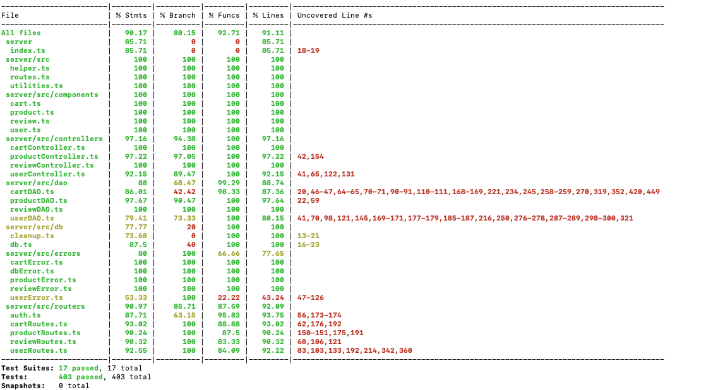

# Test Report

# Contents

- [Test Report](#test-report)
- [Contents](#contents)
- [Dependency graph](#dependency-graph)
- [Integration approach](#integration-approach)
- [Tests](#tests)
- [Coverage](#coverage)
   - [Coverage of FR](#coverage-of-fr)
   - [Coverage white box](#coverage-white-box)

# Dependency graph

# Integration approach

The integration sequence can be adopted in a "bottom-up" approach. This involves testing the smallest units first and progressively integrating them into larger components.

- Step1: User
- Step2: User + Products
- Step3: User + Products + Cart
- Step4: User + Products + Cart + Review

# Tests

| Test case name | Object(s) tested | Test level | Technique used |
| :------------: | :--------------: | :--------: | :------------: |
| #U_CONTROLLER_1 | UserController |  Unit        |    White box - Statement coverage |
| #U_CONTROLLER_2 | UserController |  Unit        |    White box - Statement coverage |
| #U_CONTROLLER_3 | UserController |  Unit        |    White box - Statement coverage |
| #U_CONTROLLER_4 | UserController |  Unit        |    White box - Statement coverage |
| #U_CONTROLLER_5 | UserController |  Unit        |    White box - Statement coverage |
| #U_CONTROLLER_6 | UserController |  Unit        |    White box - Statement coverage |
| #U_CONTROLLER_7 | UserController |  Unit        |    White box - Statement coverage |
| #U_CONTROLLER_8 | UserController |  Unit        |    White box - Statement coverage |
| #U_CONTROLLER_9 | UserController |  Unit        |    White box - Statement coverage |
| #U_CONTROLLER_10 | UserController |  Unit        |    White box - Statement coverage |
| #U_CONTROLLER_11 | UserController |  Unit        |    White box - Statement coverage |
| #U_CONTROLLER_12 | UserController |  Unit        |    White box - Statement coverage |
| #U_CONTROLLER_13 | UserController |  Unit        |    White box - Statement coverage |
| #U_CONTROLLER_14 | UserController |  Unit        |    White box - Statement coverage |
| #U_CONTROLLER_15 | UserController |  Unit        |    White box - Statement coverage |
| #U_CONTROLLER_16 | UserController |  Unit        |    White box - Statement coverage |
| #U_CONTROLLER_17 | UserController |  Unit        |    White box - Statement coverage |
| #U_CONTROLLER_18 | UserController |  Unit        |    White box - Statement coverage |
| #U_CONTROLLER_19 | UserController |  Unit        |    White box - Statement coverage |
| #U_DAO_1 | UserDAO |  Unit        |    White box - Statement coverage |
| #U_DAO_2 | UserDAO |  Unit        |    White box - Statement coverage |
| #U_DAO_3 | UserDAO |  Unit        |    White box - Statement coverage |
| #U_DAO_4 | UserDAO |  Unit        |    White box - Statement coverage |
| #U_DAO_5 | UserDAO |  Unit        |    White box - Statement coverage |
| #U_DAO_6 | UserDAO |  Unit        |    White box - Statement coverage |
| #U_DAO_7 | UserDAO |  Unit        |    White box - Statement coverage |
| #U_DAO_8 | UserDAO |  Unit        |    White box - Statement coverage |
| #U_DAO_9 | UserDAO |  Unit        |    White box - Statement coverage |
| #U_DAO_10 | UserDAO |  Unit        |    White box - Statement coverage |
| #U_DAO_11 | UserDAO |  Unit        |    White box - Statement coverage |
| #U_DAO_12 | UserDAO |  Unit        |    White box - Statement coverage |
| #U_DAO_13 | UserDAO |  Unit        |    White box - Statement coverage |
| #U_DAO_14 | UserDAO |  Unit        |    White box - Statement coverage |
| #U_DAO_15 | UserDAO |  Unit        |    White box - Statement coverage |
| #U_DAO_16 | UserDAO |  Unit        |    White box - Statement coverage |
| #U_DAO_17 | UserDAO |  Unit        |    White box - Statement coverage |
| #U_DAO_18 | UserDAO |  Unit        |    White box - Statement coverage |
| #U_DAO_19 | UserDAO |  Unit        |    White box - Statement coverage |
| #U_DAO_20 | UserDAO |  Unit        |    White box - Statement coverage |
| #U_DAO_21 | UserDAO |  Unit        |    White box - Statement coverage |
| #U_ROUTER_1 | UserRoutes |  Unit        |    White box - Statement coverage |
| #U_ROUTER_2 | UserRoutes |  Unit        |    White box - Statement coverage |
| #U_ROUTER_3 | UserRoutes |  Unit        |    White box - Statement coverage |
| #U_ROUTER_4 | UserRoutes |  Unit        |    White box - Statement coverage |
| #U_ROUTER_5 | UserRoutes |  Unit        |    White box - Statement coverage |
| #U_ROUTER_6 | UserRoutes |  Unit        |    White box - Statement coverage |
| #U_ROUTER_7 | UserRoutes |  Unit        |    White box - Statement coverage |
| #U_ROUTER_8 | UserRoutes |  Unit        |    White box - Statement coverage |
| #U_ROUTER_9 | UserRoutes |  Unit        |    White box - Statement coverage |
| #U_ROUTER_10 | UserRoutes |  Unit        |    White box - Statement coverage |
| #U_ROUTER_11 | UserRoutes |  Unit        |    White box - Statement coverage |
| #U_ROUTER_12 | UserRoutes |  Unit        |    White box - Statement coverage |
| #U_ROUTER_13 | UserRoutes |  Unit        |    White box - Statement coverage |
| #U_ROUTER_14 | UserRoutes |  Unit        |    White box - Statement coverage |
| #U_ROUTER_15 | UserRoutes |  Unit        |    White box - Statement coverage |
| #U_ROUTER_16 | UserRoutes |  Unit        |    White box - Statement coverage |
| #U_ROUTER_17 | UserRoutes |  Unit        |    White box - Statement coverage |
| #U_ROUTER_18 | UserRoutes |  Unit        |    White box - Statement coverage |
| #U_ROUTER_19 | UserRoutes |  Unit        |    White box - Statement coverage |
| #U_ROUTER_20 | UserRoutes |  Unit        |    White box - Statement coverage |
| #U_ROUTER_21 | UserRoutes |  Unit        |    White box - Statement coverage |
| #U_ROUTER_22 | UserRoutes |  Unit        |    White box - Statement coverage |
| #U_ROUTER_23 | UserRoutes |  Unit        |    White box - Statement coverage |
| #U_ROUTER_24 | UserRoutes |  Unit        |    White box - Statement coverage |
| #U_ROUTER_25 | UserRoutes |  Unit        |    White box - Statement coverage |
| #U_ROUTER_26 | UserRoutes |  Unit        |    White box - Statement coverage |
| #U_ROUTER_27 | UserRoutes |  Unit        |    White box - Statement coverage |
| #U_ROUTER_28 | UserRoutes |  Unit        |    White box - Statement coverage |
| #U_ROUTER_29 | UserRoutes |  Unit        |    White box - Statement coverage |
| #U_ROUTER_30 | UserRoutes |  Unit        |    White box - Statement coverage |
| #U_ROUTER_31 | UserRoutes |  Unit        |    White box - Statement coverage |
| #U_ROUTER_32 | UserRoutes |  Unit        |    White box - Statement coverage |
| #U_ROUTER_33 | UserRoutes |  Unit        |    White box - Statement coverage |
| #U_ROUTER_34 | UserRoutes |  Unit        |    White box - Statement coverage |
| #U_ROUTER_35 | UserRoutes |  Unit        |    White box - Statement coverage |
| #U_ROUTER_36 | UserRoutes |  Unit        |    White box - Statement coverage |
| #U_ROUTER_37 | UserRoutes |  Unit        |    White box - Statement coverage |
| #U_ROUTER_38 | UserRoutes |  Unit        |    White box - Statement coverage |
| #U_ROUTER_39 | UserRoutes |  Unit        |    White box - Statement coverage |
| #U_ROUTER_40 | UserRoutes |  Unit        |    White box - Statement coverage |
| #U_INT_1 | UserDAO, UserController, UserRoutes |  Integration        |    Black box - Equivalence partioning |
| #U_INT_2 | UserDAO, UserController, UserRoutes |  Integration        |    Black box - Equivalence partioning |
| #U_INT_3 | UserDAO, UserController, UserRoutes |  Integration        |    Black box - Equivalence partioning |
| #U_INT_4 | UserDAO, UserController, UserRoutes |  Integration        |    Black box - Equivalence partioning |
| #U_INT_5 | UserDAO, UserController, UserRoutes |  Integration        |    Black box - Equivalence partioning |
| #U_INT_6 | UserDAO, UserController, UserRoutes |  Integration        |    White box - Statement coverage |
| #U_INT_7 | UserDAO, UserController, UserRoutes |  Integration        |    Black box - Equivalence partioning |
| #U_INT_8 | UserDAO, UserController, UserRoutes |  Integration        |    Black box - Equivalence partioning |
| #U_INT_9 | UserDAO, UserController, UserRoutes |  Integration        |    Black box - Equivalence partioning |
| #U_INT_10 | UserDAO, UserController, UserRoutes |  Integration        |    Black box - Equivalence partioning |
| #U_INT_11 | UserDAO, UserController, UserRoutes |  Integration        |    Black box - Equivalence partioning |
| #U_INT_12 | UserDAO, UserController, UserRoutes |  Integration        |    Black box - Equivalence partioning |
| #U_INT_13 | UserDAO, UserController, UserRoutes |  Integration        |    Black box - Equivalence partioning |
| #U_INT_14 | UserDAO, UserController, UserRoutes |  Integration        |    Black box - Equivalence partioning |
| #U_INT_15 | UserDAO, UserController, UserRoutes |  Integration        |    Black box - Equivalence partioning |
| #U_INT_16 | UserDAO, UserController, UserRoutes |  Integration        |    Black box - Equivalence partioning |
| #U_INT_17 | UserDAO, UserController, UserRoutes |  Integration        |    White box - Statement coverage |
| #U_INT_18 | UserDAO, UserController, UserRoutes |  Integration        |    Black box - Equivalence partioning |
| #U_INT_19 | UserDAO, UserController, UserRoutes |  Integration        |    Black box - Equivalence partioning |
| #U_INT_20 | UserDAO, UserController, UserRoutes |  Integration        |    Black box - Equivalence partioning |
| #U_INT_21 | UserDAO, UserController, UserRoutes |  Integration        |    White box - Statement coverage |
| #U_INT_22 | UserDAO, UserController, UserRoutes |  Integration        |    Black box - Equivalence partioning |
| #U_INT_23 | UserDAO, UserController, UserRoutes |  Integration        |    Black box - Equivalence partioning |
| #U_INT_24 | UserDAO, UserController, UserRoutes |  Integration        |    Black box - Equivalence partioning |
| #U_INT_25 | UserDAO, UserController, UserRoutes |  Integration        |    Black box - Equivalence partioning |
| #P_CONTR01 | productController.registerProducts |  Unit          |    BlackBox Equivalence Partitioning |
| #P_CONTR02 | productController.registerProducts |  Unit          |    BlackBox Equivalence Partitioning |
| #P_CONTR03 | productController.registerProducts |  Unit          |    BlackBox Equivalence Partitioning |
| #P_CONTR04 | productController.registerProducts |  Unit          |    BlackBox Equivalence Partitioning |
| #P_CONTR04_1 | productController.registerProducts |  Unit        |    BlackBox Equivalence Partitioning |
| #P_CONTR05 | productController.changeProductQuantity |  Unit          |    BlackBox Equivalence Partitioning |
| #P_CONTR06 | productController.changeProductQuantity |  Unit          |    BlackBox Equivalence Partitioning |
| #P_CONTR07 | productController.changeProductQuantity |  Unit          |    BlackBox Equivalence Partitioning |
| #P_CONTR07_1 | productController.changeProductQuantity |  Unit        |    BlackBox Equivalence Partitioning |
| #P_CONTR08 | productController.changeProductQuantity |  Unit          |    BlackBox Equivalence Partitioning |
| #P_CONTR09 | productController.sellProduct |  Unit          |    BlackBox Equivalence Partitioning |
| #P_CONTR10 | productController.sellProduct |  Unit          |    BlackBox Equivalence Partitioning |
| #P_CONTR11 | productController.sellProduct |  Unit          |    BlackBox Equivalence Partitioning |
| #P_CONTR12 | productController.sellProduct |  Unit          |    BlackBox Equivalence Partitioning |
| #P_CONTR13 | productController.sellProduct |  Unit          |    BlackBox Equivalence Partitioning |
| #P_CONTR14 | productController.sellProduct |  Unit          |    BlackBox Equivalence Partitioning |
| #P_CONTR15 | productController.getProducts |  Unit          |    BlackBox Equivalence Partitioning |
| #P_CONTR16 | productController.getProducts |  Unit          |    BlackBox Equivalence Partitioning |
| #P_CONTR17 | productController.getProducts |  Unit          |    BlackBox Equivalence Partitioning |
| #P_CONTR18 | productController.getProducts |  Unit          |    BlackBox Equivalence Partitioning |
| #P_CONTR19 | productController.getProducts |  Unit          |    BlackBox Equivalence Partitioning |
| #P_CONTR20 | productController.getProducts |  Unit          |    BlackBox Equivalence Partitioning |
| #P_CONTR21 | productController.getProducts |  Unit          |    BlackBox Equivalence Partitioning |
| #P_CONTR22 | productController.getProducts |  Unit          |    BlackBox Equivalence Partitioning |
| #P_CONTR23 | productController.getProducts |  Unit          |    BlackBox Equivalence Partitioning |
| #P_CONTR24 | productController.getProducts |  Unit          |    BlackBox Equivalence Partitioning |
| #P_CONTR25 | productController.getAvailableProducts |  Unit          |    BlackBox Equivalence Partitioning |
| #P_CONTR26 | productController.getAvailableProducts |  Unit          |    BlackBox Equivalence Partitioning |
| #P_CONTR27 | productController.deleteAllProducts |  Unit          |    BlackBox Equivalence Partitioning |
| #P_CONTR28 | productController.deleteProduct |  Unit          |    BlackBox Equivalence Partitioning |
| #P_CONTR29 | productController.deleteProduct |  Unit          |    BlackBox Equivalence Partitioning |
| #P_CONTR30 | productController.checkGrouping |  Unit          |    BlackBox Equivalence Partitioning |
| #P_CONTR31 | productController.checkGrouping |  Unit          |    BlackBox Equivalence Partitioning |
| #P_CONTR32 | productController.checkGrouping |  Unit          |    BlackBox Equivalence Partitioning |
| #P_CONTR33 | productController.checkGrouping |  Unit          |    BlackBox Equivalence Partitioning |
| #P_CONTR34 | productController.checkGrouping |  Unit          |    BlackBox Equivalence Partitioning |
| #P_CONTR35 | productController.checkGrouping |  Unit          |    BlackBox Equivalence Partitioning |
| #P_CONTR36 | productController.checkGrouping |  Unit          |    BlackBox Equivalence Partitioning |
| #P_CONTR37 | productController.checkGrouping |  Unit          |    BlackBox Equivalence Partitioning |
| #P_CONTR38 | productController.checkGrouping |  Unit          |    BlackBox Equivalence Partitioning |
| #P_CONTR39 | productController.checkGrouping |  Unit          |    BlackBox Equivalence Partitioning |
| #P_CONTR40 | productController.invalidDate |  Unit          |    BlackBox Equivalence Partitioning |
| #P_CONTR41 | productController.invalidDate |  Unit          |    BlackBox Equivalence Partitioning |
| #P_DAO1 | productDAO.registerProducts | Unit | BlackBox Equivalence Partitioning  |
| #P_DAO2 | productDAO.registerProducts | Unit | BlackBox Equivalence Partitioning  |
| #P_DAO3 | productDAO.changeProductQuantity | Unit | BlackBox Equivalence Partitioning  |
| #P_DAO4 | productDAO.changeProductQuantity | Unit | BlackBox Equivalence Partitioning  |
| #P_DAO5 | productDAO.sellProduct | Unit | BlackBox Equivalence Partitioning  |
| #P_DAO6 | productDAO.sellProduct | Unit | BlackBox Equivalence Partitioning  |
| #P_DAO7 | productDAO.getProducts | Unit | BlackBox Equivalence Partitioning |
| #P_DAO8 | productDAO.getProducts | Unit | BlackBox Equivalence Partitioning  |
| #P_DAO9 | productDAO.getProducts | Unit | BlackBox Equivalence Partitioning  |
| #P_DAO10 | productDAO.getProducts | Unit | BlackBox Equivalence Partitioning  |
| #P_DAO11 | productDAO.getProducts | Unit | BlackBox Equivalence Partitioning  |
| #P_DAO12 | productDAO.getProducts | Unit | BlackBox Equivalence Partitioning  |
| #P_DAO13 | productDAO.getProducts | Unit | BlackBox Equivalence Partitioning  |
| #P_DAO14 | productDAO.getProducts | Unit | BlackBox Equivalence Partitioning  |
| #P_DAO15 | productDAO.getProducts | Unit | BlackBox Equivalence Partitioning  |
| #P_DAO16 | productDAO.deleteAllProducts | Unit | BlackBox Equivalence Partitioning  |
| #P_DAO17 | productDAO.deleteAllProducts | Unit | BlackBox Equivalence Partitioning  |
| #P_DAO18 | productDAO.deleteProduct | Unit | BlackBox Equivalence Partitioning  |
| #P_DAO19 | productDAO.deleteProduct | Unit | BlackBox Equivalence Partitioning  |
| #P_DAO20 | productDAO.getProductByModel | Unit | BlackBox Equivalence Partitioning  |
| #P_DAO21 | productDAO.getProductByModel   productDAO.getProductsOfCart   productDAO.registerProducts   productDAO.changeProductQuantity   productDAO.sellProduct   productDAO.getProducts   productDAO.deleteAllProducts   productDAO.deleteProduct   | Unit | WhiteBox Path coverage |
| #P_ROUTER_01 | POST /products | Unit | BlackBox Equivalence Partitioning  |
| #P_ROUTER_02 | POST /products | Unit | BlackBox Equivalence Partitioning  |
| #P_ROUTER_03 | POST /products | Unit | BlackBox Equivalence Partitioning  |
| #P_ROUTER_04 | POST /products | Unit | BlackBox Equivalence Partitioning |
| #P_ROUTER_05 | POST /products | Unit | BlackBox Equivalence Partitioning |
| #P_ROUTER_06 | POST /products | Unit | BlackBox Equivalence Partitioning  |
| #P_ROUTER_07 | POST /products | Unit | BlackBox Equivalence Partitioning  |
| #P_ROUTER_08 | POST /products | Unit | BlackBox Equivalence Partitioning  |
| #P_ROUTER_09 | POST /products | Unit | BlackBox Equivalence Partitioning  |
| #P_ROUTER_10 | POST /products | Unit | BlackBox Equivalence Partitioning |
| #P_ROUTER_11 | POST /products | Unit | BlackBox Equivalence Partitioning |
| #P_ROUTER_12 | PATCH /products/:model | Unit | BlackBox Equivalence Partitioning  |
| #P_ROUTER_14 | PATCH /products/:model | Unit | BlackBox Equivalence Partitioning  |
| #P_ROUTER_13 | PATCH /products/:model | Unit | BlackBox Equivalence Partitioning  |
| #P_ROUTER_15 | PATCH /products/:model | Unit | BlackBox Equivalence Partitioning  |
| #P_ROUTER_16 | PATCH /products/:model | Unit | BlackBox Equivalence Partitioning  |
| #P_ROUTER_17 | PATCH /products/:model | Unit | BlackBox Equivalence Partitioning  |
| #P_ROUTER_18 | PATCH /products/:model | Unit | BlackBox Equivalence Partitioning  |
| #P_ROUTER_19 | PATCH /products/:model | Unit | BlackBox Equivalence Partitioning  |
| #P_ROUTER_20 | PATCH /products/:model | Unit | BlackBox Equivalence Partitioning  |
| #P_ROUTER_20_s | PATCH /products/:model | Unit | BlackBox Equivalence Partitioning  |
| #P_ROUTER_21 | PATCH /products/:model | Unit | BlackBox Equivalence Partitioning  |
| #P_ROUTER_22 | PATCH /products/:model | Unit | BlackBox Equivalence partitioning
| #P_ROUTER_23 | PATCH /products/:model/sell | Unit | BlackBox Equivalence partitioning
| #P_ROUTER_24 | PATCH /products/:model/sell | Unit | BlackBox Equivalence partitioning
| #P_ROUTER_25 | PATCH /products/:model/sell | Unit | BlackBox Equivalence partitioning
| #P_ROUTER_26 | PATCH /products/:model/sell | Unit | BlackBox Equivalence partitioning
| #P_ROUTER_27 | PATCH /products/:model/sell | Unit | BlackBox Equivalence partitioning
| #P_ROUTER_28 | PATCH /products/:model/sell | Unit | BlackBox Equivalence partitioning
| #P_ROUTER_29 | PATCH /products/:model/sell | Unit | BlackBox Equivalence partitioning
| #P_ROUTER_30 | PATCH /products/:model/sell | Unit | BlackBox Equivalence partitioning
| #P_ROUTER_31 | PATCH /products/:model/sell | Unit | BlackBox Equivalence partitioning
| #P_ROUTER_32 | PATCH /products/:model/sell | Unit | BlackBox Equivalence partitioning
| #P_ROUTER_33 | GET /products | Unit | BlackBox Equivalence partitioning
| #P_ROUTER_34 | GET /products | Unit | BlackBox Equivalence partitioning
| #P_ROUTER_35 | GET /products | Unit | BlackBox Equivalence partitioning
| #P_ROUTER_36 | GET /products | Unit | BlackBox Equivalence partitioning
| #P_ROUTER_37 | GET /products | Unit | BlackBox Equivalence partitioning
| #P_ROUTER_38 | GET /products/available | Unit | BlackBox Equivalence partitioning
| #P_ROUTER_39 | GET /products/available | Unit | BlackBox Equivalence partitioning
| #P_ROUTER_40 | DELETE /products | Unit | BlackBox Equivalence partitioning
| #P_ROUTER_41 | DELETE /products | Unit | BlackBox Equivalence partitioning
| #P_ROUTER_42 | DELETE /products | Unit | BlackBox Equivalence partitioning
| #P_ROUTER_43 | DELETE /products/:model | Unit | BlackBox Equivalence partitioning
| #P_ROUTER_44 | DELETE /products/:model | Unit | BlackBox Equivalence partitioning
| #P_ROUTER_45 | DELETE /products/:model | Unit | BlackBox Equivalence partitioning
| #P_ROUTER_46 | DELETE /products/:model | Unit | BlackBox Equivalence partitioning
| #P_INT01 | POST /products  | Integration | Black box Equivalence partioning
| #P_INT02 | POST /products  | Integration | Black box Equivalence partioning
| #P_INT03 | POST /products  | Integration | Black box Equivalence partioning
| #P_INT04 | POST /products  | Integration | Black box Equivalence partioning
| #P_INT05 | POST /products  | Integration | Black box Equivalence partioning
| #P_INT06 | POST /products  | Integration | Black box Equivalence partioning
| #P_INT07 | GET /products  | Integration | Black box Equivalence partioning
| #P_INT08 | GET /products  | Integration | Black box Equivalence partioning
| #P_INT09 | GET /products  | Integration | Black box Equivalence partioning
| #P_INT10 | GET /products  | Integration | Black box Equivalence partioning
| #P_INT11 | GET /products  | Integration | Black box Equivalence partioning
| #P_INT12 | PATCH /products/:model/sell/  | Integration | Black box Equivalence partioning
| #P_INT13 | PATCH /products/:model/sell/  | Integration | Black box Equivalence partioning
| #P_INT15 | PATCH /products/:model/sell/  | Integration | Black box Equivalence partioning
| #P_INT16 | PATCH /products/:model/sell/  | Integration | Black box Equivalence partioning
| #P_INT17 | GET /products/available  | Integration | Black box Equivalence partioning
| #P_INT18 | GET /products/available  | Integration | Black box Equivalence partioning
| #P_INT19 | GET /products/available  | Integration | Black box Equivalence partioning
| #P_INT20 | GET /products/available  | Integration | Black box Equivalence partioning
| #P_INT21 | PATCH /products/:model  | Integration | Black box Equivalence partioning
| #P_INT22 | PATCH /products/:model  | Integration | Black box Equivalence partioning
| #P_INT23 | PATCH /products/:model  | Integration | Black box Equivalence partioning
| #P_INT24 | DELETE /products/:id  | Integration | Black box Equivalence partioning
| #P_INT25 | DELETE /products/:id  | Integration | Black box Equivalence partioning
| #P_INT26 | DELETE /products/:id  | Integration | Black box Equivalence partioning
| #P_INT27 | DELETE /products  | Integration | Black box Equivalence partioning
| #P_INT28 | DELETE /products  | Integration | Black box Equivalence partioning
| R_DAO_01 |   ReviewDAO.addReview             |  Unit          |    Black Box - eq partition      |
| R_DAO_02 |   ReviewDAO.addReview             |  Unit          |    White box - statement coverage           |
| R_DAO_03 |   ReviewDAO.getProductReviews             |  Unit          |    Black Box - eq partition            |
| R_DAO_04 |   ReviewDAO.getProductReviews             |  Unit          |   White box - statement coverage            |
| R_DAO_05 |   ReviewDAO.deleteReview             |  Unit          |    Black Box - eq partition             |
| R_DAO_06 |   ReviewDAO.deleteReview             |  Unit          |    White box - statement coverage              |
| R_DAO_07 |   ReviewDAO.deleteAllReviews             |  Unit          |    Black Box - eq partition             |
| R_DAO_08 |   ReviewDAO.deleteAllReviews              |  Unit          |    White box - statement coverage              |
| R_DAO_09 |   ReviewDAO.deleteReviewsOfProducts              |  Unit          |    Black Box - eq partition             |
| R_DAO_10 |   ReviewDAO.deleteReviewsOfProducts              |  Unit          |    White box - statement coverage              |
| R_DAO_11 |   ReviewDAO.checkReviewExists            |  Unit          |    Black Box - eq partition             |
| R_DAO_12 |  ReviewDAO. checkReviewExists             |  Unit          |    Black Box - eq partition             |
| R_DAO_13 |   ReviewDAO.checkReviewExists             |  Unit          |    White box - statement coverage             |
| R_DAO_14 |   ReviewDAO.isProductBought             |  Unit          |    Black Box - eq partition            |
| R_DAO_15 |   ReviewDAO.isProductBought            |  Unit          |    Black Box - eq partition            |
| R_DAO_16 |   ReviewDAO - database errors             |  Unit          |    White box - statement coverage            |
| R_DAO_17 |   ReviewDAO - generic errors             |  Unit          |    White box - path coverage          |
| R_CONTROLLER_01 |  ReviewController.addReview              |  Unit          |    Black Box - eq partition            |
| R_CONTROLLER_02* |  ReviewController.addReview              |  Unit          |    Black Box - eq partition            |
| R_CONTROLLER_03 |  ReviewController.addReview              |  Unit          |    Black Box - eq partition            |
| R_CONTROLLER_04 |  ReviewController.addReview              |  Unit          |    Black Box - eq partition            |
| R_CONTROLLER_05 |  ReviewController.deleteReview              |  Unit          |    Black Box - eq partition            |
| R_CONTROLLER_06 |  ReviewController.deleteReview              |  Unit          |    Black Box - eq partition            |
| R_CONTROLLER_07 |  ReviewController.deleteReview              |  Unit          |    Black Box - eq partition            |
| R_CONTROLLER_08 |  ReviewController.deleteReviewsOfProduct              |  Unit          |    Black Box - eq partition            |
| R_CONTROLLER_09 |  ReviewController.deleteReviewsOfProduct              |  Unit          |    Black Box - eq partition            |
| R_CONTROLLER_10 |  ReviewController.deleteAllReviews              |  Unit          |    Black Box - eq partition            |
| R_CONTROLLER_11 |  ReviewController.getProductReviews              |  Unit          |    Black Box - eq partition            |
| R_Router_01 |  ReviewRoutes.POST /reviews/:model              |  Unit          |    Black Box - eq partition            |
| R_Router_02 |  ReviewRoutes.POST /reviews/:model              |  Unit          |    Black Box - eq partition            |
| R_Router_03 |  ReviewRoutes.POST /reviews/:model              |  Unit          |    Black Box - boundary            |
| R_Router_04 |  ReviewRoutes.POST /reviews/:model              |  Unit          |    Black Box - eq partition            |
| R_Router_05 |  ReviewRoutes.GET /reviews/:model              |  Unit          |    Black Box  - eq partition           |
| R_Router_06 |  ReviewRoutes.GET /reviews/:model              |  Unit          |    Black Box  - eq partition           |
| R_Router_07 |  ReviewRoutes.DELETE /reviews/:model              |  Unit          |    Black Box - eq partition            |
| R_Router_08 |  ReviewRoutes.DELETE /reviews/:model              |  Unit          |    Black Box - eq partition            |
| R_Router_09 |  ReviewRoutes.DELETE /reviews/:model/all              |  Unit          |    Black Box  - eq partition           |
| R_Router_10 |  ReviewRoutes.DELETE /reviews/:model/all              |  Unit          |    Black Box - eq partition            |
| R_Router_11 |  ReviewRoutes.DELETE /reviews              |  Unit          |    Black Box - eq partition            |
| R_Router_12 |  ReviewRoutes.DELETE /reviews             |  Unit          |    Black Box - eq partition            |
| R_INT_01 | ReviewRoutes.POST /reviews/:model             |  Integration          |    Black Box - eq partition            |
| R_INT_02 | ReviewRoutes.POST /reviews/:model             |  Integration          |    Black Box - eq partition            |
| R_INT_03 | ReviewRoutes.POST /reviews/:model              |  Integration          |    Black Box - eq partition             |
| R_INT_04 | ReviewRoutes.POST /reviews/:model              |  Integration          |    Black Box - eq partition            |
| R_INT_05 | ReviewRoutes.POST /reviews/:model              |  Integration          |    Black Box - eq partition            |
| R_INT_06 | ReviewRoutes.POST /reviews/:model              |  Integration          |    Black Box - eq partition            |
| R_INT_07 | ReviewRoutes.POST /reviews/:model              |  Integration          |    Black Box - eq partition            |
| R_INT_08 | ReviewRoutes.POST /reviews/:model              |  Integration          |    Black Box - eq partition             |
| R_INT_09 | ReviewRoutes.DELETE /reviews/:model            |  Integration          |    Black Box - eq partition            |
| R_INT_10 |  ReviewRoutes.DELETE /reviews/:model             |  Integration          |    Black Box - eq partition             |
| R_INT_11 |  ReviewRoutes.DELETE /reviews/:model             |  Integration          |    Black Box - eq partition            |
| R_INT_12 |  ReviewRoutes.GET /reviews/:model             |  Integration          |    Black Box - eq partition            |
| R_INT_13 |  ReviewRoutes.GET /reviews/:model            |  Integration          |    Black Box  - eq partition           |
| R_INT_14 |  ReviewRoutes.DELETE /reviews/:model/all             |  Integration          |    Black Box  - eq partition           |
| R_INT_15 |  ReviewRoutes.DELETE /reviews/:model/all             |  Integration          |    Black Box - eq partition            |
| R_INT_16 |  ReviewRoutes.DELETE /reviews             |  Integration          |    Black Box  - eq partition           |
| R_INT_17 |  ReviewRoutes.DELETE /reviews             |  Integration          |    Black Box  - eq partition           |
| C_CONTROLLER_15  | cartController.removeProductFromCart          |  Unit           |    White Box - decision coverage  |
| C_CONTROLLER_16  | cartController.clearCart                      |  Unit           |    White Box - statement coverage  |
| C_CONTROLLER_17  | cartController.clearCart                      |  Unit           |    White Box - statement coverage  |
| C_CONTROLLER_18  | cartController.deleteAllCarts                 |  Unit           |    Black Box - eq partition  |
| C_CONTROLLER_19  | cartController.getAllCarts                    |  Unit           |    Black Box - eq partition  |
| C_ROUTER_01|     GET /carts           |  Unit          |    Black Box - eq partition            |
| C_ROUTER_02|     GET /carts           |  Unit          |    Black Box - eq partition            |
| C_ROUTER_03|     GET /carts           |  Unit          |    Black Box - eq partition            |
| C_ROUTER_04|     POST /carts           |  Unit          |    Black Box - eq partition            |
| C_ROUTER_05|     POST /carts           |  Unit          |    Black Box - eq partition            |
| C_ROUTER_06|     POST /carts           |  Unit          |    Black Box - eq partition            |
| C_ROUTER_07|     POST /carts           |  Unit          |    Black Box - eq partition            |
| C_ROUTER_08|     PATCH /carts           |  Unit          |    Black Box - eq partition            |
| C_ROUTER_09|     PATCH /carts           |  Unit          |    Black Box - eq partition            |
| C_ROUTER_10|     PATCH /carts           |  Unit          |    Black Box - eq partition            |
| C_ROUTER_11|     PATCH /carts           |  Unit          |    Black Box - eq partition            |
| C_ROUTER_12|     PATCH /carts           |  Unit          |    Black Box - eq partition            |
| C_ROUTER_13|     PATCH /carts           |  Unit          |    Black Box - eq partition            |
| C_ROUTER_14|     GET /carts/history           |  Unit          |    Black Box - eq partition            |
| C_ROUTER_15|     GET /carts/history           |  Unit          |    Black Box - eq partition            |
| C_ROUTER_16|     GET /carts/history           |  Unit          |    Black Box - eq partition            |
| C_ROUTER_17|     GET /carts/history           |  Unit          |    Black Box - eq partition            |
| C_ROUTER_18|     DELETE /carts/products/:model  |  Unit          |    Black Box - eq partition            |
| C_ROUTER_19|     DELETE /carts/products/:model  |  Unit          |    Black Box - eq partition            |
| C_ROUTER_20|     DELETE /carts/products/:model  |  Unit          |    Black Box - eq partition            |
| C_ROUTER_21|     DELETE /carts/products/:model  |  Unit          |    Black Box - eq partition            |
| C_ROUTER_22|     DELETE /carts/products/:model  |  Unit          |    Black Box - eq partition            |
| C_ROUTER_23|     DELETE /carts/products/:model  |  Unit          |    Black Box - eq partition            |
| C_ROUTER_24|     DELETE /carts/current           |  Unit          |    Black Box - eq partition            |
| C_ROUTER_25|     DELETE /carts/current           |  Unit          |    Black Box - eq partition            |
| C_ROUTER_26|     DELETE /carts/current           |  Unit          |    Black Box - eq partition            |
| C_ROUTER_27|     DELETE /carts/current           |  Unit          |    Black Box - eq partition            |
| C_ROUTER_28|     DELETE /carts           |  Unit          |    Black Box - eq partition            |
| C_ROUTER_29|     DELETE /carts           |  Unit          |    Black Box - eq partition            |
| C_ROUTER_30|     DELETE /carts           |  Unit          |    Black Box - eq partition            |
| C_ROUTER_31|     GET /carts/all           |  Unit          |    Black Box - eq partition            |
| C_ROUTER_32|     GET /carts/all           |  Unit          |    Black Box - eq partition            |
| C_ROUTER_33|     GET /carts/all           |  Unit          |    Black Box - eq partition            |
| C_INT01|       POST /carts         |  Integration       |    Black Box - eq partition            |
| C_INT02|       POST /carts         |  Integration       |    Black Box - eq partition            |
| C_INT03|       POST /carts         |  Integration       |    Black Box - eq partition            |
| C_INT04|       POST /carts         |  Integration       |    Black Box - eq partition            |
| C_INT05|       POST /carts         |  Integration       |    Black Box - eq partition            |
| C_INT06|       POST /carts         |  Integration       |    Black Box - eq partition            |
| C_INT07|       GET /carts         |  Integration       |    Black Box - eq partition            |
| C_INT08|       GET /carts         |  Integration       |    Black Box - eq partition            |
| C_INT09|       GET /carts         |  Integration       |    Black Box - eq partition            |
| C_INT10|       DELETE carts/products/:model         |  Integration       |    Black Box - eq partition            |
| C_INT11|       DELETE carts/products/:model         |  Integration       |    Black Box - eq partition            |
| C_INT12|       DELETE carts/products/:model         |  Integration       |    Black Box - eq partition            |
| C_INT13|       DELETE carts/products/:model         |  Integration       |    Black Box - eq partition            |
| C_INT14|       DELETE carts/products/:model         |  Integration       |    Black Box - eq partition            |
| C_INT15|       DELETE carts/products/:model         |  Integration       |    Black Box - eq partition            |
| C_INT16|       PATCH /carts         |  Integration       |    Black Box - eq partition            |
| C_INT17|       PATCH /carts         |  Integration       |    Black Box - eq partition            |
| C_INT18|       PATCH /carts         |  Integration       |    Black Box - eq partition            |
| C_INT19|       PATCH /carts         |  Integration       |    Black Box - eq partition            |
| C_INT20|       DELETE /carts/current         |  Integration       |    Black Box - eq partition            |
| C_INT21|       DELETE /carts/current         |  Integration       |    Black Box - eq partition            |
| C_INT22|       DELETE /carts/current         |  Integration       |    Black Box - eq partition            |
| C_INT23|       PATCH /carts         |  Integration       |    Black Box - eq partition            |
| C_INT24|       GET /carts/history         |  Integration       |    Black Box - eq partition            |
| C_INT25|       GET /carts/history         |  Integration       |    Black Box - eq partition            |
| C_INT26|       GET /carts/all         |  Integration       |    Black Box - eq partition            |
| C_INT27|       GET /carts/all         |  Integration       |    Black Box - eq partition            |
| C_INT28|       DELETE /carts         |  Integration       |    Black Box - eq partition            |
| C_INT29|       DELETE /carts         |  Integration       |    Black Box - eq partition            |

*This test was erased in V3 due to official tests (ambigous 5.1 test for review)
# Coverage

## Coverage of FR

| Functional Requirement or scenario | Test(s) |
| :--------------------------------: | :-----: |
|                FR1.1 - Login                                            | U_DAO_[1..4], U_ROUTER_[35..38], U_INT_[20..21]        |
|                FR1.2 - Logout                                           | U_ROUTER_[39..40], U_INT_[22..25]        |
|                FR1.3 - Create a new user account                        | U_CONTROLLER_[1..6], U_DAO_[5..6], U_ROUTER_[1..7], U_INT_[1..2]       |
|                FR2.1 - Show the list of all users                       | U_CONTROLLER_7, U_DAO_[10..11], U_ROUTER_[8..10], U_INT_[3..4]        |
|                FR2.2 - Show the list of all users with a specific role  | U_CONTROLLER_[8..9], U_DAO_[12..13], U_ROUTER_[11..14], U_INT_[5..7]        |
|                FR2.3 - Show the information of a single use             | U_CONTROLLER_[10..11], U_DAO_[7..9], U_ROUTER_[15..17], U_INT_[8..10]        |
|                FR2.4 - Update the information of a single user          | U_CONTROLLER_[15..19], U_DAO_[17..19], U_ROUTER_[26..34], U_INT_[16..19]        |
|                FR2.5 - Delete a single _non Admin_ user                 | U_CONTROLLER_[12..13], U_DAO_[14..16], U_ROUTER_[18..22], U_INT_[11..13]        |
|                FR2.6 - Delete all _non Admin_ users                     | U_CONTROLLER_14, U_DAO_[20..21], U_ROUTER_[23..25], U_INT_[14..15]        |
|                FR3.1 - Register a product                | P_CONTROLLER_01 > P_CONTROLLER_04_1  P_CONTROLLER_40 > P_CONTROLLER_41   P_DAO1 - P_DAO2 - P_DAO20  P_ROUTER_01 > P_ROUTER_11 |
|                FR3.2 - Update the quantity of a product               | P_CONTROLLER_05 > P_CONTROLLER_08  P_CONTROLLER_40 > P_CONTROLLER_41  P_DAO3 > P_DAO4  P_DAO20  P_ROUTER_12 > P_ROUTER_22   |
|                FR3.3 - Sell a product                  | P_CONTROLLER_09 > P_CONTROLLER_14  P_CONTROLLER_40 > P_CONTROLLER_41  P_DAO5 > P_DAO7  P_DAO20  P_ROUTER_23 > P_ROUTER_32  |
|                FR3.4 - Show the list of all products             | P_CONTROLLER_15   P_DAO7  P_DAO14 > P_DAO15  P_ROUTER_33 > P_ROUTER_37 |
|                FR3.4.1 - Show the list of all available products               | P_CONTROLLER_25 > P_CONTROLLER_26  P_DAO11  P_ROUTER_38 > P_ROUTER_39   |
|                FR3.5 -  Show the list of all products with the same category               | P_CONTROLLER_16 > P_CONTROLLER_24    P_CONTROLLER_30 > P_CONTROLLER_39  P_DAO8 > P_DAO9      |
|                FR3.5.1 - Show the list of all available products with the same category              | P_CONTROLLER_16 > P_CONTROLLER_24    P_CONTROLLER_30 > P_CONTROLLER_39   P_DAO12     |
|                FR3.6 - Show the list of all products with the same model                |  P_CONTROLLER_16 > P_CONTROLLER_24    P_CONTROLLER_30 > P_CONTROLLER_39  P_DAO10  P_DAO20   |
|                FR3.6.1 - Show the list of all available products with the same model                 |  P_CONTROLLER_16 > P_CONTROLLER_24    P_CONTROLLER_30 > P_CONTROLLER_39   P_DAO13  P_DAO20   |
|                FR3.7 - Delete a product              | P_CONTROLLER_28 > P_CONTROLLER_29  P_DAO18 > P_DAO19  P_ROUTER_43 > P_ROUTER_46   |
|                FR3.8 - Delete all products                  |  P_CONTROLLER_27  P_DAO16 > P_DAO17  P_ROUTER_40 > P_ROUTER_42   |
|                FR4.1                 | R_DAO_01, R_DAO_02, R_CONTROLLER_01, R_CONTROLLER_02, R_CONTROLLER_03, R_CONTROLLER_04, R_Router_01, R_Router_02, R_Router_03, R_Router_04, R_INT_01, R_INT_02, R_INT_03, R_INT_04, R_INT_05, R_INT_06, R_INT_07, R_INT_08       |
|                FR4.2                 | R_DAO_03, R_DAO_04, R_CONTROLLER_11, R_Router_05, R_Router_06, R_INT_12, R_INT_13        |
|                FR4.3                 | R_DAO_05, R_DAO_06, R_CONTROLLER_05, R_CONTROLLER_06, R_CONTROLLER_07, R_Router_07, R_Router_08, R_INT_09, R_INT_10, R_INT_11        |
|                FR4.4                 | R_DAO_09, R_DAO_10, R_CONTROLLER_08, R_CONTROLLER_09,  R_Router_09, R_Router_10, R_INT_14, R_INT_15        |
|                FR4.5                 | R_DAO_07, R_DAO_08, R_CONTROLLER_10, R_Router_11, R_Router_12, R_INT_16, R_INT_17      |
|                FR5.1                 |  C_DAO10, C_DAO11, C_CONTROLLER_04, C_CONTROLLER_05, C_ROUTER_01, C_ROUTER_02, C_ROUTER_03, C_INT07, C_INT08, C_INT09       |
|                FR5.2                 |  C_DAO03, C_DAO04, C_DAO05, C_DAO07, C_DAO08, C_DAO09, C_CONTROLLER_01, C_CONTROLLER_02, C_CONTROLLER_03, C_ROUTER_04, C_ROUTER_05, C_ROUTER_06, C_ROUTER_07, C_INT01, C_INT02, C_INT03, C_INT04, C_INT05, C_INT06     |
|                FR5.3                 |  C_DAO12, C_CONTROLLER_06, C_CONTROLLER_07, C_CONTROLLER_08, C_CONTROLLER_09, C_CONTROLLER_10, C_ROUTER_08, C_ROUTER_09, C_ROUTER_10, C_ROUTER_11, C_ROUTER_12, C_ROUTER_13, C_INT16, C_INT17, C_INT18, C_INT19        |
|                FR5.4                 |  C_DAO17, C_ROUTER_14, C_ROUTER_15, C_ROUTER_16, C_ROUTER_17, C_INT24, C_INT25       |
|                FR5.5                 |  C_DAO13, C_DAO14, C_DAO15, C_CONTROLLER_12, C_CONTROLLER_13, C_CONTROLLER_14, C_CONTROLLER_15, C_ROUTER_18, C_ROUTER_19, C_ROUTER_20, C_ROUTER_21, C_ROUTER_22, C_ROUTER_23, C_INT10, C_INT11, C_INT12, C_INT13, C_INT14, C_INT15       |
|                FR5.6                 |  C_DAO16, C_CONTROLLER_16, C_CONTROLLER_17, C_ROUTER_24, C_ROUTER_25, C_ROUTER_26, C_ROUTER_27, C_INT20, C_INT21, C_INT22       |
|                FR5.7                 |  C_DAO19, C_CONTROLLER_19, C_ROUTER_31, C_ROUTER_32, C_ROUTER_33, C_INT26, C_INT27       |
|                FR5.8                 |  C_DAO18, C_CONTROLLER_18, C_ROUTER_28, C_ROUTER_29, C_ROUTER_30, C_INT28, C_INT29       |

## Coverage white box

